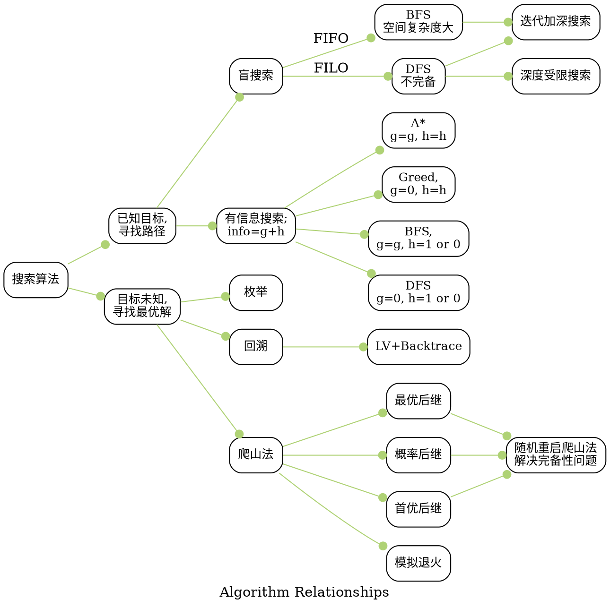

---
export_on_save:
 html: true
---

@import "/blog_head.md"

# 各种算法之间的关系图

```dot
digraph{
    label="Algorithm Relationships"
    rankdir=LR
    node [shape=Mrecord, fontsize=12]
    edge [arrowhead=dot,color="#afd275"]

    root [label="搜索算法"]
    search_path [label="已知目标,\n寻找路径"]
    search_aim [label="目标未知,\n寻找最优解"]
    path_blind [label="盲搜索"]
    path_info [label="有信息搜索;\ninfo=g+h"]
    blind_BFS [label="BFS\n空间复杂度大"]
    blind_DFS [label="DFS\n不完备"]
    blind_LimitD [label="深度受限搜索"]
    blind_IDS [label="迭代加深搜索"]
    info_AStar [label="A\*\ng=g, h=h"]
    info_Greed [label="Greed,\ng=0, h=h"]
    info_BFS [label="BFS,\ng=g, h=1 or 0"]
    info_DFS [label="DFS\ng=0, h=1 or 0"]

    aim_enum [label="枚举"]
    aim_backtrace [label="回溯"]
    bt_lv [label="LV+Backtrace"]
    aim_climb [label="爬山法"]
    climb_best [label="最优后继"]
    climb_possibility [label="概率后继"]
    climb_first [label="首优后继"]
    climb_reset [label="随机重启爬山法\n解决完备性问题"]
    climb_simu_anneal [label="模拟退火"]

    root->search_path,search_aim
    search_path->path_blind,path_info
    path_blind->blind_BFS[label="FIFO"]
    path_blind->blind_DFS[label="FILO"]
    path_info->info_AStar,info_Greed,info_BFS,info_DFS
    blind_BFS,blind_DFS->blind_IDS
    blind_DFS->blind_LimitD
    search_aim->aim_enum,aim_backtrace,aim_climb
    aim_backtrace->bt_lv
    aim_climb->climb_best,climb_possibility,climb_first->climb_reset
    aim_climb->climb_simu_anneal
}
```
根据是否存储访问过的状态分类：
- 存储访问过的状态：图搜索，速度块，需要占用更多内存，推荐。
- 不存储访问过的状态：树搜索，速度慢，占用内存少

