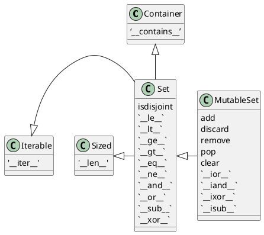
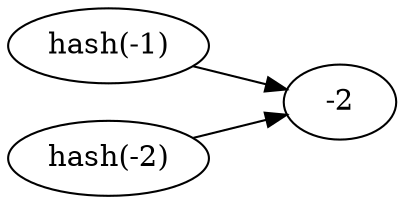

---
export_on_save:
 html: true
---

@import "/blog_head.md"

# 流畅的 Python

## 第一章 Python数据模型

不管在上面框架下写程序，都会花费大量的时间去实现那些被框架本身所调用的方法。Python碰到特殊句法时，会使用特殊方法去激活一些基本的对象操作。这些特殊的方法以两个下划线开头，两个下划线结尾(例如：`__getitem__`)。比如，`obj[key]`的背后是`__getitem__`方法，为了能获得 `my_collection[key]` 的值，解释器实际上会调用 `my_collection.__getitem__(key)`。

这些特殊方法名能够让你自己的对象实现和支持一下的语言框架，并与之交互：
- 迭代器
- 集合类
- 访问属性
- 运算符重载
- 函数和方法的调用
- 对象的创建和销毁
- 字符串的表现形式和格式化
- 管理上下文(with 块)

> 魔术方法(magic method) 是特殊方法的昵称，也称为双下方法(dunder method)。

### 一摞Python风格的纸牌
```python {cmd id="20180414082902"}
from collections import namedtuple

Card = namedtuple('Card', ['rank', 'suit'])

class FrenchDeck:
    ranks = [str(n) for n in range(2,11)] + list('JQKA')
    suits = 'spades diamonds clubs hearts'.split()

    def __init__(self):
        self._cards = [Card(rank, suit) for rank in self.ranks 
            for suit in self.suits]

    def __len__(self):
        return len(self._cards)

    def __getitem__(self, position):
        return self._cards[position]

deck = FrenchDeck()
```
自 Python2.6 开始，namedtuple 就被加入到 Python 中，用以构建只有少数属性，没有方法的对象，比如数据库条目等。
```python {cmd continue="20180414082902"}
# 调用 __len__ 方法
print(len(deck))
# 调用 __getitem__ 方法
print(deck[-1])
print(deck[2])
```

现在可以体会到通过特殊方法利用Python数据模型的两个好处了：
1. 作为你的类的用户，他们不必去记住标准操作的各式名称(如是：`length` 还是 `size`)；
2. 可以更方便地利用 Python 库，而不用重复发明轮子；

因为 `__getitem__` 方法把 [] 操作交给了 `self._cards` 列表，所以我们的 `deck` 实例也支持切片操作(slicing)

切片操作：
```python
# 获取最后 4 张牌
>>> deck[-4:]
```
```
[Card(rank='A', suit='spades'),
 Card(rank='A', suit='diamonds'),
 Card(rank='A', suit='clubs'),
 Card(rank='A', suit='hearts')]
```

另外，仅仅实现了 `__getitem__` 方法，这一摞牌就变成可迭代的了：
```python 
for i in deck:
    print(i)
```
```
Card(rank='2', suit='spades')
Card(rank='2', suit='diamonds')
Card(rank='2', suit='clubs')
... ...
```
方向迭代也可以：
```python
for i in reversed(deck):
    print(i)
```
```
Card(rank='A', suit='hearts')
Card(rank='A', suit='clubs')
Card(rank='A', suit='diamonds')
Card(rank='A', suit='spades')
... ...
```

迭代通常是隐式的，譬如说一个集合类型没有实现 `__contains__`，那么 in 运算符就会按顺序做一次迭代搜索。

通过实现 `__len__` 和 `__getitem__` 这两个特殊方法，FrenchDeck 就跟一个 Python 自有的序列数据类型一样，可以体现出 Python 的核心语言特性（例如迭代和切片）。同时这个类还可以用于标准库中，诸如：`random.choice`、`reverted`和`sorted`这些函数。

### 如何使用特殊方法

需要明确：特殊方法的存在是为了被 Python 解释器调用的，你并不需要调用它们。也就是说没有 `my_object.__len__()` 这种写法，而应该使用 `len(my_object)`。

很多时候，特殊方法的调用时隐式的，比如 `for i in x:` 这个语句，背后其实用的是 `iter(x)`，而这个函数的背后是 `x.__iter__()` 方法。当然，前提是这个方法在 x 中被实现了。

通常你的代码无需直接使用特殊方法。除非有大量的元编程存在，直接调用特殊方法的频率应该远远低于你去实现它们的次数。唯一的例外是 `__init__` 方法，你的代码中可能经常会用到它，目的是在你自己的子类 `__init__` 方法中调用超类的构造器。

**通过内置的函数 len、 iter、str、等等来使用特殊方法是最好的选择。**

不要自己想当然地添加特殊方法，比如 `__foo__`，因为虽然现在这个名字没有被 Python 内部使用，以后就不一定了。

#### 模拟数值类型

利用特殊方法，可以让自定义对象通过加号 `+` 进行运算。
```python
import math
class Vector():
    def __init__(self, x=0, y=0):
        self.x = x
        self.y = y
    
    def __repr__(self):
        return f'Vector({self.x}, {self.y})'
    
    def __str__(self):
        return f'({self.x}, {self.y})'

    def __add__(self, other):
        x = self.x + other.x
        y = self.y + other.y
        return Vector(x, y)
    
    def __abs__(self):
        return math.hypot(self.x, self.y)

    def __mul__(self, scalar):
        return Vector(self.x*scalar, self.y*scalar)

    def __bool__(self):
        return bool(abs(self))

    def __truediv__(self, scalar):
        return Vector(self.x/scalar, self.y/scalar)
```

#### __repr__

Python 有一个内置的函数叫 repr，它能把一个对象用字符串的形式表达出来以便辨认，这就是 “字符串表示形式”。`repr` 通过 `__repr__` 这个特殊方法来得到一个对象的字符串表示形式。如果没有实现 `__repr__`，当我们在控制台中打印一个向量的实例时，得到的字符串可能是：`<__main__.Vector at 0x103c4e7f0>`。

交互式控制台和调试程序(debugger)用 repr 函数来获取字符串表示形式。

如果你只想实现 `__repr__` 和 `__str__` 两个特殊方法中的一个，`__repr__` 是更好的选择，因为如果一个对象没有 `__str__` 函数，而 Python 又需要调用他的时候，解释器会用 `__repr__` 来替代。

#### 自定义的布尔值

尽管 Python 中有 bool 类型，但实际上如何对象都可以用于需要布尔值的上下文中（bool()、if、while、and、or、not 等）。为了判断一个值 x 为真还是假，Python会调用 bool(x)，这个函数只能返回 True 或 False。

默认情况下，我们自己定义的类的实例总是被认为是真的，除非这个类对 `__bool__` 或者 `__len__` 函数有自己的实现。`bool(x)` 的背后是调用 `x.__bool__()` 的结果，如果不存在 `__bool__` 方法，那么`bool(x)` 会尝试调用 `x.__len__()`，若返回0，则 bool 会返回False，否则返回True。

### 特殊方法总结

表1-1：跟运算符无关的特殊方法
|类别|方法名|
|---|---|
|字符串/字节序列表示形式|`__repr__` `__str__` `__format__` `__bytes__`|
|数值转换|`__abs__` `__bool__` `__complex__` `__int__` `__float__` `__hash__` `__index__`|
|集合模拟|`__len__` `__getitem__` `__setitem__` <br>`__delitem__` `__contains__`|
|迭代枚举|`__iter__` `__reversed__` `__next__`|
|可调用模拟|`__call__`|
|上下文管理|`__enter__` `__exit__`|
|实例创建和销毁|`__new__` `__init__` `__del__`|
|属性管理|`__getattr__` `__getattribute__` <br>`__setattr__` `__delattr__` `__dir__`|
|属性描述符|`__get__` `__set__` `__delete__`|
|跟类相关的服务|`__prepare__` `__instancecheck__` `__subclasscheck`|


表1-2：跟运算符相关的特殊方法
|类别|方法名和对应的运算符|
|---|---|
|一元运算符|`__neg__`(-) `__pos__`(+) `__abs__`|
|比较运算符|`__eq__` `__gt__` `__lt__` `__ge__` <br>`__le__` `__ne__`|
|算术运算符|`__add__` `__sub__` `__mul__` `__truediv__` <br> `__floordiv__` `__mod__` `__divmod__` `__pow__``__round__`|
|反向算术运算符|`__radd__` `__rsub__` `__rmul__` `__rtruediv__` `__rfloordiv__` `__rmod__` `__rdivmod__` `__rpow__`|
|增量赋值算术运算|`__iadd__` `__isub__` `__imul__` `__itruediv__` `__ifloordiv__` `__imod__` `__ipow__`|
|位运算符|`__invert__`~  `__lshift__`<<  `__rshift__`>>  `__and__`&  `__or__`\|  `__xor__`^|
|反向位运算符|`__rlshfit__` `__rrshift__` `__rand__` `__ror__` `__rxor__`|
|增量赋值位运算符|`__ilshift__` `__irshift__` `__iand__` `__ior__` `__ixor__`|

## 序列构成的数组

### 内置序列类型预览

- 容器序列：list、tuple、collections.deque 这些序列能存放不同类型的数据；
- 扁平序列：str、bytes、bytearray、memoryview 和 array.array，这类序列只能容纳一种类型。

容器序列存放的是它们所包含的任意类型的对象的引用，而扁平序列里存放的是值而不是引用。换句话说，扁平序列其实是一段连续的内存空间，由此可见扁平序列其实更加紧凑，但是它里面只能存放诸如字符、字节和数值这种基础类型。

序列还能按能否被修改进行分类：
- 可变序列：list、collections.deque、bytearray、array.array、memoryview。
- 不可变序列：tuple、str、bytes。

列表推导是一种构建列表的方法，它异常强大，然而由于相关的语句比较晦涩，人们往往不愿意去用它。

### 列表推导和生成器表达式

类型推导是构建列表(list)的快捷方式，而生成器列表则可以用于创建任何类型的序列。

```python
# 创建一个特殊的字符串
print(''.join(chr(i) for i in [36,162,163,165,8364,164]))
```
```
$¢£¥€¤
```
将一个字符串变成 Unicode 码位的列表：
```python
symbols = '$¢£¥€¤'
codes = []
for i in symbols:
    codes.append(ord(i))
codes
```
```
[36, 162, 163, 165, 8364, 164]
```
使用列表解析的方法：
```python
symbols = '$¢£¥€¤'
codes = [ord(i) for i in symbols]
codes
```
```
[36, 162, 163, 165, 8364, 164]
```
输出相同。

列表推导可能被滥用。以前看过有的Python代码用列表推导来重复获取一个函数的副作用。
```python {cmd}
funcs = [lambda x:i+x for i in [2,4,6]]
print(funcs[0](0))
print(funcs[1](0))
print(funcs[2](0))
```
上述的代码可以改良为：
```python {cmd}
funcs = [lambda x,i=i:i+x for i in [2,4,6]]
print(funcs[0](0))
print(funcs[1](0))
print(funcs[2](0))
```
通常的原则是：只用列表推导来创建新的列表，并且尽量保持简短。如果列表推导的代码超过两行，你可能就要考虑是不是得用for循环来重写了。

**语法提示**：Python 会忽略代码中的 []、{}、和 () 中的换行，因此，如果你的代码中有多行的列表、列表推导、生成器表达式、字典这一类的，可以省略不太好看的续行符 `\`。

在 Python2.x 中，列表推导中 for 关键字会破坏上下文，如：
```python
Python 2.7.10 (default, Oct  6 2017, 22:29:07) 
[GCC 4.2.1 Compatible Apple LLVM 9.0.0 (clang-900.0.31)] on darwin
Type "help", "copyright", "credits" or "license" for more information.
>>> x = 'my precious'
>>> dummy = [x for x in 'ABC']
>>> x
'C'
```
同理，在Pytho2.x中，for循环也会破坏 context：
```python
>>> x = 'my precious'
>>> dummy = []
>>> for x in 'ABC':
...     dummy.append(x)
... 
>>> x
'C'
```

而在 Python3中，使用 for 循环还是会破坏 context，而使用列表推导就不会出现这种情况：
```python
Python 3.6.3 (v3.6.3:2c5fed86e0, Oct  3 2017, 00:32:08) 
[GCC 4.2.1 (Apple Inc. build 5666) (dot 3)] on darwin
Type "help", "copyright", "credits" or "license" for more information.
>>> x = 'my precious'
>>> dumps = [x for x in 'ABC']
>>> x
'my precious'
>>> dumps = []
>>> for x in 'ABC':
...     dumps.append(x)
... 
>>> x
'C'
```

Python3中，列表推导、生成器表达式 以及同它们很相似的集合推导、字典推导都有自己的局部作用域，就像函数似的表达式内部的变量和赋值只在局部起作用，表达式的上下文中的同名变量可以被正常引用，局部变量不会影响到它们。

#### 列表推导同 map、filter的比较

filter 和 map 合起来能做的事情，列表推导也能做，而且不需要借助难以理解和阅读的 lambda 表达式。而且效率并不一定比它们差，所以只需要记 列表推导好了。

#### 笛卡尔积

用列表推导可以生成两个或两个以上的可迭代类型的笛卡尔积。笛卡尔积是一个列表，列表中的元素是由输入的迭代类型的元素对构成的元组，因此笛卡尔积列表的长度等于输入变量的长度的乘积：
```python
>>> colors = ['block', 'white']
>>> sizes = ['S', 'M', 'L']
>>> tshirts = [(s, c) for s in sizes for c in colors]
>>> tshirts
[('S', 'block'), ('S', 'white'), ('M', 'block'), 
('M', 'white'), ('L', 'block'), ('L', 'white')]
```

#### 生成器表达式

虽然也可以用列表推导来初始化元组、数组或其他序列类型，但是生成器表达式是更好的选择。这是因为生成器表达式背后遵循了迭代器协议，可以逐个地产生元素，而不是先建立一个完整的列表，然后把这个列表传递到某个构造函数中。

生成器更加节省内存。
```python
>>> symbols = '$¢£¥€¤'
>>> tuple(ord(s) for s in symbols)
(36, 162, 163, 165, 8364, 164)
```
如果生成器表达式是一个函数调用过程中的唯一参数，那么不需要额外用括号将它包围起来。如果不唯一，那么要包围。

如果用生成器，生成器表达式会在每次for循环运行时才生成一个组合，不会再用大量内存空间：
```python{cmd}
sizes = ['S', 'M', 'L']
colors = ['block', 'white']
for tshirt in (f'{s} {c}' for s in sizes 
                          for c in colors):
    print(tshirt)
```

### 元组不仅仅是不可变的列表

有些 Python 入门教程将元组称为是 “不可变列表”，然而这并没有完全概括元组的特点。

除了用作不可变的列表之外，它还可以用于没有字段名的记录。

#### 元组-记录

元组其实是对数据的记录：元组中的每个元素都存放了记录中的一个字段的数据，外加这个字段的位置，正是这个位置信息给数据赋予了意义。

如果只把元组理解为不可变的列表，那其他信息——它所含有的元素的总数和它们的位置似乎就变得可有可无了。但是如果把元组动作一些字段的集合，那么数量和位置信息就变得非常重要。

元组拆包：
```python {cmd}
a = ['black', 'white', 'yellow', 'red', 'green', 'blue']
# 获取第三、四个元素，忽略其他的
_,_,c,d,*rest = a
print(c,d)
# 获取最后两个元素
*head,c,d = a
print(c,d)
```

元组的拆包是可以嵌套的：
```python {cmd}
vehicles = [
    (87, 'BWM', (35.3, 143.6)),
    (98, 'Ford', (33.7, -120.7)),
    (102, 'Porsche', (23.9, 117.2))
]
for speed, brand, (lantitude,longitude) in vehicles:
    if longitude > 0:
        print(f'{brand} : ({lantitude}, '
        f'{ longitude}), {speed}km/s')
```

#### 具名元组

`collections.namedtuple` 是一个工厂函数。

用 namedtuple 构建的类的实例所消耗的内存跟元组是一样的，因为字段名被存在对应的类里面。这个实例跟普通的对象实例比起来也要小一些，因为 Python 不会用 `__dict__` 来存放这些实例的属性。

```python {cmd id="20180415214553"}
from collections import namedtuple
City = namedtuple('City', 'name population coordinates')
beijin = City('Beijin', 2170, (116, 40))
```
```python {cmd continue}
print(beijin.population)
print(beijin.coordinates)
print(beijin[0])
```
除了从普通元组继承的属性外，还有 `_fields`类属性、`_make(iterable)`类方法和实例方法`_asdict()`:
```python {cmd continue="20180415214553"}
print(City._fields)
```

#### tuple没有的方法

进行修改的方法：+=、-=、*=、append、`__delitem__`、clear、extend、insert、remove、pop、reverse

没意义的方法：copy（因为元组不能修改，没必要深度拷贝）

### 切片

在 Python 中，像list、tuple和str这类序列类型都支持切片操作，但是实际上切片化操作比人们所想象的要强大得多。

#### 为什么切片和区间会忽略最后一个元素

在切片和区间操作中不包含区间范围的最后一个元素是Python的风格，这个习惯符合 Python、C和其他语言中以0作为其实下标的传统，好处：
- range(3) 和 my_list[:3] 都返回3个元素
- 方便计算长度，my_list[start:stop] 共stop-start个元素
- 便于分割：my_list[:x] 和 my_list[x:]不会重合

Python 解释器对切片操作的理解：
`s[a:b:c]` 的形式对 s 在 a 和 b 之间以 c 为间隔取值。c 的值可以为负，表示方向取值。

#### 多维切片和省略

[] 运算符还可以使用以逗号分开的多个索引或者是切片，外部库 NumPy 就是用到了这个特性，二维的 numpy.ndarray 就可以用 a[i,j] 这种形式来获取，抑或是 a[m:n, k:l] 的方式来得到二维切片。

**Python 内置的序列类型都是一维的，因此它们只支持单一的索引，成对出现的索引是没有用的。**

省略(ellipsis) 的正确书写方法是三个英语句号，在 NumPy 中，x[i,...] 就是 x[i,:,:,:]的缩写。

一个错误的嵌套列表使用方法：
```python
>>> weird_board = [['-']*3]*3
>>> weird_board
[['-', '-', '-'], ['-', '-', '-'], ['-', '-', '-']]
>>> weird_board[0][1] = 'o'
>>> weird_board
[['-', 'o', '-'], ['-', 'o', '-'], ['-', 'o', '-']]
```
正确的应该是：
```python
>>> normal_board = [['-']*3 for i in range(3)]
>>> normal_board
[['-', '-', '-'], ['-', '-', '-'], ['-', '-', '-']]
>>> normal_board[0][1] = 'o'
>>> normal_board
[['-', 'o', '-'], ['-', '-', '-'], ['-', '-', '-']]
```

### 序列的增量赋值

+= 背后的特殊方法是`__iadd__` ，但是如果一个类没有实现这个方法的话，Python就会退一步调用 `__add__`。

总的来说，可变序列一般都实现了 `__iadd__` 方法，因此 += 是就地加法，而不可变序列根本就不支持这个操作，所以会关联到新的变量上。

```python
>>> l = [1,2,3]
# id : return the identity of an object
>>> id(l)
4368634376
>>> l *= 2
>>> id(l)
4368634376
>>> t = (1,2,3)
>>> id(t)
4368618984
>>> t *= 2
>>> id(t)
4364255592
```
从上面的例子可以看出，可变序列的 id 在增量赋值时不会改变，不可变序列在增量赋值是会改变 id。

对不可变序列进行重复拼接的时候，效率很很低，因为每次都有一个新对象，而解释器需要把原来对象中的元素先复制到新的对象中，然后追加新的元素。【str 是个例外，效率也很快，毕竟对字符串的 += 操作也非常普遍】

一个 += 的谜题：
```python
>>> t = (1,2,[3,4])
>>> t[2] += [5,6]
Traceback (most recent call last):
  File "<stdin>", line 1, in <module>
TypeError: 'tuple' object does not support item assignment
>>> t
(1, 2, [3, 4, 5, 6])
```
在抛出异常的同时，居然实现了功能。

查看 `s[a] += b` 操作的字节码：
```python
>>> dis.dis('s[a]+=b')
  1           0 LOAD_NAME                0 (s)
              2 LOAD_NAME                1 (a)
              4 DUP_TOP_TWO
              6 BINARY_SUBSCR
              8 LOAD_NAME                2 (b)
             10 INPLACE_ADD
             12 ROT_THREE
             14 STORE_SUBSCR
             16 LOAD_CONST               0 (None)
             18 RETURN_VALUE

```
可以看出：在第 10 处，进行了增量赋值操作，在第 14 处对 s 进行赋值。而如果s第不可变序列，就会出错。

总结：
- 不要把可变对象放在元组中
- 增量赋值不是一个原子操作，它虽然抛出了异常，也实现了功能
- 查看 Python 的字节码并不难，对了解代码背后的运行机制非常有帮助

### list.sort 方法和内置函数 sorted

`list.sort` 方法会就地排序列表，也就是说不会把原列表复制一份。这也是这个方法的返回值是 None 的原因。

与 `list.sort` 相反的是内置函数 sorted，它会新建一个列表作为返回值。这个方法可以接受任何形式的可迭代对象作为参数，甚至包括不可变序列或生成器。而不管 sorted 接受的是怎样的参数，它最后都会返回一个列表。

不管是 list.sort 还是 sorted ，它都接受两个参数 *key* 和 *reverse*。

### 用 bisect 来管理已排序的序列

bisect 模块中包含两个主要函数，bisect 和 insort，两个函数都利用二分查找算法在有序序列中查找或插入元素。

- `bisect(haystack, needle)` : 在 haystack 中搜索 needle 的位置，该位置满足的条件是：把 needle 插入该位置后，haystack 仍然保持升序。也就是说：这个函数返回的位置前面的值，都小于或等于 needle 的值。其中 haystack 必须是有序序列。
```python
>>> import bisect
>>> l = [2,5,7]
>>> bisect.bisect(l,3)
1
>>> l.insert(1, 3)
>>> l
[2, 3, 5, 7]
>>> bisect.insort(l,4)
>>> l
[2, 3, 4, 5, 7]
```

### 当列表不是首选时

虽然列表既灵活又简单，但面对各种需求时，我们可能会有更好的选择，数组 `array` 的效率要高得多，因为数组在背后存的并不是 float 对象，而是数字的机器翻译，即字节表述。这一点就跟 C 语言中的数组一样。

再比如，若要频繁对序列进行先进先出的操作，`deque` 的速度回更快。

而 set 的包含操作（检查一个元素是否出现在一个集合中）效率很高。

#### 数组

如果我们需要一个只包含数字的列表，那么 array.array 比 list 更加高效，包括 `.pop` `.insert` `.extend`。另外，数组还提供了从文件读取和存入的更快的方法：`.fromfile` 和 `.tofile`。

Python 数组跟 C 语言数组一样精简，创建数组需要一个类型码，用于表示在底层的 C 语言中应该存放怎样的数据类型，比如 b 类型表示有符号字符（signed char），因此 `array('b')` 创建出的数组就只能存放一个字节大小的整数，范围从 -128~127，这样在序列很大的时候，我们能节省很多空间。

另外，一个快速序列化数字类型的方法是使用：`pickle` 模块。pickle.dump 处理发电数组的速度几乎跟 array.tofile 一样快。不过 `pickle` 可以处理几乎所有的内置函数字类型，包括数字、嵌套集合，甚至用户自定义的类。前提是这些类没有什么特别复杂的实现。

从 Python 3.4 开始，数组类型不在支持诸如 `list.sort()` 这种就地排序方法。要给数组排序的话，得用 sorted 函数新建一个数组。
```python
a = array.array(a.typecode, sorted(a))
```
要在不打乱次序的情况下为数组添加新的元素，可以用`bisect.insort`。

#### 内存视图

`memoryview` 是一个内置类，它能让用户在不复制内容的情况下操作同一个数组的不同切片。`memoryview` 的概念受到了 NumPy 的启发。

> memoryview 其实是泛化和去数学化的NumPy数组。它让你在不需要复制内容的前提下，在数据结构之间共享内存。其中，数据结构可以是任何形式，比如 PIL 图片、SQLite数据库 和 NumPy 的数组，等等。这个功能在处理大型数据集合的时候非常重要。

`memoryview.cast` 和 C语言中的类型转换非常类似。memoryview.cast 会把同一块内存里的内容打包成一个全新的 `memoryview` 对象。
```python
>>> numbers = array('h',[-2,-1,0,1,2])
>>> memv = memoryview(numbers)
>>> memv[0]
-2
>>> len(memv)
5
>>> memv_oct = memv.cast('B')
>>> list(memv_oct)
[254, 255, 255, 255, 0, 0, 1, 0, 2, 0]
>>> memv_oct[5] = 4
>>> numbers
array('h', [-2, -1, 1024, 1, 2])
```

如果利用数组来做高级的数字处理是你的日常工作，那么 NumPy 和 SciPy 应该是你的常用武器。

**NumPy 和 SciPy**

凭借着 NumPy 和 SciPy 提供的高阶数组和矩阵操作，Python 成为了科学计算应用的主流语言。

**双向列表**
`list` 利用 append 和 pop 可以模拟先进后出的堆栈操作。也可以通过 append 和 pop(0) 来模拟队列操作，不过删除列表第一个元素（或者是在第一个元素之前添加一个元素）之类的操作都是很耗时的，因为这些操作会牵扯到移动列表中的所有元素。

`collections.deque` 类是一个线程安全、可以快速从两端添加或者删除元素的数据类型。而如果想要有一种数据类型存放 “最近使用到的几个元素”，deque也是一个很好的选择。**新建一个双向队列的时候可以指定队列的大小，如果队列满员，还可以从反向端删除过期的元素，然后在尾端添加新的元素。**

`deque([iterable[, maxlen]]) --> deque object`，maxlen 是一个可选参数，代表这个队列可以容纳的元素数量，一旦设定，这个属性就不能修改了。

append 和 popleft 都是原子操作，也就是说 deque 可以在多线程中安全地当先进先出的栈使用，而不需要担心资源锁的问题。

除了 deque 之外，还有一些其他的Python标准库也有对队列的实现。

queue：提供了同步(线程安全)类Queue、LifoQueue和PriorityQueue，不同的线程可以利用这些数据类型来交换信息。这3个类的构造方法都有一个可选参数 maxsize，它接受正整数作为输入值，用来限定队列的大小。但是在满员的时候，这些类不会扔掉就的元素来腾出位置，而是会被锁住，直到另外的线程移除了某个元素而腾出位置。这一特性让这些类很适合用来控制活跃线程的数量。

asyncio：Python3.4 新提供的包，里面有 Queue、LifoQueue、PriorityQueue 和 JoinableQueue，这些类受到 queue 和 multiprocessing 模块的影响，但是为异步编程里的任务管理提供了专门的便利。

注意：list 中最好存放同类型的数据，至少是存放能够相互比较的数据，否则 sort 和 sorted 都不能使用了。而 tuple 并经常用来存放不同类型的元素，这也符合它的本质，元组就是用作存放彼此之间没有关系的数据的记录，也并不需要进行比较。

**key 参数很妙** ：list.sort/sorted/max/min函数的key参数使一个很棒的设计，其他语言里的排序函数需要用户提供一个接受两个参数的比较函数作为参数，比如 Python2 中的 cmp(a,b) 。用 key 参数能把事情变得简单且高效，简单是因为只需要提供一个单参数函数来提取或计算一个值作为比较大小的标准即可，而 Python2 的这种设计需要用户写一个返回值是 -1、0或1的双参数函数。说它高效，是因为在每个元素上，key 函数只会被调用一次，而双参数比较函数则在每次两两比较的时候都会被调用。诚然，在排序的时候，Python总会比较两个键 key，但是那一阶段的计算会发生在C语言那一层，这样会比调用用户自定义的Python比较函数更快。

另外，key参数也能让你对一个混有数字字符和数值的列表进行排序：
```python
>>> a = ['12',1,9,'8',3,'15',6]
>>> sorted(a, key=int)
[1, 3, 6, '8', 9, '12', '15']
```

sorted 和 list.sort 背后的排序算法是 Timsort，它是一种自适应算法，会根据原始数据的顺序特点交替使用插入排序和归并排序，以达到最佳效率。这样的算法被证明是很有效的，因为来自真实世界中的数据通常是有一定的顺序特点的。

## 字典和集合

> 字典这个数据结构活跃在所有 Python 程序的背后，即使你的编码中没有直接用到它。——A.M. Kuchling

dict 类型不但在各种程序中广泛使用，**它也是 Python语言的基石**。模型的命名空间、实例属性和函数的关键字参数中都可以看到字典的身影，跟它有关的内置函数都在 `__builtins__.__dict__`模块中。

正是因为字典至关重要，Python 对它的实现做了高度优化，而散列表则是字典类型性能出众的根本原因。

要想进一步理解集合和字典，首先要理解散列表的原理。

标准库中的所有映射类型都是利用 dict 来实现的，因此它们有一个共同的限制，即只有可散列的数据类型才能用作这些映射里的键。

什么是可散列的？
> 如果一个对象是可散列的，那么这个对象的生命周期中，它的散列值是不变的，而且这个对象需要实现 `__hash__()` 方法。另外，可散列对象还要有 `__qe__()` 方法，这样才能跟其他键作比较。如果两个散列对象是相等的，那么它们的散列值一定是一样的。

原子不可变数据类型(str, bytes, 数值类型)都是可散列的，frozenset 也是可散列的。元组的话，只有当一个元组包含的所有元素都是可散列类型的情况下，它才是可散列的：
```python
>>> tt = (1,2,(30,40))
>>> hash(tt)
8027212646858338501
>>> t1=(1,2,[30,40])
>>> hash(t1)
Traceback (most recent call last):
  File "<stdin>", line 1, in <module>
TypeError: unhashable type: 'list'
>>> t1 = (1,2,frozenset([30,40]))
>>> hash(t1)
-4118419923444501110
```
字典定义了很多的构造方法：
```python
>>> a = {'one':1, 'two':2, 'three':3}
>>> b = dict(one=1, two=2, three=3)
>>> c = dict(zip(['one','two','three'],[1,2,3]))
>>> d = dict([('one',1),('two',2),('three',3)])
>>> e = dict({'one':1, 'two':2, 'three':3})
```
除了这些字面句法和灵活的构造方法外，字典推导(dict comprehension)也可以用来创建新的dict。

### 字典推导

自 Python2.7 以来，列表推导和生成器表达式的概念就移植到了字典上，从而有了字典推导。
```python
>>> pairs = [('one',1),('two',2),('three',3),
...     ('four',4),('five',5),('six',6)]
>>> d = {k:v for k,v in pairs}
>>> d
{'one': 1, 'two': 2, 'three': 3, 'four': 4, 'five': 5, 'six': 6}
>>> d = {k:v for k,v in pairs if v%2==0}
>>> d
{'two': 2, 'four': 4, 'six': 6}
```

### 常见的映射方法

表3-1：`dict`、`collections.defaultdict` 和 `collections.OrderedDict`这三种映射类型的方法列表：
||dict|defaultdict|OrderedDict||
|---|---|---|---|---|
|`d.clear()`|*|*|*|移除所有元素|
|`d.__contains__(k)`|*|*|*|检查k是否在d中|
|`d.copy()`|*|*|*|浅复制|
|`d.__copy__()`||*||用于支持 copy.copy|
|`d.default_factory`||*||默认值|
|`d.__delitem(k)`|*|*|*|del d[k],移除键为k的元素|
|`d.fromkeys(it,[initial])`|*|*|*||
|`d.get(k,[default])`|*|*|*||
|`d.__getitem__(k)`|*|*|*|获取d[k]|
|`d.items()`|*|*|*|返回d中所有键值对|
|`d.__iter__()`|*|*|*|获取键的迭代器|
|`d.keys()`|*|*|*|获取所有的键|
|`d.__len__()`|*|*|*|len(d)|
|`d.__missing__(k)`||*||d[k]找不到k时被调用|
|`d.move_to_end(k,[last])`|||*|将k的元素移到最靠后或最靠前位置|
|`d.pop(k,[default])`|*|*|*||
|`d.popitem()`|*|*|*|随机弹出一个键值对|
|`d.__reversed__()`|||*|对键进行倒叙排列|
|`d.setdefault(k,[default])`|*|*|*||
|`d.__setitem__(k,v)`|*|*|*|d[k]=v|
|`d.update(m,[**kargs])`|*|*|*|用m中内容更新d对应条目|
|`d.values()`|*|*|*|返回字典中的所有值|

**鸭子类型(duck typing)**：一种动态类型的风格，在这种风格中，一个对象有效的语义不是由继承自特定的类或特定的接口决定，而是由 *当前方法和属性的集合* 决定。

鸭子测试可以表述为：当看到一只鸟走起来像鸭子、游泳像鸭子、叫起来也像鸭子，那这只鸟就可以被称为鸭子。

### 映射的弹性键查询

有时候为了方便起见，就算某个键在映射里不存在，我们也洗完通过这个件读取值得时候能得到一个默认值，三种方式：
- `setdefault`
- `defaultdict`
- 自定义 `dict` 子类

#### defaultdict 处理找不到的键的一个选择

在用户创建 `defaultdict` 对象的时候，就需要给它配置一个为找不到的键创造默认值的方法。

具体而言，在实例化一个 defaultdict 的时候，就需要给它配置一个为找不到的键创造默认值的方法。

**`defaultdict` 中的 `default_factory` 只会在 `__getitem__`中被调用，其他地方不会发挥作用，比如 dd 是一个 `defaultdict`，k 是个找不到的键，dd[k] 会调用 `default_factory`，不过 dd.get(k) 会返回 None。**

```python
>>> dd = defaultdict(list)
>>> dd.get('a')
>>> dd['a']
[]
```
所有者一切背后的功臣其实是特殊方法 `__missing__`，它会在`defaultdict`遇到找不到的键的时候调用`default_factory`,而实际这个特性是所有映射类型都可以选择去支持的。
```python {cmd}
class MyDict(dict):
    def __init__(self, default_factory):
        super().__init__()
        self.default_factory = default_factory
    def __missing__(self, k):
        self[k] = self.default_factory()
        return self[k]

md = MyDict(list)
md['a'].append(1)
print(md)
```

> `__missing__` 方法只会被 `__getitem__` 调用(比如在表达式 d[k] 中)。提供 `__missing__` 方法对 get 或 `__contains__` 这些方法的使用没有影响。
```python
class StrKeyDict0(dict):
    def __missing__(self, k):
        if isinstance(k, str):
            raise KeyError(k)
        return self[str(k)]
    def get(self, k, default=None):
        try:
            return self[k]
        except KeyError:
            return default
    def __contains__(self, k):
        return k in self.keys() or str(k) in self.keys()
d = StrKeyDict0([('2','two'),('4','four')])
d['2']
d[4]
```
> 如果要自定义一个映射类型，更合适的策略是继承 `collection.UserDict`类。

### 字典的变种

`collections.OrderedDict` : 这个类型在添加键的时候会被保持顺序，因此键的迭代次序总是一致；

`collecton.ChainMap` : 该类型可以容纳数个不同的映射对象，然后在进行键查找操作的时候，这些对象会被当做一个整体被逐个查找，找到键被找到为止。
```python
>>> d1 = {'one': 1, 'two': 2, 'three': 3, 'four': 4}
>>> d2 = {'eleven':11, 'twelve':12}
>>> from collections import ChainMap
>>> d = ChainMap(d1,d2)
>>> 'one' in d
True
>>> 'eleven' in d
True
```

`collections.Counter`：这个映射类型会给键准备一个整数计数器，每次更新一个键的时候就会增加这个计数器，所以这个类型可用于给可散列列表对象技术，或者是当成多重集来用——多重集就是集合中的元素可以出现不止一次：
- 计数/多重集合 作用：
```python
>>> Counter('abccabacd')
Counter({'a': 3, 'c': 3, 'b': 2, 'd': 1})
>>> Counter([1,2,2,3,3,1,2,3,6,5,6])
Counter({2: 3, 3: 3, 1: 2, 6: 2, 5: 1})
```
- `+`/`-` 运算
```python
>>> c1 = Counter('abbcbca')
>>> c2 = Counter('bccdb')
>>> c1
Counter({'b': 3, 'a': 2, 'c': 2})
>>> c2
Counter({'b': 2, 'c': 2, 'd': 1})
>>> c1 + c2
Counter({'b': 5, 'c': 4, 'a': 2, 'd': 1})
>>> c1 - c2
Counter({'a': 2, 'b': 1})
```

- `most_common(n)`计算最频繁的 n 个元素
```python
>>> c = Counter('aabdababbabdcddeabd')
>>> c
Counter({'a': 6, 'b': 6, 'd': 5, 'c': 1, 'e': 1})
>>> c.most_common(2)
[('a', 6), ('b', 6)]
>>> c.most_common(1)
[('a', 6)]
```

`collection.UserDict` ：这个类单纯地将标准 dict 用纯Python又实现了一遍，跟 OrderedDict、ChainMap、Counter这些开箱机用的类型不同，UserDict是让用户继承写子类的。

### 子类化 UserDict

UserDict 不是 dict 的子类，但是 UserDict 有个叫 data 的属性，是 dict 实例，这个属性实际上就是 UserDict 最终存储数据的地方。这样做的好处主要是：`UserDict` 的子类能够在实现 `__setitem__` 的时候避免不必要的递归，也可以让 `__contains__` 中的代码更加简洁。

因为 UserDict 继承的是 MutableMapping，所以自定义的`StrKeyDict`中剩下的那些映射方法都是从 UserDict、MutableMapping和Mapping这些超类中继承而来的。Mapping类虽然是一个抽象基类（ABC)，但它却提供了好几个实用的方法。
```python
>>> class StrKeyDict0(UserDict):                          
...     def __missing__(self, k):
...         if isinstance(k, str):
...             raise KeyError(k)
...         return self[str(k)]
...     def __setitem__(self, key, item):
...         self.data[str(key)] = item 
...     def __contains__(self, k):    
...         return str(k) in self.data
... 
>>> d = StrKeyDict0([('2','two'),('4','four'),('1',None)])
>>> d[3] = 'three'
>>> 1 in d
True
>>> 5 in d
False
>>> d
{'2': 'two', '4': 'four', '1': None, '3': 'three'}
# 继承自 MutableMapping 的 update 方法
>>> d.update([(5,'five'),(6,'six')])
>>> d.update({7:'seven'})
>>> d
{'2': 'two', '4': 'four', '1': None, '3': 'three', '5': 'five', '6': 'six', '7': 'seven'}
# 继承自 Mapping 的 get 方法
>>> d.get(10,'N/A')
'N/A'
```

### 不可变映射类型

标准库中的所有映射类型都是可变的。

通过 `MappingProxyType` 可以变相实现只读：
```python
from types import MappingProxyType
>>> d = {1:'A'}
>>> d_proxy = MappingProxyType(d)
>>> d_proxy
mappingproxy({1: 'A'})
>>> d_proxy[1]
'A'
>>> d_proxy[2] = 'x'
Traceback (most recent call last):
  File "<stdin>", line 1, in <module>
TypeError: 'mappingproxy' object does not support item assignment
>>> d_proxy[1] = 'B'
Traceback (most recent call last):
  File "<stdin>", line 1, in <module>
TypeError: 'mappingproxy' object does not support item assignment
# d_proxy 是动态的，对 d 所做的任何改动都会反馈到 d_proxy 上
>>> d[2] = 'B'
>>> d_proxy
mappingproxy({1: 'A', 2: 'B'})
>>> d_proxy[2]
'B'
```
### 集合论

集合的本质是许多唯一对象的聚集，因此，集合可以用于去重：
```python
>>> l = ['spam','spam','eggs','spam']
>>> set(l)
{'spam', 'eggs'}
>>> list(set(l))
['spam', 'eggs']
```

set 和它不可变的姐妹类型 frozenset 直到 Python2.3 才首次以模块的形式出现，在 Python2.7 中它们升级为built-in类型。

集合中的元素必须是可散列的，set 类型本身是不可散列的，但是 fronzeset 可以。因此可以创建一个包含不同 frozenset 的 set。

集合的运算：a | b (a和b的并集)，a & b (a和b的交集)，a - b (a和b的差集)，a ^ b (a和b的对称差)。

代码 `{1,2,3}` 这种字面量句法相比于构造方法`set([1,2,3])`要更快且更易读：
```python
>>> from dis import dis
>>> dis('{1}')
  1           0 LOAD_CONST               0 (1)
              2 BUILD_SET                1
              4 RETURN_VALUE
>>> dis('set([1])')
  1           0 LOAD_NAME                0 (set)
              2 LOAD_CONST               0 (1)
              4 BUILD_LIST               1
              6 CALL_FUNCTION            1
              8 RETURN_VALUE
```

由于 Python 中没有针对 frozenset 的特殊字面量句法，我们智能常用构造方法：
```python
>>> frozenset(range(5))
frozenset({0, 1, 2, 3, 4})
```

#### 集合推导

Python2.7 带来了集合推导（set comprehensions）和之前的字典推导。新建一个Latin-1 字符集合，该集合中的每个字符的 Unicode 名字里都有 'SIGN' 这个单词：
```python
>>> {chr(i) for i in range(32,256) if 'SIGN' in name(chr(i),'')}
{'±', '$', '§', '¢', '°', '¬', '£', '>', '×', '÷', '%', 
'+', '¥', '¶', 'µ', '#', '<', '¤', '®', '=', '©'}
```

备注：可以使用 `in` 判断某个字符串是否有某种类型的子字符串，而不用正则表达式：
```python
>>> s = "apple banana"
>>> 'na' in s
True
>>> 'aa' in s
False
```

#### 集合的操作



相求4个聚合类型 a、b、c、d的并集，可以用 `a.union(b,c,d)`，其中 a 必须是 set，b、c、d可以是如何类型的可迭代对象：
```python
>>> def f():
...     m = 0
...     while m < 3:
...         yield m
...         m += 1
... 
>>> a = {5}
>>> b = f()
>>> c = 'xyz'
>>> d = {10,'w'}
>>> a.union(b,c,d)
{0, 1, 2, 'x', 'z', 5, 10, 'y', 'w'}
```

下面，我们会继续讨论字典和集合类型背后的实现。

### dict 和 set 的背后

5 个问题：
1. Python 中的 dict 和 set 的效率有多高？
1. 为什么它们是无序的？
1. 为什么不是所有的Python对象都可以当做 dict 的键或者 set 里的元素？
1. 为什么 dict 的键和 set 元素的顺序是根据它们被添加的次序而定的？为什么映射对象的生命周期中，这个顺序并不是一成不变的？
1. 为什么不应该在迭代循环 dict 或 set 的同时往里面添加元素？

#### 一个关于效率的实验

所有的 Python 程序员都从经验中得出结论，认为字典和集合的速度是非常快的。接下来我们要通过可控的实验来验证这一点。

为了对比容器的大小对 dict、set 或 list 的 in 元素运算符效率的影响，先创建一个有 1000万个双精度浮点数的数组，名叫 haystack。另外还有一个包含 1000 个浮点数的 needles 数组。 从其中 500 个数字是从 haystack 中跳出的，另外500个肯定不在 haystack 中。

作为 dict 测试的基准，用 dict.fromkeys() 来建立一个含有 1000 个浮点数的名叫 haystack 的字典，并用 timeit 模块测试：
实验设备：Python 3.6，MacBook Pro 13， Core i5
|haystack<br>长度|增长<br>系数|dict|增长<br>系数|集合|增长<br>系数|集合<br>交集|增长<br>系数|队列|增长<br>系数|
|---|---|---|---|---|---|---|---|---|---|
|1000|1×|70.5 μs|1.0x|74.9 µs|1.0x|19.6 μs|1.0x|6.54 ms|1.0x|
|10000|10×|84.6 μs|1.2x|80.5 µs|1.08x|25.1 µs|1.28x|68.7 ms|10.5x|
|100000|100×|91.5 μs|1.3x|83.3 µs|1.15x|28.4 µs|1.45x|882 ms|134x|
|1000000|1000×|114 μs|1.62x|91.7 µs|1.22x|32.1 µs|1.64x|31.2 s|4771x|
|10000000|10000×|139 μs|1.97x|98.9 µs|1.32x|37.5 µs|1.91x|517s|79051x|

下面让我们看看字典和集合如此快的原因：对散列表内部结构的讨论。

#### 字典中的散列表

散列表其实是一个稀疏数组（总是有空白元素的数组称为稀疏数组）。在一部的数据结构教材中，散列表中的单元通常称为表元(bucket)。在dict散列表中，每个键值对都占用一个表元，每个表元有两个部分，一个是对键的引用。因为所有表元的大小一致，所以可以通过偏移量来读取某个表元。

因为 Python 会设法保证大概还有三分之一的表元是空的，所以在快到达这个阈值的时候，原有的散列表会被复制到一个更大的空间里面。

要把一个对象放入到散列表中，首先要计算这个元素的散列值。Python 中可以用 hash() 方法来做这件事情。

**01. 散列值和相等性**
内置的 `hash()` 方法可以用于所有的内置类型对象。如果自定义对象调用`hash()` 的话，实际上运行的是自定义的 `__hash__` 。如果两个对象在比较的时候是相等的，那它们的散列值必须相等，否则散列表就不能正常运行了。例如，如果1==1.0为True，那么hash(1)==hash(1.0)也必须为True。

**注意：hash函数并不是单射，即一个值有对应的一个的哈希值，但一个哈希值可能有多个值与之对应，这就产生了冲突。**

为了让散列值能够胜任散列表索引这一角色，它们必须在索引空间中尽量分散开来。这意味着在最理想的状况下，越是相似但不相等的对象，它们的散列值得差别应该越大。
```python {cmd}
import sys
MAX_BITS = len(format(sys.maxsize, 'b'))
print('%s-bit Python build' %(MAX_BITS+1))

def hash_diff(o1, o2):
    h1 = f'{hash(o1):>0{MAX_BITS}b}'
    h2 = f'{hash(o2):>0{MAX_BITS}b}'
    diff = ''.join('!' if b1!=b2 else ' ' for b1,b2 in zip(h1,h2))
    count = f'! = {diff.count("!")}'
    width = max(len(repr(o1)), len(repr(o2)),8)
    sep = '-' * (width * 2 + MAX_BITS)
    return (f'{o1:<{width}}{h1}\n'
    f'{"":{width}}{diff} {count}\n' 
    f'{o2:<{width}}{h2}\n{sep}')

if __name__ == '__main__':
    print(hash_diff(1, 1.0))
    print(hash_diff(1.0, 1.0001))
    print(hash_diff(1.0001, 1.0002))
    print(hash_diff(1.0002, 1.0003))    
```

从 Python3.3 开始，str、bytes、datetime 对象的散列值计算过程中多了随机的“加盐”的过程。所以，加盐值是Python进程内的一个常量，但是每次启动Python解释器都会生成一个不同的盐值。随机盐值是为了防止 DOS 攻击而采取的一种安全策略。

**02. 散列表算法**

为了获取 `my_dict[search_key]` 背后的值，Python 首先会调用 hash(search_key) 来计算 search_key 的散列值，把这个值最低的几位数字作为偏移量，在散列表中查找表元（具体取几位，得看当前散列表的大小）。若找到的表元是空的，则抛出 KeyError 异常。若不是空的，则表元里会有一对 found_key:found_value。这时候 Python 会检验 search_key==found_key 是否为真，如果它们相等的话，就会返回 found_value。

如果 search_key 和 found_key 不匹配的话，这种情况称为散列冲突。发生这种情况是因为散列表所做的其实是把随机地元素映射到只有几位的数字上，而散列表本身的索引又只依赖于这个数字的一部分。

#### dict 的实现及其导致的结果

使用散列表给 dict 带来的优势和限制有哪些：

- 键必须是可散列的
    - 支持 hash() 函数，并通过 `__hash__()` 方法所得到的散列值是不变的；
    - 支持通过 `__eq__()` 方法检测相等性；
    - 如果 a==b 为 True，那么 hash(a)==hash(b) 必定为 True；

> 如果你实现了一个类的 `__eq__` 方法，并且希望它是可散列的，那么一定要有一个恰当的 `__hash__` 方法，保证在 a==b 为真的情况下，hash(a)==hash(b) 也必定为真，否则就会破坏核定的散列表算法，导致由这些对象所组成的字典和集合完全失去可靠性，这个后果是非常可怕的。另一方面，如果一个含有自定义的 `__eq__` 依赖的类处于可变的状态，那就不要再这个类中实现 `__hash__` 方法。

- 字典在内存上的开销较大

由于字典使用了散列表，而散列表又必须是**稀疏的**，这导致了它在空间上的效率低下。举例而言，如果你需要存放数量巨大的记录，那么放在元组或是具名元组构成的列表中会使比较好的选择；最好不要根据 JSON 的风格，用由字典组成的列表用来存放这些记录。

> 记住我们现在讨论的是空间优化，如果你手头有几百万个对象，而你的机器有几个GB的内存，那么空间的优化工作可以等到真正需要的时候在开始计划，因为优化往往是可维护性的对立面。

- 键查询很快：dict 的实现是典型的空间换时间：字典类型有较大的内存开销，但它们提供了无视数量大小的快速访问——只要字典能被装在内存里。

- 键的次序取决于添加顺序
```python
>>> DIAL_CODES = [
... (86,'China'),
... (91,'India'),
... (62,'Indonesia'),
... (1, 'United States'),
... (55, 'Brazil'),
... (92, 'Pakistan'),
... (880, 'Bangladesh'),
... (234, 'Nigeria'),
... (7, 'Russia'),
... (81, 'Japan')]
>>> d1 = dict(DIAL_CODES)
>>> print('d1:',d1.keys())
d1: dict_keys([86, 91, 62, 1, 55, 92, 880, 234, 7, 81])
>>> d2 = dict(sorted(DIAL_CODES))
>>> print('d2:', d2.keys())
d2: dict_keys([1, 7, 55, 62, 81, 86, 91, 92, 234, 880])
>>> d3 = dict(sorted(DIAL_CODES, key=lambda x:x[1]))
>>> print('d3:', d3.keys())
d3: dict_keys([880, 55, 86, 91, 62, 81, 234, 92, 7, 1])
>>> d1==d2==d3
True
```

不要对字典同时进行迭代和修改，如果想扫描并修改一个字典，最好分成两步来进行：首先对字典迭代，以得出需要添加的内容，吧这些内容放在一个字典中，迭代结束后对原有字典进行更新。

> 在 Python3 中，keys()、items()、values() 方法返回的都是字典的视图，即这些方法返回的值更像集合，而不是像 Python2 那样返回列表。

### set 的实现集导致的结果

set 和 frozenset 的实现也依赖于散列表，但是它们的散列表中只存有元素的引用（相当于字典中只存放键而没有相应的值）。

**在 set 加入到 Python 之前，我们都是把字典加上无意义的值当做集合来用的。**

- 集合中的元素必须是可散列的
- 集合很消耗内存
- 可以很高效地判断元素是否存在于某个集合中
- 元数的次序取决于被添加到集合中的次序
- 往集合中添加元素可能会改变集合中已有元素的次序

JSON 被当做 “瘦身版XML”，在很多情境下，JSON都成功取代了XML，由于用于紧凑的列表和字典表达式，JSON格式可以完美地用于数据交换。

## 文本和字节序列

> 人类使用文本，计算机使用字节序列。——Esther Nam and Travis Fischer

Python 3 明确区分了人类可读的文本字符串和原始的字节序列，隐式地吧字节序列转换成Unicode文本已成为过去。

### 字符问题

“字符串” 是一个相当简单的概念：一个字符串就是一个字符序列，问题出在对“字符”的定义上。

在 2015 年，字符的最佳定义是 Unicode 字符。

Unicode 标准把字符的标识和具体的字节表述进行了如下的明确区分：

- 字符的标识：即码位，是 0~1114111 的数字，在Unicode 标准中以 4~6 个十六进制数字表示。
- 字符的具体表述取决于所用编码，编码时码位和字节序列之间的转换是使用的算法。在 UTF-9 编码中，A(U+0041)的码位编码成单个字节 \x41，而在 UTF-16LE编码中编码成两个字节 \x41\0x00。再比如，欧元符号(U+20AC)在UTF-8中编码是3个字节：\xe2\x82\xac，而在UTF-16LE中编码成两个字节：\xac\x20。

把码位转换成字节序列的过程称为编码，把字节序列变为码位的过程是解码。
```python
>>> s = 'café'
>>> len(s)
4
# 编码过程：码位 -> 字节序列
>>> b = s.encode('utf-8')
>>> b
b'caf\xc3\xa9'
>>> len(b)
5
# 解码过程：字节序列 -> 码位
>>> b.decode('utf-8')
'café'
```
> 如果想帮助自己记住 `.encode` 和 `.decode`，可以把字节序列变为晦涩难懂的机器磁芯转储，把 Unicode 字符串想成“人类可读”的文本，那么把字节序列变成人类可读的文本字符串就是解码，而把字符串变成用于存储或传输的字节序列就是编码。

虽然 Python3 的 str 类型基本上相当于 Python2 的unicode类型，只不过换了一个新的名字，但是 Python3 的 bytes 类型却不是把 str 类型换个名称那么简单，而且还有关系紧密的 bytearray 类型。因此，在讨论编码和解码的问题之前，有必要先来介绍一下二进制序列类型。

### 字节概要

bytes 和 bytearray 对象的各个元素是介于 0~255 之间的整数，而不是像 Python2 的 str 对象那样是单个的字符。然而，二进制序列的切片始终是同一类型的二进制序列，包括长度为1的切片：
```python
>>> cafe = bytes('café', encoding='utf-8')
>>> cafe
b'caf\xc3\xa9'
>>> cafe[0]
99
>>> cafe[:1]
b'c'
>>> cafe_arr = bytearray(cafe)
>>> cafe_arr
bytearray(b'caf\xc3\xa9')
>>> cafe_arr[-1:]
bytearray(b'\xa9'
```

虽然二进制序列其实是整数序列，但是它们的字面量表示法表明其中有 ASCII 文本，因此，各个字节的值可能会使用下列3种不同的方式显示：
- 可打印的 ASCII 范围内的直接(从空格到~)：使用ASCII字符本身
- 制表符、换行符、回车符和\对应的字节：使用转义序列\t、\n、\r、\\\\。
- 其他字节的值：使用十六进制转义序列（例如，\x00 是空字节）

除了格式化方法（format、format_map）和几个处理 Unicode 数据的方法(如casefold / isdicimal / isidentifier / isnumeric / isprintable / encode)之外，str类型的其他方法都支持bytes和bytearray类型。

二进制序列中有个类方法是 str 没有的，名为 fromhex：
```python
>>> bytes.fromhex('31 4B ce A9')
b'1K\xce\xa9'
```
使用缓冲类对象构建二进制序列是一种底层操作，可能涉及类型转换：
```python
>>> from array import array
# 创建 signed short 类型的 array
>>> numbers = array('h',[-2,-1,0,1,2])
>>> octets = bytes(numbers)
>>> octets
b'\xfe\xff\xff\xff\x00\x00\x01\x00\x02\x00'
```
使用缓冲类对象创建 bytes 或 bytearray 对象时，始终赋值源对象中的字节序列。与之相反，memoryview 对象允许在二进制数据结构之间共享内存。如果从二进制序列中提取结构化信息，struct 模块是重要的工具。

#### 结构体和内存试图
struct 模块中提供了一些函数，将打包的字节序列转换成不同类型字段组成的元组，还有一些函数用于反向操作。struct 模块能处理 bytes、bytearray、memoryview对象。
```python
>>> import struct
# < 表示小端模式，3s表示3字节的bytes，H表示unsigned short
>>> fmt = '<3s3sHH'
>>> with open('filter.gif', 'rb') as fp:
...     img = memoryview(fp.read())
... 
>>> header = img[:10]
>>> bytes(header)
b'GIF89a,\x01,\x01'
# 拆包，得到一个元组，包括类型、版本、宽度、高度
>>> struct.unpack(fmt, header)
(b'GIF', b'89a', 300, 300)
```

### 基本的编解码器

Python 自带了超过 100 中编码解码器(codec, ecoder/decoder)，用于在文本和字节之间相互转换。每个编码器都有一个名称，如 'utf_8'，而且经常有几个别名，如'utf8'、'utf-8'、'U8'。这些名称可以传递给 open()、str.encode()、bytes.decode()等函数的encoding参数。

使用3个编码器编码字节字符串 'El Niño'，得到的字节序列相差很大：
```python
>>> for codec in ['latin-1','utf-8','utf-16']:
...     print(codec, 'El Niño'.encode(encoding=codec), sep='\t')
... 
latin-1	b'El Ni\xf1o'
utf-8	b'El Ni\xc3\xb1o'
utf-16	b'\xff\xfeE\x00l\x00 \x00N\x00i\x00\xf1\x00o\x00'
```

一些编码的介绍：
- latin1（即iso8859_1）：一种重要的编码，是其他编码的基础，例如cp1252 和 Unicode（注意：latin1与cp1252的字节值是一样的，甚至连码位都相同）
- cp1252：Microsoft定制的latin1超集，添加了有用的符号，例如弯引号和€：有些Windows应用把它称为 ASCI，但它并不是ASCI标准
- cp437：IBM PC 最初的字符集，包含框图符号，与后来出现的 latin1 不兼容
- gb2312：用于编码简体中文的陈旧标准，这是亚洲语言中使用最广泛的多字节编码之一
- utf-8：目前Web中最常用的8位编码，与ASCII兼容
- utf-16le：UTF-16的16位编码方案的一种形式；所有 UTF-16 支持通过转义序列(称为代理对，surrogate pair)表示超过U+FFFF的码位。

### 了解编码解码问题

虽然有个一般性的 UnicodeError 异常，但是报告错误时几乎都会指明具体的异常：UnicodeEncodeError(把字符串转换成二进制序列时)或UnicodeDecodeError(把二进制序列转换成字符串时)。如果源码的编码与预期不符，加载Python模块时还可能抛出 SyntaxError。

#### 处理 UnicodeEncodeError

多数非 UTF 编解码器只能处理 Unicode 字符的一小部分子集。
```python
>>> city = 'São Paulo'
# utf-? 编码能处理任何的字符串
>>> city.encode('utf-8')
b'S\xc3\xa3o Paulo'
>>> city.encode('utf-16')
b'\xff\xfeS\x00\xe3\x00o\x00 \x00P\x00a\x00u\x00l\x00o\x00'
# iso8859-1 也能处理 'São Paulo'
>>> city.encode('iso8859_1')
b'S\xe3o Paulo'
# cp437 不能处理 ã
>>> city.encode('cp437')
Traceback (most recent call last):
  File "<stdin>", line 1, in <module>
  File "/Users/fenghuabin/anaconda3/lib/python3.6/encodings/cp437.py", line 12, in encode
    return codecs.charmap_encode(input,errors,encoding_map)
UnicodeEncodeError: 'charmap' codec can't encode character '\xe3' in position 1: character maps to <undefined>
# 以忽略无法编码的字符跳过，这种做法通常不妥
>>> city.encode('cp437',errors='ignore')
b'So Paulo'
# 将无法编码的字符替换成 ?，显示给用户
>>> city.encode('cp437',errors='replace')
b'S?o Paulo'
# 把无法编码的字符替换成 XML 实体
>>> city.encode('cp437',errors='xmlcharrefreplace')
b'S&#227;o Paulo'
```

#### 处理 UnicodeDecodeError
不是每个字节都包含有效的ASCII字符，也不是每个字符序列都是有效的UTF-8或UTF-16。因此，把二进制序列转换成文本时，如果假设是这两个编码中的一个，遇到无法转换的字节序列时就会抛出 UnicodeDecodeError。

另一方面，很多陈旧的 8 为编码 —— 如 cp1252，iso8859-1 和 koi8-r 能解码如何字节序列流而不抛出错误，例如随机噪声。因此，如果程序使用错误的8位编码，解码过程悄无声息，而得到的是无用的输出。

> 乱码字符称为鬼符(gremlin)

把字节序列解码成字符串：成功和错误处理
```python
# 这些字节是使用latin1 编码的 'Montréal'
>>> octets = b'Montr\xe9al'
# 可以使用 cp1252 解码，因为它是 latin1 的有效超集
>>> octets.decode('cp1252')
'Montréal'
# ISO-8895-7 用于希腊文编码，无法正确解码 '\xe9'
>>> octets.decode('iso8859-7')
'Montrιal'
# KOI8-R 用于编码俄文
>>> octets.decode('koi8_r')
'MontrИal'
# utf-8 检测到 octets 不是有效的 UTF-8 字符串，抛出错误 UnicodeDecodeError
>>> octets.decode('utf-8')
Traceback (most recent call last):
  File "<stdin>", line 1, in <module>
UnicodeDecodeError: 'utf-8' codec can't decode byte 0xe9 in position 5: invalid continuation byte
# \xe9 被替换成 � （码位：U+FFFD）
>>> octets.decode('utf-8', errors='replace')
'Montr�al'
```

#### 使用预期之外的编码加载模块时抛出SyntaxError

Python3 默认使用 UTF-8 编码源码，Python2 默认使用 ASCII。

如果加载的 .py 模块中包含 UTF-8 之外的数据，而且没有声明编码，会得到类似下面的消息：
```
SyntaxError: Non-UTF-8 code starting with '\xc4' in file x2.py on line 1, 
but no encoding declared; see http://python.org/dev/peps/pep-0263/ for details
```
GNU/Linux 和 OS X 系统大都使用 UTF-8，因此打开在 Windows 系统中使用 cp1252 编码。

为了修正这个问题，可以在文件顶部添加一个神奇的 coding 注释：
```python
# coding: cp1252
print('你好，世界')
```
> 现在 Python3 的源码不再限于使用ASCII，而是默认使用优秀的 UTF-8，因此要修正源码的陈旧编码（如 cp1252）问题，最好将其转换为UTF-8，别去麻烦coding注释，如果你用的编辑器不支持 UTF-8，那就换了它。

Python 允许在源码中使用非ASCII标识符：
```python
>>> 苹果='apple'
>>> print(苹果)
apple
>>> π = 3.14
>>> print(π)
3.14
```

#### 如何找出字节序列的编码

如何找出字节序列的编码？简单来说，不能，必须有人告诉你。

有些通信协议和文件格式，如HTTP、XML，包含明确证明内容的首部。可以确定的是，某些字节流不是 ASCII，因为其中包含大于127的字节值，而且 UTF-8 和 UTF-16 的方式也限制了可用的字节序列。不过即便如此，我们也不能根据特定的位模式来 100% 确定二进制文件的编码时 ASCII 或 UTF-8。

统一字符编码侦测包 chardet 可以识别所支持的 30 种编码。Chardet 是一个 Python 库，可以在程序中使用，不过它也提供了命令行工具 chardetect。
```sh
bash-3.2$ chardetect ai_homework.md 
ai_homework.md: utf-8 with confidence 0.99
```
二进制序列编码文本通常不会指明自己的编码，但是 UTF 格式可以在文本内容的开始添加一个字节序标记。

#### BOM 有用的鬼符

UTF-16 编码的序列开头有几个额外的字节：
```python
>>> u16 = 'El Niño'.encode(encoding='utf-16')
>>> u16
b'\xff\xfeE\x00l\x00 \x00N\x00i\x00\xf1\x00o\x00'
```
其中的`\xff\xfe`就是额外的字节。这是 BOM，即字节序标记（Byte Order Mark），指明编码时使用 Intel CPU 的小字节序。

在小字节序设备中，各个码位的最低有效字节在前面。

UTF-16 有两个变种：UTF-16LE 显式指明使用小字节序，UTF-16BE，显式指明使用大字节序，如果使用这两个变种，不会生成 BOM：
```python
>>> 'El Niño'.encode(encoding='utf_16')
b'\xff\xfeE\x00l\x00 \x00N\x00i\x00\xf1\x00o\x00'
>>> 'El Niño'.encode(encoding='utf_16le')
b'E\x00l\x00 \x00N\x00i\x00\xf1\x00o\x00'
>>> 'El Niño'.encode(encoding='utf_16be')
b'\x00E\x00l\x00 \x00N\x00i\x00\xf1\x00o'
```
如果有BOM，UTF-16编码器会将其过滤掉，为你提供没有前导 ZERO WITH NOBREAK SPACE 字符的真正文本。根据标准，文件使用 UTF-16编码，并且没有BOM，那么应该假定使用 UTF-16BE 编码。然而，Intel x86 架构用的是小字节序，因此有很多文本用的是不带 BOM 的小字节序 UTF-16 编码。

### 处理文本文件

处理文本的最佳时间是 "Unicode三明治"：要尽早将输入的字节序列解码成字符串三明治中的“肉片”是程序的业务逻辑，在这里只能处理字符串对象。在其他处理过程中，一定不能编码或解码。对输出来说，则要尽量晚地把字符串编码成字节序列。多数 Web 框架都是这样做的，使用框架时很少接触字节序列。例如，在 Django 中，视图应该输出 Unicode 字符串；Django 会负责将响应编码成字节序列，而且默认使用UTF-8编码。

> 需要在多台设备中或多种场合中运行的代码，一定不能依赖默认编码。打开文件时始终应该明确传入 encoding=参数，因为不同的设备使用的默认编码可能不同，有时隔一天都会发生变化。

> 除非像判断编码，否则不要在二进制模式中打开文本文件；即使如此，也应该使用 Chardet 而不是重新发明轮子。常规代码只应该使用二进制模式打开二进制文件，如光栅图像。

### 为了正确比较而规范化 Unicode 字符串

因为 Unicode 有组合字符（变音符号和附加到前一个字符上的记号，打印时作为一个整体），所以字符串比较起来很复杂，比如 café 可以用两种方式构成，分别有 4 个和 5 个码位，但是结果完全一样：
```python
>>> s1 = 'café'
>>> s2 = 'cafe\u0301'
>>> s1, s2
('café', 'café')
>>> len(s1), len(s2)
(4, 5)
>>> s1==s2
False
```

U+0301 是 COMBINING ACUTE ACCENT，加在 e 后面得到 é。在Unicode标准中，'é' 和 'e\u0301' 这样的序列称为 标准等价物，应用程序应该吧它们视为相同字符。但是，Python看到的是不同的码位序列，因此判定两者不相等。

这个问题的解决方案是使用 unicodedata.normalize 函数提供的 Unicode 规范化。这个函数的第一个参数使4个字符串中的一个：NFC、NFD、NFKC、NFKD。

- NFC（Normalization Form C）：使用最少的码位构成等价的字符串
- NFD ：把组合字符分成基字符和单独的组合字符

这两种规范化方式都能让比较行为符合预期：
```python
>>> from unicodedata import normalize
>>> s1 = 'café'
>>> s2 = 'cafe\u0301'
>>> len(s1), len(s2)
(4, 5)
>>> len(normalize('NFC',s1)),len(normalize('NFC',s2))
(4, 4)
>>> len(normalize('NFD',s1)),len(normalize('NFD',s2))
(5, 5)
>>> normalize('NFC',s1)==normalize('NFC',s2)
True
>>> normalize('NFD',s1)==normalize('NFD',s2)
True
```
另两个规范化形式为 NFKC 和 NFKD。

#### 大小写折叠

大小写折叠就是把所有文本写成小写，再做其他转换，由 `str.casefold()` 支持。

对于只包含 latin1 字符的字符串 s，`s.casefold()` 得到的结果与 `s.lower()` 一样。


# 把函数视为对象

## 一等函数

在 Python 中，函数是一等对象。编程语言理论家将“一等对象”定义为满足下列条件的程序实体：

- 在运行时创建
- 能赋值给变量或数据结构中的元素
- 能作为参数传给函数
- 能作为函数的返回值

在 Python 中，整数、字符串和字典都是一等对象。

一等函数实际上的意思是：函数在Python中是一等对象。

### 把函数视为对象

```python
>>> def factorial(n):
...     '''returns n! '''
...     return 1 if n < 2 else n*factorial(n-1)
... 
>>> factorial(42)
1405006117752879898543142606244511569936384000000000
>>> factorial.__dict__
{}
>>> type(factorial)
<class 'function'>
```
### 高阶函数
接受函数为参数，或者把函数作为结果返回的函数就是高阶函数（higher-order function）。map 函数就是一例，此外，内置函数 sorted 也是。

### 匿名函数

lambda 关键字在Python表达式中创建匿名函数。

除了作为参数传递给高阶函数之外，Python 很少使用匿名函数。

**Lumdh 提出的 lambda 表达式重构秘籍**
如果使用 lambda 表达式导致一段代码难以阅读，Fredrik Lundh 建议像下面这样重构：
1. 编写注释：说明 lambda 表达式的作用
1. 研究一会注释，并找出一个名称来概括注释
1. 把lambda表达式转换成def语句，使用那个名称来定义函数
1. 删除注释

### 可调用对象

除了用户定义的函数，调用运算符（即括号）还可以用到其他对象上，如果想判断对象能否被调用，可以使用内置的 callable()函数。
Python 数据模型文档列出了 7 种可调用对象：
1. 用户定义的函数：用lambda 和 def 创建
1. 内置函数：使用C语言实现的函数，如 len 或 time.strftime
1. 内置方法：使用C实现的方法，如 dict.get
1. 方法：在类的定义体中定义的函数
1. 类：调用类时会运行类的 `__new__` 方法创建一个实例，然后运行 `__init__` 方法，初始化实例，最后把实例返回给调用方。因为 Python 没有 new 运算符，所以调用类相当于调用函数。
1. 类的实例：如果定义了 `__call__` 方法，那么它的实例可以作为函数调用
1. 生成器函数：使用 yield 关键字的函数或方法，调用生成器函数返回的是生成器对象。

生成器函数在很多方面与其他可调用对象不同，后面章节会介绍，生成器函数还可以作为协程。

Python 中有各种各样的可调用类型，因此判断对象是否可调用，最安全的方式是使用内置的 callable() 函数。

### 用户定义的可调用类型

不仅 Python 函数是真正的对象，任何 Python 对象都可以表现得像函数，为此，只需要实现实例方法：`__call__`。
```python
>>> class A:
...     def __call__(self):
...         print('hello,world')
... 
>>> a = A()
>>> a()
hello,world
```
实现 `__call__` 方法的类是创建函数类对象的简便方式，可以使用类中的属性记录运行环境，如下实现了一个计数器：
```python
>>> class MyCounter:
...     def __init__(self, init=0):
...         self.v = init
...     def __call__(self):
...         self.v += 1
...         return self.v
... 
>>> c1 = MyCounter()
>>> c1()
1
>>> c1()
2
>>> c2 = MyCounter()
>>> c1()
3
>>> c2()
1
```
创建保有内部状态的函数还有另一种截然不同的方法--使用闭包。
```python
>>> def GetCounter(init=0):
...     v = init
...     def f():
...         nonlocal v
...         v += 1
...         return v
...     return f
... 
>>> c1 = GetCounter()
>>> c1()
1
>>> c1()
2
>>> c2 = GetCounter()
>>> c1()
3
>>> c2()
1
```

下面讨论把函数视为对象处理的另一方面：运行时内省。

### 函数内省

除了 `__doc__`，函数对象还有很多属性。使用 dir 可以探知 factorial 具有下列属性：
```
['__annotations__', '__call__', '__class__', '__closure__', '__code__', 
'__defaults__', '__delattr__', '__dict__', '__dir__', '__doc__', '__eq__', 
'__format__', '__ge__', '__get__', '__getattribute__', '__globals__', '__gt__', 
'__hash__', '__init__', '__init_subclass__', '__kwdefaults__', '__le__', '__lt__', 
'__module__', '__name__', '__ne__', '__new__', '__qualname__', '__reduce__', 
'__reduce_ex__', '__repr__', '__setattr__', '__sizeof__', '__str__', 
'__subclasshook__']
```
其中大多数属性是 Python 对象共有的，本节讨论把函数作为对象相关的几个属性。

1. `__dict__` : 存储赋予它的 **用户属性**。一般来说，为函数随意赋予属性不是很常见，但是 Django 框架这么做了。

下面字典说明函数专有而一边对象没有的属性。计算两个属性集合的差便能得到函数专有属性列表：
```python
>>> class C:pass
... 
>>> def fun():pass
... 
>>> obj = C()
>>> sorted(set(dir(fun))-set(dir(obj)))
['__annotations__', '__call__', '__closure__', '__code__', '__defaults__', 
'__get__', '__globals__', '__kwdefaults__', '__name__', '__qualname__']
```
用户定义的函数的属性：
|名称|类型|说明|
|---|---|---|
|`__annotations__`|dict|参数和返回值的注解|
|`__call__`|method-<br>wrapper|实现 () 运算，即可调用对象协议|
|`__closure__`|tuple|函数闭包，即自由变量的绑定(通常为 None)|
|`__code__`|code|编译成字节码的函数元数据和函数定义体|
|`__defaults__`|tuple|形参默认值|
|`__get__`|method-<br>wrapper|实现只读描述符协议|
|`__globals__`|dict|函数所在模块中的全局变量|
|`__kwdefaults__`|dict|**仅限关键字形式参数**的默认值|
|`__name__`|str|函数名称，匿名函数为 <lambda>|
|`__qualname__`|str|函数的限定名称|

### 从定位参数到仅限关键字参数

Python 最好的特性之一是提供了极为灵活的参数处理机制，而且 Python 3 进一步提供了仅限关键字 参数(keyword-only argument)。与之密切相关的是，调用函数时使用 * 和 ** 展开可迭代对象，映射到单个参数。

定义一个用于生成HTML标签的tag函数：
```python {class=line-numbers}
def tag(name, *content, cls=None, **attrs):
    """生成一个或多个HTML标签"""
    attr_str = ''
    if attrs:
        for k,v in attrs.items():
            attr_str += f' {k}="{v}"'
    cls_str = ''
    if cls is not None:
        cls_str = f' class="{cls}"'
    left_tag = f'{name}{cls_str}{attr_str}'
    right_tag = f'/{name}'
    if not content:
        return f'<{left_tag} />'
    return '\n'.join(f'<{left_tag}>{sub_ct}<{right_tag}>'
        for sub_ct in content)
```
测试效果：
```python
>>> tag('br')
'<br />'
>>> tag('p','hello')
'<p>hello</p>'
>>> print(tag('p','hello','world'))
<p>hello</p>
<p>world</p>
>>> tag('p','hello',id=33)
'<p id="33">hello</p>'
>>> print(tag('p','hello','world',cls='sidebar'))
<p class="sidebar">hello</p>
<p class="sidebar">world</p>
>>> tag(content='testing',name='img')
''
>>> my_tag = {'name':'img','title':'Sumset Boulevard',
...     'src':'sunset.jpg', 'cls':'framed'}
>>> tag(**my_tag)
''
```

仅限关键字参数是 Python3 新增的特性。在上面的示例中，cls 参数只能通过关键字参数指定，它一定不会捕获未命名的定位参数。**定义函数时，若想指定仅限关键字参数，要把它们放到前面有 \* 的参数后面**。

如果不想支持数量不定的定位参数，但是想支持仅限关键字参数，在签名中放一个 \* :
```python
>>> def f(a,*,b):
...     return a,b
... 
>>> f(1,b=2)
(1, 2)
>>> f(1,2,b=3)
Traceback (most recent call last):
  File "<stdin>", line 1, in <module>
TypeError: f() takes 1 positional argument but 2
>>> f(1)
Traceback (most recent call last):
  File "<stdin>", line 1, in <module>
TypeError: f() missing 1 required keyword-only argument: 'b'
```
注意：仅限关键字参数不一定要有默认值，可以像上例 b 一样，强制传入实参。

### 获取关于参数的信息

函数对象有个 `__defaults__` 属性，它的值是一个元组，里面保存着定位参数和关键字参数的默认值。仅限关键字参数的默认值在 `__kwdefaults__` 属性中。然而，参数的名称在 `__code__` 属性中，它的值是一个 code 对象引用，自身也有很多属性。
```python
>>> def f(a, b=100):
...     c = a + b
...     d = c*2
...     return d
... 
>>> f.__defaults__
(100,)
>>> f.__code__
<code object f at 0x10adebc00, file "<stdin>", line 1>
>>> f.__code__.co_varnames
('a', 'b', 'c', 'd')
>>> f.__code__.co_argcount
2
```
可以看出，这种组织信息的方式并不遍历。参数名在 `__code__.co_varnames` 中，不过里面还有函数定义体中创建的局部变量。因此，参数名称是前 N 个字符串，N 的值由 `__code__.argcount` 确定。

我们可以用更好的方式--使用`inspect`模块。
```python
>>> def f(a, b=100):
...     c = a + b
...     d = c * 2
...     return d
... 
>>> from inspect import signature
>>> sig = signature(f)
>>> sig
<Signature (a, b=100)>
>>> str(sig)
'(a, b=100)'
>>> for name, param in sig.parameters.items():
...     print(param.kind, ':', name, '=', param.default)
... 
POSITIONAL_OR_KEYWORD : a = <class 'inspect._empty'>
POSITIONAL_OR_KEYWORD : b = 100
```
`inspect.signature` 函数返回一个 inspect.Signature 对象，他有一个 parameters 属性，这是一个有序映射，把参数名和 inspect.Parameter 对象对应起来。各个 Parameter 属性也有自己的属性。

kind 属性值是 _ParameterKind 类中的5个值之一：
- POSITIONAL_OR_KEYWORD : 可以通过定位参数和关键字传入的形参
- VAR_POSITIONAL : 定位参数元组，如 `f(*a)` 中的 `a`
- VAR_KEYWORD : 定位参数元组，如`f(**a)` 中的 `a`
- KEYWORD_ONLY : 仅限关键字参数(Python3 新增)，如`f(*, a)`和`f(*x,a)`中的`a`
- POSITIONAL_ONLY : 目前，Python声明语句的句法不支持，但是有些使用C语言实现且不接受关键字参数的函数支持。

### 函数注释

Python 3 提供了一种句法，用于为函数声明中的参数和返回值附加元数据。
```python
def clip(text:str, max_len:'int > 0'=80)->str:
    """在 max_len 前面或后面的第一个空格处截断文本
    """
    end = None
    if len(text) > max_len:
        space_before = text.rfind(' ', 0, max_len)
        if space_before >=0:
            end = space_before
        else:
            space_before = text.rfind(' ', max_len)
            if space_before >= 0:
                end = space_before
        if end is None:
            end = len(text)
    return text[:end].rstrip()
```
函数声明中各个参数可以在冒号`:`之后添加注释表达式。如果参数有默认值，注释放在参数名和=号之间。如果想注释返回值，在 `)` 和函数声明末尾的 `:` 之间添加 `->` 和一个表达式。那个表达式可以是任何类型，注释中最常见的是类（如 str 和 int）和字符串（如 'int > 0'）。

注释不会做任何的处理，只会存储在函数的`__annotations__`属性（一个字典）中。
```python
>>> clip.__annotations__
{'text': <class 'str'>, 'max_len': 'int > 0', 'return': <class 'str'>}
```
注释只是元数据，可供 IDE、框架和装饰器等工具使用。

### 支持函数是编程的包

虽然 Guido 明确表明，Python 的目标不是编程函数式编程语言，但是得益于 operator 和 functools 等包的支持，函数式编程风格也可以实现。

#### operator 模块

在函数式编程中，经常需要把算术运算符当做函数使用，例如，不想使用递归计算阶乘。求和可以使用 sum 函数，但是求积却没有这样的函数，我们可以使用 reduce 函数，但是需要一个函数计算序列中两个元素之积。
```python
>>> from functools import reduce
>>> a = [1,2,3,4,5]
# 求和公式
>>> reduce(lambda a,b:a+b, a)
15
# 求积公式
>>> reduce(lambda a,b:a*b, a)
120
```
operator 模块为多个算术运算符提供了对应的函数，从而避免编写 `lambda a,b:a*b` 这样的平凡匿名化函数。
```python
>>> import operator
>>> reduce(operator.add, a)
15
>>> reduce(operator.mul, a)
120
```

`operator` 模块中还有一类函数，能替代从序列中取出元素或读取对象属性的lambda表达式：因此`itemgetter` 和 `attrgetter` 其实会自动构建函数。
```python
>>> d = [('apple',4.8),('orange',6.2),('banana',2.3),('pear',3.9)]
>>> sorted(d, key=operator.itemgetter(1))
[('banana', 2.3), ('pear', 3.9), ('apple', 4.8), ('orange', 6.2)]
>>> sorted(d, key=lambda p:p[1])
[('banana', 2.3), ('pear', 3.9), ('apple', 4.8), ('orange', 6.2)]
```
itemgetter 还可以返回多个提取的值构成的元组：
```python
>>> get_fruit = operator.itemgetter(1,0)
>>> for fruit in d:
...     print(get_fruit(fruit))
... 
(4.8, 'apple')
(6.2, 'orange')
(2.3, 'banana')
(3.9, 'pear')
>>> get_fruit = lambda o:(o[1],o[0])
>>> for fruit in d:
...     print(get_fruit(fruit))
... 
(4.8, 'apple')
(6.2, 'orange')
(2.3, 'banana')
(3.9, 'pear')
```
itemgetter 使用 [] 运算符，因此它不仅支持序列，还支持映射和任何实现 `__getitem__` 方法的类。

`attrgetter` 的演示：
```python
>>> class Fruit:
...     def __init__(self, name, price):
...         self.name, self.price = name, price
... 
>>> fruits = [Fruit(n,p) for n,p in zip(['apple','orange','banana','pear'],
...     [4.8,6.2,2.3,3.9])]
>>> get_frname = operator.attrgetter('name')
>>> for fx in fruits:
...     print(get_frname(fx))
... 
apple
orange
banana
pear
>>> get_frname = lambda o:o.name
>>> for fx in fruits:
...     print(get_frname(fx))
... 
apple
orange
banana
pear
```

下面是 `operator` 模块中定义的部分函数（省略了以 _ 开头的名称，因为它们基本上是实现细节）：
```python
>>> [name for name in dir(operator) if not name.startswith('_')]
['abs', 'add', 'and_', 'attrgetter', 'concat', 'contains', 'countOf', 
'delitem', 'eq', 'floordiv', 'ge', 'getitem', 'gt', 'iadd', 'iand', 
'iconcat', 'ifloordiv', 'ilshift', 'imatmul', 'imod', 'imul', 'index', 
'indexOf', 'inv', 'invert', 'ior', 'ipow', 'irshift', 'is_', 'is_not', 
'isub', 'itemgetter', 'itruediv', 'ixor', 'le', 'length_hint', 
'lshift', 'lt', 'matmul', 'methodcaller', 'mod', 'mul', 'ne', 'neg', 
'not_', 'or_', 'pos', 'pow', 'rshift', 'setitem', 'sub', 'truediv', 
'truth', 'xor']
```

最后介绍一下 methodcaller。它的作用于 attrgetter 和 itemgetter 类似，它会自行创建函数。methodcaller 创建的函数会在对象上调用参数指定的方法：
```python
>>> from operator import methodcaller
>>> s = 'The time has come'
>>> upcase = methodcaller('upper')
>>> upcase(s)
'THE TIME HAS COME'
# 类似于 functions.partial 函数，用于冻结某些参数
>>> hiphenate = methodcaller('replace', ' ', '-')
>>> hiphenate(s)
'The-time-has-come'
>>> s
'The time has come'
```

#### 使用 functools.partial 冻结参数

functools 模块提供了一系列的高阶函数，其中最广为人知或许的是 `reduce`。余下的函数中，最有用的是 partial 及其辩题，partialmethod。

functools.partial 这个高阶函数用于部分应用函数。部分应用是指：基于一个函数创建一个新的可调用对象，把原函数的某些参数固定。使用这些函数可以把接受1个或多个参数的函数改编成需要回调的API，这样参数更少。
```python
>>> from operator import mul
>>> from functools import partial
>>> triple = partial(mul, 3)
>>> triple(7)
21
>>> [triple(i) for i in range(1,10)]
[3, 6, 9, 12, 15, 18, 21, 24, 27]
```

```python
>>> picture = partial(tag, 'img', cls='pic-frame')
>>> picture(src='wumpus.jpeg')
''
>>> picture
functools.partial(<function tag at 0x10ab21e18>, 'img', cls='pic-frame')
>>> picture.func
<function tag at 0x10ab21e18>
>>> picture.args
('img',)
>>> picture.keywords
{'cls': 'pic-frame'}
```

`functools.partialmethod` 函数(Python 3.4 新增)的作用与 partial 一样，不过是用于处理方法，如：
```python
>>> from functools import partialmethod
>>> class MyMul:
...     def mul(self, a, b):
...         return a*b
...     double = partialmethod(mul, 2)
... 
>>> mymul = MyMul()
>>> mymul.double(20)
40
```

#### 后记

Python 从另一门函数语言（Hashell）中借鉴了列表推导，使得Python对map、filter、以及lambda表达式的需求极大地减少了。

## 使用一等函数实现设计模式

虽然设计模式与语言无关，但这并不意味着每一个设计模式都能在每一种语言中使用。

《设计模式：可复用面向对象软件的基础》的作者在引言中承认，所用的语言决定了那些设计模式可用：
> 程序设计语言的选择非常重要，它将影响人们理解问题的出发点。我们的设计模式常用了 Smalltalk 和 C++ 层的语言特性，这个选择实际上决定了那些机制可以方便地实现，那些则不能。若我们常用过程式语言，可能就要包括诸如“集成”、“封装” 和 “多态” 的设计模式了。

### 案例分析

如果合理利用作为一等对象的函数，某些设计模式可以被简化，“策略”模式就是其中一个很好的例子。

#### 经典的策略模式

策略模式的定义：定义一系列算法，把它们一一封装起来，并且使它们可以相互替换。本模式使得算法可以独立于使用它的客户而改变。

电商领域有个功能明显可以使用“策略”模式，即根据客户的属性或订单中的商品计算折扣。

假如一个网店制定了下述的折扣规则：
- 同一订单中，单个商品的数量达到20个或以上，享 10% 折扣
- 订单中的不同商品达到10个或以上，享7%折扣
- 有 1000 或以上积分的顾客，每个订单享 5% 折扣

简单起见，我们假定一个订单一次只能享用一个折扣。


- 上下文：把一些计算委托给实现不同算法的可互换组件，它提供服务。在这个电商示例中，上下文是 Order，它会根据不同的算法计算促销折扣。
- 策略：实现不同的组件共同的接口，在这个示例中，名为 Promotion 的抽象类表演这个角色
- 具体策略：策略的具体子类。fidelityPromo/BulkPromo/LargeOrderPromo是实现的3个具体策略。

实现 Order 类，支持插入式折扣策略：
```python {cmd id="20180419145715" class=line-numbers}
from abc import ABC, abstractmethod
from collections import namedtuple

Customer = namedtuple('Customer', 'name fidelity')

class LineItem:
    def __init__(self, product, quantity, price):
        self.product = product
        self.quantity = quantity
        self.price = price
    
    def total(self):
        return self.price * self.quantity

class Order: # 上下文
    def __init__(self, customer, cart, promotion=None):
        self.customer = customer
        self.cart = list(cart)
        self.promotion = promotion

    def total(self):
        if not hasattr(self, '__total'):
            self.__total = sum(item.total() for item in self.cart)
        return self.__total

    def due(self):
        if self.promotion is None:
            discount = 0
        else:
            discount = self.promotion.discount(self)
        return self.total() - discount

    def __repr__(self):
        fmt = 'Order total: {:.2f} due:{:.2f}'
        return fmt.format(self.total(), self.due())

class Promotion(ABC): # 策略，抽象基类
    @abstractmethod
    def discount(self, order):
        """返回折扣金额（正值）"""

class BulkItemPromo(Promotion):
    """单个商品为20个或以上时提供10%的折扣
    """
    def discount(self, order):
        discount_v = 0
        for item in order.cart:
            if  item.quantity >= 20:
                discount_v += item.quantity*item.price*0.1
        return discount_v

class LargeOrderPromo(Promotion):
    """订单中的不同商品达到10个或以上的时候，提供 7% 的折扣
    """
    def discount(self, order):
        distinct_items = {item.product for item in order.cart}
        if len(distinct_items) >= 10:
            return order.total() * 0.07
        else:
            return 0


class FidelityPromo(Promotion): 
    """为积分1000或以上的顾客提供 5% 的折扣
    """
    def discount(self, order):
        return order.total()*0.05 if order.customer.fidelity > 1000 else 0
```
注意：在示例 6-1 中，我把 Promotion 定义为抽象基类 (Abstract Base Class, ABC)，这么做是为了使用 `@abstractmethod` 装饰器，从而明确表明所用的模式。

> 在Python3.4及之后，声明抽象基类的最简单方式是子类话`abc.ABC`。

```python {cmd continue="20180419145715"}
joe = Customer('John Doe', 0)
ann = Customer('Ann Smith', 1100)
cart = [LineItem('banana', 4, 0.5),
    LineItem('apple', 10, 1.5),
    LineItem('watermellon', 5, 5.0)]
print( Order(joe, cart, FidelityPromo()) )
print( Order(ann, cart, FidelityPromo()) )
banana_cart = [LineItem('banana', 30, .5),
    LineItem('apple', 10, 1.5)]
print( Order(joe, banana_cart, BulkItemPromo()) )
long_order = [LineItem(str(item_code),1,1.0) for item_code in range(10)]
print( Order(joe, long_order, LargeOrderPromo()) )
print( Order(joe, cart, LargeOrderPromo()) )
```

#### 使用函数实现 “策略” 模式

在上面的例子中，每个具体策略都是一个类，而且都自定义了一个方法，即`discount`。此外，策略实例没有状态（没有实例属性）。其实它看起来像是普通的函数，下面对上面的例子进行重构，把具体策略换成简单的函数，并去掉 Promo 抽象类。
```python {cmd id="20180420140618"}
from abc import ABC, abstractmethod
from collections import namedtuple

Customer = namedtuple('Customer', 'name fidelity')

class LineItem:
    def __init__(self, product, quantity, price):
        self.product = product
        self.quantity = quantity
        self.price = price
    
    def total(self):
        return self.price * self.quantity

class Order: # 上下文
    def __init__(self, customer, cart, promotion=None):
        self.customer = customer
        self.cart = list(cart)
        self.promotion = promotion

    def total(self):
        if not hasattr(self, '__total'):
            self.__total = sum(item.total() for item in self.cart)
        return self.__total

    def due(self):
        if self.promotion is None:
            discount = 0
        else:
            discount = self.promotion(self)
        return self.total() - discount

    def __repr__(self):
        fmt = 'Order total: {:.2f} due:{:.2f}'
        return fmt.format(self.total(), self.due())
```
```python {cmd id="20180419164816"  continue="20180420140618" class=line-numbers}
def fidelity_promo(order):
    """为积分为1000及以上的顾客提供 5%的折扣"""
    return order.total()*.05 if order.customer.fidelity>=1000 else 0

def bulk_item_promo(order):
    """单个商品为20个或以上的提供10%的折扣"""
    discount = 0
    for item in order.cart:
        if item.quantity >= 20:
            discount += item.total() * .1
    return discount

def large_order_promo(order):
    """订单中的不同商品达到10个或以上 提供7%的折扣"""
    if len({item.product for item in order.cart})>=10:
        return order.total() * .07
    else:
        return 0

joe = Customer('John Doe', 0)
ann = Customer('Ann Smith', 1100)
cart = [LineItem('banana', 4, 0.5),
    LineItem('apple', 10, 1.5),
    LineItem('watermellon', 5, 5.0)]
banana_cart = [LineItem('banana', 30, .5),
    LineItem('apple', 10, 1.5)]
long_order = [LineItem(str(item_code),1,1.0) 
    for item_code in range(10)]
```
测试效果：
```python {cmd continue="20180419164816"}
print( Order(joe, cart, fidelity_promo) )
print( Order(ann, cart, fidelity_promo) )
print( Order(joe, banana_cart, bulk_item_promo) )
print( Order(joe, long_order, large_order_promo) )
print( Order(joe, cart, large_order_promo) )
```

值得注意的是，《设计模式：可复用面向对象软件的基础》一书的作者指出：“策略对象通常是很好的享元（flyweight）”。其中，书中对享元的定义为：
> 享元是可共享的对象，可以同时在多个上下文中使用。共享是推荐的做法，这样不必在每个新的上下文中（这里是Order实例）中使用相同的策略时不断新建具体策略对象，从而减少消耗。

以此，为了避免“策略”模式的一个缺点（运行时消耗），《设计模式：可复用面向对象软件的基础》的作者建议使用另一个模式，但是代码行数和维护成本都会不断攀升。

在复杂的情况下，需要具体策略维护内部状态，可能需要把 “策略” 和 “享元” 结合起来。但是，具体策略一般没有内部状态，只是处理上下文中的数据，此时一定要使用普通的函数，别去编写只有一个方法的类，再去实现另一个类声明的单函数接口。*函数比用户定义的类的实例轻量，并且因为不会创建实例，所以没必要用享元*。

假设我们想创建一个“元策略”，让它为指定的订单选择最佳折扣，接下来的几节会继续重构，利用函数和模块是对象，使用不同的方法实现这个需求。

#### 最佳选择策略：简单的方式

我们继续使用上面的顾客和购物车，在此基础上添加3个测试：
`best_promo` 函数计算所有折扣，并返回额度最大的：

```python {cmd continue="20180419164816"}
promo_func = [fidelity_promo, bulk_item_promo, large_order_promo]
def best_promo(order):
    """选择可用的最佳折扣
    """
    return max(f(order) for f in promo_func)

print(Order(joe, long_order, best_promo))
print(Order(joe, banana_cart, best_promo))
print(Order(ann, cart, best_promo))
```

上面实例的一个小缺陷：若想添加新的促销策略，要定义相应的函数，还要记得把它添加到 promo_func ，否则新策略不能进入对比。

#### 找出模块中的全部策略

在 Python 中，模块也是一等对象，而且标准库提供了几个处理模块的函数。

- `globals()` : 返回一个字典，表示当前的全局符号表。这个符号表始终指向当前模块（对函数或方法来说，是指定它们的模块，而不是调用它们的模块）

方案1：使用`globals` 函数帮助 best_promo 自动找到其他可用的 *_promo 函数，过程有点曲折：
```python {cmd continue="20180419164816"}
promos = [globals()[name] for name in globals()
    if name.endswith('_promo') and name!='best_promo']
def best_promo(order):
    return max(f(order) for f in promos)

print(Order(joe, long_order, best_promo))
print(Order(joe, banana_cart, best_promo))
print(Order(ann, cart, best_promo))
```

收集上有可用促销的另一种方法是，在一个单独的模块中保存上有策略函数，把 `best_promo` 排除在外。

在下面的实例中，最大的变化是内省名为 promotions 的独立模块，构建策略函数列表。注意，要导入 promotions 模块，并提供高阶内省函数的 inspect 模块：
```python
import promotions

promos = [func for name,func in inspect.getmembers(
    promotions, inspect.isfunction)]

def best_promo(order):
    """选择可用的最佳折扣
    """
    return max( f(order) for f in promos )
```

`inspect.getmembers` 函数用于获取对象的属性。第二个参数使可选的判断条件（一个布尔值函数）。我们使用的是`inspect.isfunction`，只获取模块中的函数。

不过怎么命名策略函数，方法2的`promotions`模块只能包含计算订单折扣的函数。当然，这是对代码的隐形假设，如果有人在 `promotions`模块中使用不同的签名定义函数，那么 `best_promo` 也会尝试将其应用到订单上时就会出错。

我们可以添加更为严格的测试，审查传递给实例的参数，进一步过滤函数。

下一节讨论 “命令” 模式，这个设计模式也常使用单方法类实现，同样也可以换成普通的函数。

### 命令模式

“命令” 设计模式也可以通过将函数作为参数传递而简化。这一模式对类的编排如下：

图6-2：菜单驱动的文本编辑器的 UML 类图，使用命令设计模式的实现。各个命令可以有不同的接收者（实现操作的对象）。对`PasteCommand`来说，接收者就是Document，对OpenCommand来说，接收者就是应用程序。

**“命令”模式的目的是解耦调用操作的对象（调用者）和提供实现的对象（接收者）**。在《设计模式：可复用面向对象软件的基础》所列举的实例中，调用者是图形应用程序中的菜单，而接收者是被编辑的文档或者是应用程序自身。

这个模式的做法是，在两者之间放一个 Command 对象，让它实现只有一个方法（execute）的接口，调用接收者中的方法执行所需的操作，这样，调用者无需了解接收者的接口，而且不同的接收者可以适应不同的Command子类。调用者有一个具体的命令，通过调用 execute 方法执行。

Gamma 等人说过：命令模式是回调机制的面向对象的替代品。

我们可以不为调用者提供一个 Command 实例，而是给它一个函数，此时，调用者不用调用 command.execute(),而是直接调用 command() 即可。MacroCommand()可以实现成定义了 `__call__` 方法的类。这样， MacroCommand 的实例就是可调用对象，各自维护一个函数列表，供之后的调用：
```python
class MacroCommand:
    """一个执行一组命令的命令
    """
    def __init__(self, commands):
        self.commands = commands

    def __call__(self):
        for command in self.commands:
            command()
```
## 函数装饰器和闭包

> 很多人抱怨，把这个特性命名为“装饰器”不好，主要原因是，这个名词与GoF书使用的不一致。装饰器这个名称可能更适合在编译器领域使用，因为它会遍历并注解语法书。

GoF：是Gang of Four 的缩写，表示《设计模式：可复用面向对象软件的基础》的4名作者。

函数装饰器用于在源码中“标记”函数，以某种方式增强函数的行为，这是一项强大的功能，如要掌握，必须先理解闭包。
除了在装饰器中有用处外，闭包还是回调式异步编程和函数式编程风格的基础。

### 装饰器基础知识

装饰器是可调用的对象，其参数是另一个函数（被装饰的函数）。装饰器可能会处理被装饰的函数，然后把它返回，或者将其替换成另一个函数或可调用对象。

假如有个名为 decorate 的装饰器：
```python
@decorate
def target():
    print('running target()')
```
上面的代码效果等价于：
```python
def target():
    print('running target()')

target = decorate(target)
```
两种写法的最终结果是一样的，上述两个代码片段执行完毕后，得到的target不一定是原来那个target函数，而是decorate(target)返回的函数。

示例：装饰器通常把函数替换成另一个函数：
```python
>>> def decorate(func):
...     def inner():
...         print('running inner()')
...     return inner
... 
>>> @decorate
... def target():
...     print('running target()')
... 
>>> target()
running inner()
>>> target
<function decorate.<locals>.inner at 0x10b3ff598>
```
严格来说，装饰器只是语法糖。如前所示，装饰器可以像常规的可调用高阶函数那样调用。

总结：装饰器的一大特性是，能把装饰的函数转换成其他函数。第二个特点是，装饰器在加载模块时立即执行。

### Python 何时执行装饰器

```python{cmd}
registry = []

def register(func):
    print(f'running register({func.__name__})')
    registry.append(func)
    return func

@register
def f1():
    print('running f1')

@register
def f2():
    print('running f2')

def f3():
    print('running f3')

def main():
    print('running main()')
    print('registry length :', len(registry))
    f1()
    f2()
    f3()

if __name__ == '__main__':
    main()
```

总结：函数装饰器在导入模块时立即执行，而被装饰函数只有在明确调用时才运行。这突出了Python程序员所说的导入时和运行时的区别。

考虑到装饰器在真实代码中的常用方式，上面的代码有两个不寻常的地方：
- 装饰器和被装饰函数在同一个模块中定义。实际情况是，装饰器通常在一个模块中定义，然后应用到其他模块中的函数上；
- register 装饰器返回的函数与通过参数传入的系统，实际上大多数装饰器都会在内部定义一个函数然后将其返回,并且每次返回的id通常都会不同；

上面那种形式的装饰器也称为 “注册装饰器”。

### 使用修饰器改进“策略”模式

```python {cmd continue="20180420140618"}
promos = []
def promotion(promo_func):
    promos.append(promo_fun)
    return promo_func

@promotion
def fidelity_promo(order):
    """为积分为1000及以上的顾客提供 5%的折扣"""
    return order.total()*.05 if order.customer.fidelity>=1000 else 0

@promotion
def bulk_item_promo(order):
    """单个商品为20个或以上的提供10%的折扣"""
    discount = 0
    for item in order.cart:
        if item.quantity >= 20:
            discount += item.total() * .1
    return discount

@promotion
def large_order_promo(order):
    """订单中的不同商品达到10个或以上 提供7%的折扣"""
    if len({item.product for item in order.cart})>=10:
        return order.total() * .07
    else:
        return 0

def best_promo(order):
    """ 选择可用的最佳折扣
    """
    return max(f(order) for f in promos)
```
该方案相比于之前，有以下的优点：
1. 促销策略无需使用特殊的名称（即不一定以 _promo 结尾）
1. @promotion 装饰器突出了被装饰的函数的作用，便于临时禁用某个促销策略：只需要将装饰器注释掉即可
1. 促销折扣策略可以在其他模块中定义，在系统中任何地方都可以，只要使用 @promotion 装饰即可。

不过，多数装饰器会修改被装饰的函数，通常，它们会定义一个内部函数，然后将其返回，替换被装饰的函数。使用内部函数的代码几乎都要靠闭包才能正确运行。为了理解闭包，我们要退后一步，先了解 Python中的变量作用域。

### 变量作用域规则

```python
>>> b = 6
>>> def f1(a):
...     print(a)
...     print(b)
... 
>>> f1(3)
3
6
```
上面的代码不会发生错误，但是下面的代码却会产生错误：
```python
>>> b = 6
>>> def f2(a):
...     print(a)
...     print(b)
...     b = 9
... 
>>> f2(3)
3
Traceback (most recent call last):
  File "<stdin>", line 1, in <module>
  File "<stdin>", line 3, in f2
UnboundLocalError:local variable 'b' referenced before assignment
```
其中第二个 print 都没执行就失败了。

原因：因为在 f2 中，有对 b 进行赋值的语句，所以 Python 编译函数的定义体时认为它是局部变量，但是在 print(b) 之前没有赋值操作，所以找不到该变量。

这不是缺陷，而是设计选择：Python不要求声明变量，但是 **假定在函数定义体中赋值的变量是局部变量**。这比 JavaScript 好多了，JavaScript 也不要求声明变量，但是如果忘记把变量声明为局部变量（使用var），可能会在不知情的情况下获取全局变量。

如果在函数中赋值时，想让解释器把 b 当成全局变量，使用 `global` 声明：
```python
>>> b = 6
>>> def f3(a):
...     global b
...     print(a)
...     print(b)
...     b = 9
... 
>>> f3(3)
3
6
>>> b
9
```
**比较字节码**
```python
>>> dis(f1)
  2           0 LOAD_GLOBAL              0 (print)
              2 LOAD_FAST                0 (a)
              4 CALL_FUNCTION            1
              6 POP_TOP

  3           8 LOAD_GLOBAL              0 (print)
            # 加载global b
             10 LOAD_GLOBAL              1 (b) 
             12 CALL_FUNCTION            1
             14 POP_TOP
             16 LOAD_CONST               0 (None)
             18 RETURN_VALUE
>>> dis(f2)
  2           0 LOAD_GLOBAL              0 (print)
              2 LOAD_FAST                0 (a)
              4 CALL_FUNCTION            1
              6 POP_TOP

  3           8 LOAD_GLOBAL              0 (print)
            # 加载 local b
             10 LOAD_FAST                1 (b)
             12 CALL_FUNCTION            1
             14 POP_TOP

  4          16 LOAD_CONST               1 (9)
             18 STORE_FAST               1 (b)
             20 LOAD_CONST               0 (None)
             22 RETURN_VALUE
```

### 闭包

在博客圈中，人们有时候会把闭包和匿名函数弄混，这是有历史原因的：在函数内部定义函数不常见，直到开始使用匿名函数才会这样做。而且，只有涉及嵌套函数时才有闭包问题。因此，很多人是同时直到这两个概念的。

其实，闭包指延伸了作用域的函数，其中包含函数定义体中引用、但不在定义体中定义的非全局变量。和函数是不是匿名没有关系，关键是它能访问定义体之外定义的非全局变量。

例子：假如有一个名为 avg 函数，作用是计算不断增加的序列值的均值：
```python
>>> avg(10)
10.0
>>> avg(11)
10.5
>>> avg(12)
11.0
```
实现方式1：
```python
class Averager:
    def __init__(self):
        self.series = []
    def __call__(self, new_value):
        self.series.append(new_value)
        return sum(self.series)/len(self.series)
avg = Averager()
print(avg(10))
print(avg(11))
print(avg(12))
```
实现方式2：
```python
def makeaverager():
    series = []
    def averager(new_value):
        series.append(new_value)
        return sum(series)/len(series)
    return averager
avg = makeaverager()
print(avg(10))
print(avg(11))
print(avg(12))
```
以上两种实现方式有共通之处：调用 `Averager()` 或者是 `makeaverager()` 得到一个可调用对象 avg，它会更新历史值，然后计算当前均值。

Averager类实例 avg 的 `series` 其一个属性。而方式 2 中的 `series` 既不是 `avg` 函数的局部变量，也非属性，也不是全局变量，该变量称为 **自由变量（free variable）**，这是一个技术术语，指未在本地作用域中绑定的变量。
```python
>>> avg.__code__.co_varnames
('new_value',)
>>> avg.__code__.co_freevars
('series',)
>>> avg.__closure__[0].cell_contents
[10, 11, 12]
```
总结：闭包是一种函数，它会保留定义函数时存在的自由变量的绑定，这样调用函数时，虽然定义作用域不可用，但是仍能使用那些绑定。

### nonlocal 声明
前面实现的 `makeaverager` 的效率不高。新方案可以为：
```python
def makeaverager():
    count = 0
    total = 0
    def averager(new_value):
        total += new_value
        count += 1
        return total/count
    return averager
```
在调用时发生了错误：
```python
>>> avg = makeaverager()
>>> avg(10)
Traceback (most recent call last):
  File "<stdin>", line 1, in <module>
  File "<stdin>", line 5, in averager
UnboundLocalError: local variable 'total' referenced before assignment
```
问题是，当 count 是数字或任何不可变类型时，`count+=1` 语句的作用其实与 `count = count + 1` 是等价的。因此，我们在 averager 的定义体中位 count 赋值了，这会把 count 变成局部变量，total 也是。

为了解决这个问题， Python 3 引入了 nonlocal 声明。它的作用是把变量标记为自由变量，即使在函数中为变量赋予新值，也会变成自由变量。修改后的代码变为
```python
def makeaverager():
    count = 0
    total = 0
    def averager(new_value):
        nonlocal count, total
        total += new_value
        count += 1
        return total/count
    return averager
```
在没有 `nonlocal` 之前的解决方案是将内部函数需要修改的变量（如count、total）存储为可变对象，如字典或简单的实例。

在了解了 Python 闭包之后，就可以使用嵌套函数正式实现修饰器了。

### 实现一个简单额修饰器

一个简单的修饰器，输出函数的运行时间：
```python {cmd id="20180420155214"}
import time

def clock(func):
    def clocked(*args):
        t0 = time.perf_counter()
        result = func(*args)
        elapsed = time.perf_counter()-t0
        name = func.__name__
        arg_str = ', '.join(repr(arg) for arg in args)
        print(f'[{elapsed:.8f}s] {name}({arg_str}) -> {result!r}')
        return result
    return clocked
```
下面使用 clock 装饰器：
```python {cmd continue="20180420155214"}
@clock
def snooze(seconds):
    time.sleep(seconds)

@clock
def factorial(n):
    return 1 if n < 2 else n*factorial(n-1)

print(f"{'Calling snooze(.123)':*^40s}")
snooze(.123)
print(f"{'Calling factorial(6)':*^40s}")
print(f'6! = {factorial(6)}')
```

这是装饰器的典型行为：把被装饰的函数替换成新函数，二者接受相同的参数，而且（通常）返回被修饰的函数本该返回的值，同时还会做一些额外操作。

> GoF 的《设计模式：可复用面向对象软件的基础》一书是这样概述 “装饰器” 模式的：“动态地给一个对象添加一些额外的职责。”函数装饰器符合这一说法，但是在实现层面上，Python修饰器与《设计模式》中所描述的“装饰器”没有多少相似之处。

`clock` 装饰器的几个缺点：
1. 不支持关键字参数
1. 遮盖了被修饰函数的 `__name__` 和 `__doc__` 属性

下面的实例使用 `functools.wraps` 装饰器吧相关属性从 func 赋值到 clocked 中，此外，该版本还能正确处理关键词参数：
```python {cmd id="20180420163907"}
import time
from functools import wraps
def clock(func):
    @wraps(func)
    def clocked(*args, **kwargs):
        t0 = time.perf_counter()
        result = func(*args, **kwargs)
        elapsed = time.perf_counter()-t0
        name = func.__name__
        arg_str = ', '.join(repr(arg) for arg in args)
        print(f'[{elapsed:.8f}s] {name}({arg_str}) -> {result!r}')
        return result
    return clocked
```
```python {cmd continue="20180420163907"}
@clock
def snooze(seconds):
    time.sleep(seconds)

@clock
def factorial(n):
    return 1 if n < 2 else n*factorial(n-1)

print(snooze.__name__)
print(factorial.__name__)
print(factorial(n=2))
```

### 标准库中的装饰器

Python 内置了 3 个用于装饰方法的函数：property、classmethod 和 staticmethod。

另一个常见的装饰器是 `functools.wraps`，它的作用是协助构建行为良好的装饰器。

标准库中最值得关注的两个装饰器是 `lru_cache` 和全新的 `singledispatch`(Python3.4新增)。这两个装饰器都在 `functools` 模块中定义。

#### 使用 functools.lru_cache 做备忘

`functools.lru_cache` 是非常使用的装饰器，它实现了备忘(memoization)功能。这是一项优化技术，它把耗时的函数的结果保持起来，避免传入系统的参数时重复计算。

LRU三个字母是 “Least Recently Used” 的缩写，表明缓存不会无限制增长，一段时间不用的缓存就会被扔掉。

生成第 n 个斐波那契数这种慢递归函数非常适合使用 lru_cache:

```python {cmd}
from functools import lru_cache
import time

def clock(f, *args, **kwargs):
    t0 = time.perf_counter()
    r = f(*args, **kwargs)
    print(f'\n{f.__name__}:')
    print(f'Result : {r}')
    print(f'Used : {time.perf_counter()-t0} s')
def normal_fabonacci(n):
    return (1 if n <2 else 
    normal_fabonacci(n-1)+normal_fabonacci(n-2))

# 注意：必须像常规函数那样调用 lru_cache，因为lru_cache
@lru_cache()
def lru_fabonacci(n):
    return (1 if n<2 else
    lru_fabonacci(n-1)+lru_fabonacci(n-2))

def fabonacci(n):
    a, b = 1, 1
    i = 1
    while(i<n):
        a, b = a+b, a
        i += 1
    return a

clock(normal_fabonacci, 35)
clock(lru_fabonacci, 35)
clock(fabonacci, 35)
```

除了优化递归算法外，lru_cache 在从 Web 中获取信息的应用中也能发挥巨大作用。

特别要注意，lru_cache 可以使用两个可选的参数来配置，它的签名是：
`functools.lru_cache(maxsize=120, typed=False)`
maxsize 指定最多存储多少个调用的结果，缓冲满了之后，就得结果会被扔掉，腾出空间。为了得到最佳性能，maxsize 应该设为 2 的幂。

typed 参数如果为True，把不同参数类型得到的结果分开保存，即把通常认为相等的浮点数和整数（如 1 和 1.0）区分开。

另外，因为 lru_cache 使用字典存储结构，而且键根据调用时传入的定位参数和关键字参数创建，所以被 lru_cache 装饰的函数，其所有的参数都必须是可散列的。

#### 单分派泛函数

假设我们在开发一个调试 Web 应用的工具，想生成 HTML，显示不同类型的 Python 对象。

我们可能会编写这样的函数：
```python
import html

def htmlize(obj):
    content = html.escape(repr(obj))
    return '<pre>{}</pre>'.format(content)
```
这个函数适用于任何 Python 类型，但是现在我们想做个扩展，让它使用特别的方式显示某些类型：

- str：把内部的换行符题替换为 '<br>\n'；不适用 <pre>，而是 <p>；
- int：以十进制和十六进制显示数字
- list：输出一个HTML列表，根据各个元素的类型进行格式化；

比如：
```python
>>> htmlize({1, 2, 3})
'<pre>{1, 2, 3}<pre>'
>>> htmlize(abs)
'<pre>&lt;built-in function abs&gt;</pre>'
>>> htmlize('Heimlich & Co.\n- a game')
'<p>Heimlich &amp; Co.<br>\n- a game</p>'
>>> htmlize(42)
'<pre>42 (0x2a)</pre>'
>>> print(htmlize(['alpha', 66, {3, 2, 1}]))
<ul>
<li><p>alpha</p></li>
<li><pre>66 (0x42)</pre></li>
<li><pre>{1, 2, 3}<pre></li>
</ul>
```
因为 Python 不支持重载方法或函数，所以我们不能使用不同的签名定义 htmlize 的变体，也无法使用不同的方式处理不同的数据类型。

在 Python 中，一种常见的做法是把 htmlize变成一个分派函数，使用一串 if/elif/else，调用专门的函数，如：htmlize_str、htmlize_int 等等。但是这样不便于模块的用户扩展，还显得笨拙：时间一长，分派函数 htmlize 会变得很大，而且它与各个专门函数之间的耦合也很紧密。

Python3.4 新增的 functools.singledispatch 装饰器可以把整体方案拆分成多个模块，甚至可以为你无法修改的类提供专门的函数。使用 @singlepatch 装饰器的普通函数会变成 泛函数（generic function）：根据第一个函数的参数，以不同的方式执行相同操作的一组函数，具体做法为：
```python
from functools import singledispatch
from collections import abc
import numbers
import html

@singledispatch
def htmlize(obj):
    content = html.escape(repr(obj))
    return f'<pre>{content}</pre>'

@htmlize.register(str)
def _(s):
    return "<p>{}</p>".format(html.escape(
        s).replace('\n', '<br>\n'))

@htmlize.register(numbers.Integral)
def _(integer):
    return f'<pre>{integer} (0x{integer:x})</pre>'

@htmlize.register(tuple)
@htmlize.register(abc.MutableSequence)
def _(seq):
    return "<ul>\n{}\n</ul>".format(
        '\n'.join(f'<li>{htmlize(i)}</li>' 
        for i in seq))
```
只要可能，注册的专门函数应该处理抽象基类（如numbers.Integral 和 abc.MutableSequence），不要处理具体实现（如 int 和 list）。这样，代码支持的兼容类型更广泛。例如，Python 扩展可以子类化 numbers.Integral，使用固定的位数实现 int 类型。

singledispatch 机制的一个显著特征时，你可以在系统的任何地方和任何模块中注册专门函数。如果后来在新的模块中定义了新的类型，可以轻松添加一个新的专门函数来处理那个类型。

此外，你还可以为不是自己编写的或者不能修改的类添加自定义函数。

> @singledispatch 不是为了把 Java 的那种方法重载带入 Python 。在一个类中，为同一个方法定义多个重载变体，比在一个函数中使用一长串 if/elif/elif/elif 块要更好。但是这两种方案都有缺陷，因为它们让代码单元（类或函数）承担的职责太多。@singledispatch 的优点是支持模块化扩展：各个模块可以为它支持的各个类型注册一个专门函数。

### 叠放装饰器

把 @d1 和 @d2 两个装饰器按顺序应用到 f 函数上，作用相当于 f = d1(d2(f))，即
```python
@d1
@d2
def f():
    print('f')
```
等价于：
```python
def f():
    print('f')

f = d1(d2(f))
```

### 参数化装饰器

解析源代码中的装饰器时，Python 把装饰器的函数作为第一个参数传递给装饰器函数。那如何让装饰器接受其他参数呢？答案是：创建一个装饰器工厂函数，把参数传给它，返回一个装饰器，然后再把它应用到要装饰的函数上。

例如有一个简单的 @register 装饰器：
```python
registry = []

def register(fun):
    print(f'running register({fun})')
    registry.append(fun)
    return fun

@register
def f1():
    print('running f1()')

print('running main()')
print('registry ->', registry)
f1()
```

#### 一个参数化的注册装饰类

为了便于启用或禁用 register 执行的函数注册功能，我们为它提供一个可选的 active 参数，设为 False 时，不注册被装饰的函数。

```python {cmd}
registry = set()

def register(active=True):
    def decorate(fun):
        print(f'running register(active={active})' 
        f'->decorate({fun.__name__})')
        if active:
            registry.add(fun.__name__)
        else:
            registry.discard(fun.__name__)
        return fun
    return decorate

@register(True)
def f1():
    print('running f1()')

@register(False)
def f2():
    print('running f2()')

# 即使不传入参数，register也要返回decorate
# 然后把它应用到被修饰的函数上
# 等价于 register()(f3)
@register()
def f3():
    print('running f3()')

print(registry)

# 将 f3 名从注册表中删除
register(False)(f3)

print(registry)
```
参数化装饰器的原理相当复杂，我们刚刚讨论的那个比大多数都简单。参数化装饰器通常会把被装饰的函数替换掉，而且结构上需要多一次嵌套。接下来会探讨这种函数金字塔。

#### 参数化 clock 函数

本节再次探讨 clock 装饰器，为它添加一个功能：让用户传入一个格式字符串，控制被装饰函数的输出。
```python {cmd id="20180421153833"}
import time
import functools

DEFAULT_FMT = '[{elapsed:0.8f}s] {name}({args})->{result}'

def clock(fmt=DEFAULT_FMT):
    def decorate(func):
        @functools.wraps(func)
        def clocked(*_args):
            t0 = time.time()
            _result = func(*_args)
            elapsed = time.time() - t0
            name = func.__name__
            args = ', '.join(repr(arg) for arg in _args)
            result = repr(_result)
            print(fmt.format(**locals()))
            return _result
        return clocked
    return decorate
```
使默认的格式化参数：
```python {cmd continue="20180421153833"}
@clock()
def snooze(seconds):
    time.sleep(seconds)
print(snooze.__name__)
for i in range(3):
    snooze(0.123)
```

使用新的格式：
```python {cmd continue="20180421153833"}
@clock('{name} : {elapsed:.8f} s')
def snooze(seconds):
    time.sleep(seconds)

for i in range(3):
    snooze(.123)
```

> Granham Dumpleton 和 Lennart Regebro 认为，装饰器最好通过 `__call__` 方法的类实现，而不应该像本章的实例那样通过函数实现。的确，使用非平凡的装饰器更好，但是使用函数解说这个语言特性的基本思想更加容易理解。

## 对象引用、可变性和代码回收

### 变量不是盒子

Python 变量类似于 Java 中的引用式变量，因此最好把它理解为附加在对象上的标注。

因为变量只不过是标注，所以无法阻止为对象贴上多个标注。贴的多个标注就是别名。

#### 标示、相等性、别名

`==` 调用的是对象的 `__eq__` 方法，而 `is` 比较的是对象的 id 。

在变量和单例值之间比较时，应该使用 is。最常见使用 is 检查变量绑定的值是不是 None。
```python
x is None
x is not None
```
is 运算符比 == 速度快，因为它不能重载，所以 Python 不用寻找并调用特殊方法，而是直接比较两个整数 ID。

#### 元组的相对不可变性

元组与多数 Python 集合（list、dict、set 等）一样，保存的是对象的引用。如果引用的对象是可变的，即使元组本身不可变，元素依然可变。也就是说，元组的不可变性其指定是 tuple 数据结构的物理内容(即保存的引用)不可变，与引用的对象无关。

> str、bytes、array 等扁平型序列，它们保存的不是应用，而是在连续的内存中保存数据本身（字符、字节、数字）

### 默认做浅复制

复制列表（或多数内置的可变集合）最简单的方式是使用内置的类型构造方法。例如：
```python
>>> l1 = [3, [55,44], (7,8,9)]
>>> l2 = list(l1)
>>> l2
[3, [55, 44], (7, 8, 9)]
>>> l2 == l1
True
>>> l2 is l1
False
```

然而，构造方法 或 [:] 做的是浅复制（即复制了最外层容器，副本中的元素是源容器中元素的引用）。如果所有元素都是不可变的，那么没有问题，还能节省内存，但是如果有可变元素，可能会导致意想不到的问题。
```python
>>> l1 = [3, [55,44], (7,8,9)]
>>> l2 = list(l1)
>>> l1.append(100)
>>> l1[1].remove(55)
>>> print('l1 :', l1)
l1 : [3, [44], (7, 8, 9), 100]
>>> print('l2 :', l2)
l2 : [3, [44], (7, 8, 9)]
>>> l2[1] += [33, 22]
>>> l2[2] += (10, 11)
>>> print('l1 :', l1)
l1 : [3, [44, 33, 22], (7, 8, 9), 100]
>>> print('l2 :', l2)
l2 : [3, [44, 33, 22], (7, 8, 9, 10, 11)]
```

**为容易对象做深复制和浅复制**

浅复制没有什么问题，但有时我们需要的是深复制（即副本不共享内部对象的引用）.

为了演示 copy 和 deepcopy 的用法，下面的实例定义了一个简单的类 Bus。这个类表示运载乘客的校车，在中途乘客会上车或下车。
```python
class Bus:
    def __init__(self, passengers=None):
        if passengers is None:
            self.passengers = []
        else:
            self.passengers = list(passengers)        
    def pick(self, name):
        self.passengers.append(name)
    def drop(self, name):
        self.passengers.remove(name)
```

接下来，我们将创建一个 Bus 实例（bus1）和两个副本，一个是浅复制副本（bus2），另一个是深复制副本（bus3），看看在bus1有学生下车后会发生什么：
```python
>>> import copy
>>> bus1 = Bus(['Alice','Bill','Claire','David'])
>>> bus2 = copy.copy(bus1)
>>> bus3 = copy.deepcopy(bus1)
>>> id(bus1), id(bus2), id(bus3)
(4484073512, 4484073960, 4484074128)
>>> bus1.drop('Bill')
>>> bus2.passengers
['Alice', 'Claire', 'David']
>>> id(bus1.passengers), id(bus2.passengers), id(bus3.passengers)
(4484075784, 4484075784, 4484044552)
>>> bus3.passengers
['Alice', 'Bill', 'Claire', 'David']
```
注意，一般来说，深复制不是一件简单的事。如果对象有循环引用，那么这个朴素的算法会进入无限循环。deepcopy 函数会记住已经复制的对象，因此能够优雅地处理循环引用，如：
```python
>>> a = [10, 20]
>>> b = [a, 30]
>>> a.append(b)
>>> a
[10, 20, [[...], 30]]
>>> c = copy.deepcopy(a)
>>> c
[10, 20, [[...], 30]]
```
此外，深复制有时候可能太深。例如，对象可能会引起不该复制的外部资源或单例值。我们可以实现特殊的`__copy__()` 和 `__deepcopy__()`，控制 copy 和 deepcopy 的行为。

通过别名共享对象还能解释 Python 中传递参数的方式，以及使用可变类型作为参数默认值引起的问题，接下来讨论这些问题。

### 函数的参数作为引用时

Python 唯一支持的参数传递是共享传参（call by sharing）。多数面向对象语言都采用这一模式。包括 Ruby、Smalltalk 和 Java。

共享传参指函数的各个形参获得实参中各个引用的副本。也就是说，函数内部的形参是实参的别名。

这种方案的结果是，函数可能会修改作为参数传入的**可变对象**。但是，无法修改那些对象的标识（即不能把一个对象替换成另一个对象）。

```python
>>> def f(a,b):
...     a += b
...     return a
... 
>>> x = 1
>>> y = 2
>>> f(x, y)
3
>>> x, y
(1, 2)
>>> a = [1, 2]
>>> b = [3, 4]
>>> f(a, b)
[1, 2, 3, 4]
>>> a, b
([1, 2, 3, 4], [3, 4])
>>> t = (10, 20)
>>> u = (30, 40)
>>> f(t, u)
(10, 20, 30, 40)
>>> t, u
((10, 20), (30, 40))
```
### 不要使用可变类型作为参数的默认值

可选参数可以有默认值，这是 Python 函数定义的一个很棒的特性,这样我们的API在进化的同时能保证向后的兼容性。然而，我们应该避免使用可变的对象作为参数的默认值。

我们以上面的 Bus 类为基础定义一个新类 HauntedBus，然后修改 `__init__` 方法，我们这一次， passengers 的默认值不是 None，而是 []，这样就不用像之前那样用 if 进行判断了：
```python {cmd}
class HauntedBus:
    """The bus haunted by ghost
    """
    def __init__(self, passengers=[]):
        self.passengers = passengers
    def pick(self, name):
        self.passengers.append(name)
    def drop(self, name):
        self.passengers.remove(name)
```
测试如下：
```python
>>> bus1 = HauntedBus(['Alice', 'Bill'])
>>> bus1.pick('Charlie')
>>> bus1.drop('Alice')
>>> bus1.passengers
['Bill', 'Charlie']
>>> bus2 = HauntedBus()
>>> bus2.passengers
[]
>>> bus2.pick('Carrie')
>>> bus2.passengers
['Carrie']
>>> bus3 = HauntedBus()
>>> bus3.passengers
['Carrie']
>>> bus3.pick('Dave')
>>> bus2.passengers
['Carrie', 'Dave']
>>> bus2.passengers is bus3.passengers
True
```
问题在于，没有指定初始乘客的 HauntedBus 实例会共享一个乘客列表。

### del 和垃圾回收

> 对象绝不会自动销毁；然而，无法得到对象时，可能会被当做垃圾回收。<br>——Python 语言参考手册中的 Data Model 一章

del 语句删除名称，而不是对象。del 命令可能会导致对象被当做垃圾回收，但是仅当删除的变量保存的是对象的最后一个引用，或者无法得到对象时。重新绑定也可能会使对象的引用数量归零，导致对象被销毁。

在 CPython 中，垃圾回收使用的主要算法是引用计数。实际上，每个对象都会统计有多少引用指向自己。当引用计数归零时，对象立即被销毁：CPython 会在对象上调用 `__del__` 方法（如果定义了），然后释放分配给对象的内存。

演示：没有指向对象的引用时，监视对象生命结束时的情形：
```python
>>> import weakref
>>> s1 = {1, 2, 3}
>>> s2 = s1
>>> def bye():
...     print('Gone   with the wind...')
... 
>>> ender = weakref.finalize(s1, bye)
>>> del s1
>>> ender.alive
True
>>> s2 = 'spam'
Gone   with the wind...
>>> ender.alive
False
```

### 弱引用

正是因为有引用，对象才会在内存中存在。当对象的引用数量归零后，垃圾回收程序会把对象销毁。但是，有时需要引用对象，而不让对象存在的时间超过所需时间，这经常用在缓存中。

弱引用不会增加对象的引用数量引用的目标对象称为所指对象（referent），因此，我们说弱引用不会妨碍所指对象被当做垃圾回收。

弱引用当对象存在时，返回对象；在被销毁后，返回 None。
```python
>>> import weakref
>>> a_set = {0, 1}
>>> wref = weakref.ref(a_set)
>>> wref
<weakref at 0x10b455688; to 'set' at 0x10b45e048>
# 调用 wref() 返回的是被引用的对象，{0,1}
# 因为是控制台会话，所以{0,1}会被绑定给 _ 变量
>>> wref()
{0, 1}
# a_set 不再指向 {0,1} 集合，因此集合的引用数量减一
# 但是 _ 变量仍然指向它
>>> a_set = {0, 1, 2}
# 调用 wref() 依然返回 {0,1}
>>> wref()
{0, 1}
# 计算这个表达式时，{0,1}依然存在，因此 wref()不是None
# 该表达式后，_ 绑定到结果值 False，{0,1}失去引用
>>> wref() is None
False
# 引用数为0后，wref() 变为 None
>>> wref() is None
True
```

weakre 模块的文档指出：weakref.ref 类其实是底层接口，仅供高级用途使用，多数程序最好使用 weakref 集合和 finalize。也就是说，应该使用 WeakKeyDictionary、WeakValueDictionary、WeakSet和finalize，不要自己动手创建并处理 weakref.ref 实例。

#### WeakValueDictionary 简介

WeakValueDictionary 类实现的是一种可变映射，里面的值是对象的弱引用。被引用的对象在程序中的其他地方被当作垃圾回收后，对应的键会自动从 WeakValueDictionary 中删除，因此，WeakValueDictionary经常用于缓冲。

```python
class Cheese:
    def __init__(self, kind):
        self.kind = kind
    def __repr__(self):
        return f'Cheese({self.kind!r})'
```
```python
>>> import weakref
>>> stock = weakref.WeakValueDictionary()
>>> catalog = [Cheese('Red Leicester'), Cheese('Tilsit'),
...     Cheese('Brie'), Cheese('Parmesan')]
>>> for cheese in catalog:
...     stock[cheese.kind] = cheese
... 
>>> sorted(stock.keys())
['Brie', 'Parmesan', 'Red Leicester', 'Tilsit']
>>> del catalog[1]
>>> sorted(stock.keys())
['Brie', 'Parmesan', 'Red Leicester']
>>> del catalog
>>> sorted(stock.keys())
['Parmesan']
>>> del cheese
>>> sorted(stock.keys())
[]
```
与 WeakValueDictionary 相对应的是 WeakKeyDictionary，后者的键是弱引用：WeakKeyDictionary 实例可以为应用中其他部分拥有的对象附加数据，这样就无需为对象添加属性。这对覆盖属性访问权限的对象尤其重要。

weakref 没开还提供了 WeakSet 类，按照文档的说明，这个类的作用很简单：“保存元素弱引用的集合类。元素没有强引用时，集合会把它删除”。如果一个类需要所有实例，一种好的方案是创建一个 WeakSet类型的类属性，保存实例的引用。
```python
>>> class A():pass
... 
>>> wk_set = weakref.WeakSet()
>>> a1 = A()
>>> wk_set.add(a1)
>>> len(wk_set)
1
>>> a2 = A()
>>> wk_set.add(a2)
>>> len(wk_set)
2
>>> del a1
>>> len(wk_set)
1
```

#### 弱引用的局限

不是每个 Python 对象都可以作为弱引用的目标（或称所指对象）。基本的 list 和 dict 实例不能作为所指对象，但他们的子类可以轻松解决这个问题：
```python
>>> a1 = list(range(5))
>>> wref = weakref.ref(a1)
Traceback (most recent call last):
  File "<stdin>", line 1, in <module>
TypeError: cannot create weak reference to 'list' object
>>> class MyList(list):pass
... 
>>> a2 = MyList(range(5))
>>> wref = weakref.ref(a2)
>>> wref()
[0, 1, 2, 3, 4]
```

set 实例可以作为所指对象，用户定义的类型也没问题。但是，int 和 tuple 实例不能作为弱引用的目标，甚至它们的子类都不行。

这些局限基本上是在 CPython 的实现细节上，在其他 Python 解释其中情况可能不一样。这些局限是内部优化导致的结果。

## 符合 Python 风格的对象

> 绝对不要使用两个前导下划线，这是很烦人的自私行为。 <br>——Ian Bicking，pip、virtualenv 和 Paste 等项目的创建者

得益于 Python 数据模型，自定义类型的行为可以像内置类型那样自然。实现如此自然的行为，靠的不是继承，而是鸭子类型(duck typing)：我们只需要按照预定行为实现对象所需的方法即可。

### 对象表示形式

每门面向对象的语言至少都有一种获取对象的字符串表示形式的标准方法。Python 提供了两种方式：
- `repr()`：以便于开发者理解的方式返回对象的字符串表示形式
- `str()`：以便于用户理解的方式返回对象的字符串表示形式

为了给对象提供其他的表示形式，还会用到两个特殊方法：`__bytes__` 和 `__format__` 。`__bytes__` 方法与 `__str__ ` 方法类似：`bytes()` 函数调用它获取对象的字节序列表示形式，而 `__format__` 方法会被内置的 `format()` 函数和 `str.format()` 方法调用，使用特殊的格式代码显示对象的字符串表示形式。

### 再谈向量类

为了说明用于生成对象表示形式的众多方法，我们将使用一个 Vector2d 类。

其实现的效果为：
```python
>>> v1 = Vector2d(3, 4)
>>> print(v1.x, v1.y)
3.0 4.0
>>> x, y = v1
>>> x, y
(3.0, 4.0)
>>> v1
Vector2d(3.0, 4.0)
# 这里使用 eval 是为了演示，实际上使用 copy.copy 更加快速安全
>>> v1_clone = eval(repr(v1))
>>> v1 == v1_clone
True
>>> print(v1)
(3.0,4.0)
# 会自动调用 __bytes__ 方法，生成实例的二进制表示形式
>>> octets = bytes(v1)
>>> octets
b'd\x00\x00\x00\x00\x00\x00\x08@\x00\x00\x00\x00\x00\x00\x10@'
>>> abs(v1)
5.0
>>> bool(v1), bool(Vector2d(0,0))
(True, False)
```
先思考一下应该如何实现 `Vector2d` 类。

实现代码如下：
```python
import math
from array import array
class Vector2d:
    # typecode 是类属性，在与字节序列相互转换时使用
    typecode = 'd'
    def __init__(self, x, y):
        self.x = float(x)
        self.y = float(y)
    # 定义了 `__iter__` 方法，把 Vector2d 实例变为可迭代对象，这样才能拆包
    def __iter__(self):
        return ( i for i in (self.x, self.y) )
    def __repr__(self):
        return f'{type(self).__name__}({self.x!r}, {self.y!r})'
    def __str__(self):
        return f'({self.x}, {self.y})'
    def __bytes__(self):
        pass
    def __abs__(self):
        return math.hypot(self.x, self.y)
    def __bool__(self):
        return bool(self.x) or bool(self.y)
    def __eq__(self, other):
        return tuple(self)==tuple(other)
    def __bytes__(self):
        return ( (bytes([ord(self.typecode)]) +
            bytes(array(self.typecode, self))) )
```

### 备选构造方法

我们可以把 Vector2d 实例转换成字节序列；同理也应该能从字节序列转换成 Vector2d 实例。其中`array.array` 有个类方法 `.frombytes` 正好符合这个条件：
```python
    # 类方法使用 @classmethod 装饰器修饰
    @classmethod
    # 不传入 self，而是传入 cls 传入类本身
    def frombytes(cls, octets):
        typecode = chr(octets[0])
        memv = memoryview(octets[1:]).cast(typecode)
        return cls(*memv)
```

### classmethod 和 staticmethod

Python 教程没有提到 classmethod 装饰器，也没有提到 staticmethod。

**classmethod**：该装饰器用于定义操作类，而不是操作实例的方法。classmethod 改变了调用方法的方式，因此类方法的第一个参数时类本身而不是实例。classmethod 最常见的用途是定义备选构造方法，如之前的 `.frombytes`。注意`.frombytes` 最后一行使用 cls 参数构建了一个新实例，即 `cls(*memv)`。按照约定，类方法的第一个参数名为 cls，不过Python不会介意具体怎么命名。

**staticmethod**：该装饰器也会改变方法的调用方式，但是第一个参数不是特殊的值。**其实静态方法就是普通的函数**，只是碰巧在类的定义体中，并不是在模块层定义。

```python
>>> class Demo:
...     @classmethod
...     def classmeth(*args):
...         return args
...     @staticmethod
...     def staticmeth(*args):
...         return args
... 
>>> Demo.classmeth()
(<class '__main__.Demo'>,)
>>> Demo.classmeth('spam')
(<class '__main__.Demo'>, 'spam')
>>> Demo.staticmeth()
()
>>> Demo.staticmeth('spam')
('spam',)
```
> classmethod 装饰器非常有用，但是我没有见过不得不用 staticmethod 的情况。如果想定义不需要与类交互的函数，那么在模块中定义就好了。有时候，函数虽然不想处理类，但是函数的功能与类密切相关，因此想把它放在近处。即便如此好，在同一模块中的类前面或后面定义函数也就行了。

**Python 要想获取一个实例的类对象，可以使用 `type(instance)`**

### 格式化显示

内置的 format() 函数和 str.format() 方法把各个类型的格式化方法委托给对应的`.__format__(format_spec)` 方法。format_spec 是格式说明符，它是：
- format(my_obj, format_spec) 的第二个参数，或者
- str.format() 方法的格式字符串，{} 中代换字段中冒号后面的部分
```python
>>> br1 = 1/2.34
>>> br1
0.4273504273504274
>>> format(br1, '0.4f')
'0.4274'
>>> '1 BRL = {rate:0.2f} USD'.format(rate=br1)
'1 BRL = 0.43 USD'
```
格式规范微语言为一些内置类型提供了作用的表示代码，比如 b 和 x 分别表示二进制和十六进制的 int 类型，f 表示小数形式的 float 类型：
```python
>>> format(42, 'b')
'101010'
>>> format(2/3,'.1%')
'66.7%'
```
格式规范微语言是可扩展的，因为各个类可以自行决定如何解释 format_spec 参数。例如，datetime 模块中的类，它们的 `__format__` 方法使用的格式代码与 `strftime()` 函数一样。下面是内置的 format 函数和 str.format 方法的示例：
```python
>>> from datetime import datetime
>>> now = datetime.now()
>>> format(now, '%H:%M:%S')
'14:18:40'
>>> f"It's now {now:%I:%M %p}"
"It's now 02:18 PM"
```
如果类没有定义 `__format__` 方法，从 object 继承的方法会返回 str(my_object)，我们为 Vector2d 类定义了 `__str__` 方法，因此可以这样做：
```python
>>> v1 = Vector2d(3, 4)
>>> format(v1)
'(3.0, 4.0)'
```

然而，如果传入格式说明符，`object.__format__` 方法会抛出 TypeError：
```python
>>> format(v1, '.3f')
Traceback (most recent call last):
  File "<stdin>", line 1, in <module>
TypeError: unsupported format string passed to Vector2d.__format__
```

我们将实现自己的微语言来解决这个问题。首先，假定用户提供的格式说明符是用于格式化向量中各个浮点数分量的，我们想要的效果是：
```python
>>> v1 = Vector2d(3, 4)
>>> format(v1)
'(3.0, 4.0)'
>>> format(v1, '.2f')
'(3.00, 4.00)'
>>> format(v1, '.3e')
'(3.000e+00, 4.000e+00)'
```
要实现这种输出的 `__format__` 如下：
```python
    def __format__(self, fmt_spec=''):
        components = (format(c, fmt_spec) for c in self)
        return '({}, {})'.format(*components)
```
下面要在微语言中添加一个自定义的格式代码：如果格式说明符以 'p' 结尾，那么在极坐标中显示向量，即 `<r, θ>`，其中 `r` 是模，`θ` 是弧度。

> 在自定义的格式代码选择字母时，我会避免使用其他类型用过的字母。在格式规范微语言( <https://docs.python.org/3/library/string.html#formatspec> ) 中我们看到，整数使用的代码有'bodnxXc'，浮点数使用的代码有 'eEfFgGn%'，字符串使用的代码有 's'，因此，我为极坐标选的代码是 'p'。各个类使用自己的方式解释格式代码，在自定义的格式代码中重复使用格式字母不会出错，但是可能会让用户困惑。

对于极坐标而言，模长可以通过 `__abs__` 获得，因此还需要定义一个 `angle` 方法，我们使用 `math.atan2()` 获得角度：

```python
    def angle(self):
        return math.atan2(self.y, self.x)
```

这样就可以增强 `__format__` 方法：
```python
    def angle(self):
        return math.atan2(self.y, self.x)
    def __format__(self, fmt_spec=''):
        if fmt_spec.endswith('p'):
            fmt_spec = fmt_spec[:-1]
            coords = (abs(self), self.angle())
            out_format = '<{}, {}>'
        else:
            coords = self
            out_format = '({}, {})'
        components = (format(c, fmt_spec) for c in coords)
        return out_format.format(*components)
```
结果为：
```python
>>> format(Vector2d(1, 1), 'p')
'<1.4142135623730951, 0.7853981633974483>'
>>> format(Vector2d(1, 1), '.3ep')
'<1.414e+00, 7.854e-01>'
>>> format(Vector2d(1, 1), '.5fp')
'<1.41421, 0.78540>'
```
下面介绍如何将 Vector2d 实例变为可散列的，这样就可以构建向量集合，或者将向量当做 dict 的键使用。不过在此之前，必须让向量不可变。

### 可散列的 Vector2d

为了把 Vector2d 实例变成可散列的，必须使用 `__hash__`方法（还需要 `__eq__` 方法）。此外还要让向量不可变。

目前，我们可以为分量赋新值，如 `v1.x = 7`，Vector2d 类的代码并不阻止这么做。为了使其不可变，需要把 x、y 分量设为只读的：

```python
class Vector2d:
    typecode = 'd'
    def __init__(self, x, y):
        # 使用双前导下划线标记属性为私有
        self.__x = float(x)
        self.__y = float(y)
    @property
    def x(self):
        return self.__x
    @property
    def y(self):
        return self.__y
    def __iter__(self):
        return (i for i in (self.x, self.y))
```

注意，我们让这些向量不可变是有原因的，因为这样才能实现 `__hash__` 方法。这个方法应该返回一个整数，理想情况下，还要考虑对象属性的散列值，因为系统的对象应该具有相同的散列值。

```python
# 在 Vector2的类中定义
def __hash__(self)
    return hash(self.x) ^ hash(self.y)
```
添加 `__hash__` 方法之后，向量变为可散列的了：
```python
>>> v1 = Vector2d(3, 4)
>>> v2 = Vector2d(3.1, 4.2)
>>> hash(v1), hash(v2)
(7, 384307168202284039)
```
> 要想创建可散列的类型，不一定要实现特性，也不一定要保护实例属性。只需要正确地实现 `__hash__` 和 `__eq__` 方法即可。但是，实例的散列值绝不应该变化，因此我们借机提到只读特性。

如果定义的类型有标量数值，可能还要实现 `__init__` 和 `__float__` 属性，以便在某些情况下用于强制类型转换。此外，还有用于支持内置的 `complex()` 构造函数的 `__complex__` 方法。

### Python 的私有属性和受保护的属性

Python 不能像 Java 那样使用 private 修饰符创建私有属性，但是 Python 有个简单的机制，能避免子类以外覆盖 ”私有“ 属性。

举个例子。有人编写了一个名为 Dog 的类，这个类的内部用到了 mood 实例属性，但是没有将其开发，现在你创建了 Dog 类的子类：Beagle。如果你在毫不知情的情况下又创建了名为 mood 的实例属性，那么在继承的方法中就会把 Dog 类的 mood 属性覆盖掉。这是一个难以调试的问题。

为了避免这种情况，如果以 `__mode` 的形式命名实例属性，Python 会把属性名存入实例的 `__dict__` 属性中，而且会在前面加上一个下划线和类名。因此，对 Dog 来说，`__mood` 会变成 `_Dog_mood`；对Beagle类来说，会变成 `_Beagle__mood`。这个语言特性叫做名称改写。

```python
>>> v1 = Vector2d(3, 4)
>>> v1.__dict__
{'_Vector2d__x': 3.0, '_Vector2d__y': 4.0}
>>> v1._Vector2d__x
3.0
```
**名称改写是一种安全措施，不能保证万无一失：它的目的是避免意外访问，不能防止故意做错事。**

不是所有的 Python 程序员都喜欢名称改写，也不是所有人都喜欢 `self.__x` 这种不对称的名称。 有些人不喜欢这种句法，他们约定使用一个下划线前缀编写 “受保护” 的属性（如 self._x）。批评使用双下划线这种改写机制的人认为，应该使用命名约定来规避意外覆盖属性，如 Ian Bicking 认为：
> 绝对不要使用两个前导下划线，这是很烦人的自私行为。如果担心名称冲突，应该明确使用一种名称改写方式（如 `_MyThing_balhblah`）。这其实与使用双下划线一样，不过自己定的规则比双下划线易于理解。

Python 解释器不会对使用单个下划线的属性名做特殊处理，不过这是很多 Python 程序员严格遵守的约定，它们不会在类外部访问这种属性。遵守使用一个下划线标记对象的所有属性很容易。

### 使用 \_\_slots\_\_ 类属性节省空间

默认情况下，Python 在各个实例中名为 `__dict__` 的字典中存储实例属性。为了底层的散列表提升访问速度，字典会消耗大量内存。如果要处理数百万个属性不多的实例，通过 `__slots__` 类属性，能节省大量内存，方法是让解释器在元组中存储实例属性，而不用字典。

> 继承自超类的 `__slots__` 属性没有效果。Python 只会使用各个类中定义的 `__slots__` 属性。

定义 `__slots__` 的方式是，创建一个类属性，使用 `__slots__` 这个名字，并把它的值设为一个字符串构造的可迭代对象，其中各个元素表示各个实例属性。我喜欢使用 元组，因为这样定义的 `__slots__` 中所含的信息不回变化：
```python
class Vector2d:
    __slots__ = ('__x', '__y')
    
    typecode = 'd'

    # 下面是各个方法
    ...
```
在类中定义 `__slots__` 属性的目的是告诉解释器：“这个类中的所有实例属性都在这里了！”这样，Python会在各个实例中使用类似元组的存储结构存储变量，从而避免使用消耗内存的 `__dict__` 属性。如果有数百万个实例同时活动，这样能节省大量内存。

> 在类中定义 `__slots__` 属性后，实例不能再有 `__slots__` 中所列名称之外的其他属性。这只是一个副作用，不是 `__slots__` 存在的真正原因。不要使用 `__slots__` 属性禁止类的用户新增实例属性。

粗心的优化甚至比提早优化还糟糕。

此外，还有一个实例属性可能需要注意，即`__weakref__` 属性，为了让对象支持弱引用，必须有这个属性。用户定义的类中默认有 `__weakref__` 属性。可是，如果类中定义了 `__slots__` 属性，而且想把实例作为弱引用的目标，那要把 `__weakref__` 添加到 `__slots__` 中。

综上，`__slots__` 属性有些需要注意的地方，而且不能滥用，不能使用它限制用户能赋值的属性。处理列表数据时 `__slots__` 属性最有用，例如 模式固定的数据库记录，以及特大型数据集。

**\_\_slots\_\_的问题**

总之，如果使用得当，`__slots__` 能够显著节省内存，不过有几点要注意：
- 每个子类都要定义 `__slots__` 属性，因为解释器会忽略继承的 `__slots__` 属性
- 实例只能拥有 `__slots__` 中列出的属性，除非把`__dict__` 加入 `__slots__` 中（这样做就失去了节省内存的功效）
- 如果不把 `__weakref__` 加入 `__slots__`，实例就不能作为弱引用的目标

如果你的程序不用处理百万个实例，或许不值得费劲去创建不寻常的类，那就禁止他创建动态属性或不支持弱引用。与其他优化措施一样，仅当权衡当下的需求，并仔细手机资料后证明确实有必要时候，才应该使用 `__slots__` 属性。


### 覆盖类属性

Python 有个独特的特性：类属性可用于为实例属性提供默认值。

如果为不存在的实例属性复制，会新建实例属性。

有种修改方法更符合 Python 风格，而且效果持久，也更有针对性。类属性是公开的，因此会被子类基础，于是经常会创建一个子类，只用于定制类的数据属性。

ShortVector2d 是 Vector2d 的子类，只用于覆盖 typecode 的默认值：
```python
class ShortVector2d(Vector2d):
    typecode = 'f'
```

### 总结

要构建符合 Python 风格的对象，就要观察真正的 Python 对象的行为。


## 序列的修改、散列和切片

### Vector 类：用户定义的序列类型

我们将使用组合模式实现 Vector 类，而不适用继承。向量的分量存储在浮点数数组中，而且还将实现不可变扁平序列所需的方法。

不过，在实现序列方法之前，我们要确保 Vector 类与之前定义的 Vector2d 类兼容，除非有些地方让二者兼容没有什么意义。


### Vector类第1版：与Vector2d类兼容

**序列类型的构造方法最好接受可迭代的对象为参数，因为所有内置的序列类型都是这样做的。**

测试 `Vector.__init__` 和 `Vector.__repr__` 方法：
```python
>>> Vector([3.1, 4.2])
Vector([3.1, 4.2]))
>>> Vector((3, 4, 5))
Vector([3.0, 4.0, 5.0]))
>>> Vector(range(10))
Vector([0.0, 1.0, 2.0, 3.0, 4.0, ...])
>>> Vector(Vector2d(3, 4))
Vector([3.0, 4.0])
```
> 如果 Vector 实例的分量超过 6 个，`repr()` 生成的字符串就会使用 `...` 省略一部分。包含大量元素的集合类型一定要这么做，因为字符串表示形式是用于调试的（因此不想让大型对象在控制台或日志中输出几千行内容）。使用 `reprlib` 模块可以生成长度有限的表示形式。

实现方式为：

```python
import reprlib
from array import array
import math
class Vector:
    typecode = 'd'
    def __init__(self, components):
        self._components = array(self.typecode, components)
    def __iter__(self):
        return iter(self._components)
    def __repr__(self):
        components = reprlib.repr(self._components)
        components = components[components.index('['):-1]
        return f'{type(self).__name__}({components})'
    def __str__(self):
        return str(tuple(self))
    def __bytes__(self):
        return (bytes([ord(self.typecode)]) +  
            bytes(array(self.typecode, self)) )
    def __eq__(self, other):
        return tuple(self)==tuple(other)
    def __abs__(self):
        return math.sqrt(sum(v*v for v in self))
    def __bool__(self):
        return bool(abs(self))
    @classmethod
    def frombytes(cls, octets):
        typecode = chr(octets[0])
        memv = memoryview(octets[1:])
        return cls(memv.cast(typecode))
```

需要对 `reprlib.repr` 的方式需要做些说明：这个函数用于生成大型结构或递归结构的安全表示形式，它会限制输出字符串的长度，用 `...` 表示截断的部分。

> 调用 `repr()`函数的目的是调试，因此绝对不能抛出异常。如果 `__repr__` 方法的实现有问题，那么必须处理，尽量输出有用的内容，让用户能够识别目标对象。

### 协议和鸭子类型

在第一章中我们说过，在 Python 中创建功能完善的序列无需使用继承，只需实现符合序列协议的方法。不过，这里说的协议是什么？

在面向对象编程中，协议是非正式的接口，只在文档中定义。在代码中不定义。例如：Python 的序列协议只需要 `__len__` 和 `__getitem__` 两个方法。如何类（如 Spam），主要使用标准的签名和语义实现了这两个方法，就能用在任何期待序列的地方。

Spam 是不是哪个类的子类无关紧要，只要提供了所需的方法即可。

```python
import collections

Card = collections.namedtuple('Card', 'rank suit')

class FrenchDeck:
    ranks = [str(i) for i in range(2, 11)] + list('JKQA')
    suits = ['spades', 'diamonds', 'clubs', 'hearts']

    def __init__(self):
        self._cards = [Card(rank, suit) for suit in self.suits 
                for randk in self.ranks]
    
    def __len__(self):
        return len(self._cards)

    def __getitem__(self, position):
        return self._cards[position]
```
上面的 `FrenchDeck` 类能充分利用 Python 的很多功能，因为它实现了序列协议，不过代码并没有声明这一点。任何有经验的 Python 程序员只要看一眼就知道它是序列，即便它是 object 的子类也无妨。我们可以说它是序列，因为它的行为像序列，这才是重点。人们称其为 鸭子类型(duck typing)。

协议是非正式的，没有强制力，因此如果你知道类的具体使用场景，通常只需要实现一个协议的部分。例如，为了支持迭代，只需要支持`__iter__`，而不需要支持 `__len__`。

### Vector类第二版：可切片的序列

我们添加 `__len__` 和 `__getitem__` 方法：
```python
class Vector:
    #省略之前部分代码
    ...

    def __len__(self):
        return len(self._components)
    def __getitem__(self, index):
        return self._components[index]
```

```python
>>> v1 = Vector([3, 4, 5])
>>> len(v1)
3
>>> v1[0], v1[-1]
(3.0, 5.0)
>>> v7 = Vector(range(7))
>>> v7[1:4]
array('d', [1.0, 2.0, 3.0])
```

可以看到，现在连切片都支持了，不过尚不完美。如果 Vector 实例的切片也是 Vector 实例，而不是 array 就更好了。

**内置的系列类型，切片得到的是各个类型的新实例，而不是其他类型。**

#### 切片原理

```python
>>> class MySeq:
...     def __getitem__(self, index):
...         return index
... 
>>> s = MySeq()
>>> s[1]
1
>>> s[1:4]
slice(1, 4, None)
>>> s[1:4:2]
slice(1, 4, 2)
# 如果 [] 中有逗号，那么 __getitem__ 收到的是元组
>>> s[1:4:2, 9]
(slice(1, 4, 2), 9)
>>> s[1:4:2, 7:9]
(slice(1, 4, 2), slice(7, 9, None))
```
现在我们来仔细看看 slice 本身：
```python
# slice 是内置的类型
>>> slice
<class 'slice'>
# slice 有 start、stop、step 数据属性以及 indices 方法
>>> dir(slice)
['__class__', '__delattr__', '__dir__', '__doc__', '__eq__', '__format__',
'__ge__', '__getattribute__', '__gt__', '__hash__', '__init__',
'__init_subclass__', '__le__', '__lt__', '__ne__', '__new__', 
'__reduce__', '__reduce_ex__', '__repr__', '__setattr__', '__sizeof__',
'__str__', '__subclasshook__', 'indices', 'start', 'step', 'stop']
```

slice 有个 indices 方法有很大的作用，但是鲜为人知。

`S.indices(len) -> (start, stop, stride)` 计算切片S作用于长度为 len 的序列对应的扩展切片的起始(start)、结尾(stop)索引，以及步幅(stride)。超出边界的索引会被截掉，这与常规切片的处理方式一样。

换句话说，indices 方法开发了内置序列实现的棘手逻辑，用于优雅地处理缺失索引和负数索引，以及长度超过目标序列的切片。这个方法会“整顿”元组，把start、stop和stride都变成非负数，而且都落到指定长度序列的边界内。
```python
# 'ABCDE'[:10:2] 等价于 'ABCDE'[0:5:2]
>>> slice(None, 10, 2).indices(5)
(0, 5, 2)
# 'ABCDE'[-3::] 等价于 'ABCDE'[2:5:1]
>>> slice(-3, None, None).indices(5)
(2, 5, 1)
```

#### 能处理切片的 `__getitem__`

```python
    def __len__(self):
        return len(self._components)
    def __getitem__(self, index):
        cls = type(self)
        if isinstance(index, slice):
            return cls(self._components[index])
        elif isinstance(index, numbers.Integral):
            return cls(self._components[index])
        else:
            msg = f'{cls.__name__} indices must be integers'
            raise TypeError(msg)
```
> 大量使用 isinstance 可能表明面向对象设计的不好，不过在 `__getitem__` 方法中使用它处理切片是很合理的。注意，上面的实例中测试使用的是 numbers.Integral，这是一个抽象基类（Abstract Base Class）。在 isinstance 中使用抽象基类做测试能让API更加灵活更容易更新。


```python
import math
class Vector:
    typecode = 'd'
    def __init__(self, components):
        self._components = array(self.typecode, components)
    def __iter__(self):
        return iter(self._components)
    def __repr__(self):
        components = reprlib.repr(self._components)
        components = components[components.index('['):-1]
        return f'{type(self).__name__}({components})'
    def __str__(self):
        return str(tuple(self))
    def __bytes__(self):
        return (bytes([ord(self.typecode)]) +  
            bytes(array(self.typecode, self)) )
    def __eq__(self, other):
        return tuple(self)==tuple(other)
    def __abs__(self):
        return math.sqrt(sum(v*v for v in self))
    def __bool__(self):
        return bool(abs(self))
    @classmethod
    def frombytes(cls, octets):
        typecode = chr(octets[0])
        memv = memoryview(octets[1:])
        return cls(memv.cast(typecode))
    def __len__(self):
        return len(self._components)
    def __getitem__(self, index):
        return self._components[index]
```


