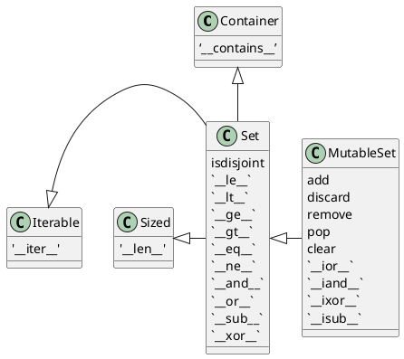
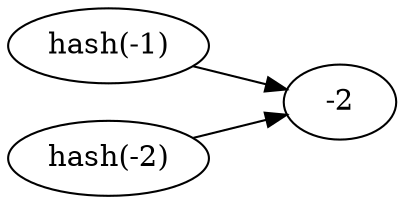

---
export_on_save:
 html: true
---

@import "/blog_head.md"

# 流畅的 Python

## 第一章 Python数据模型

不管在上面框架下写程序，都会花费大量的时间去实现那些被框架本身所调用的方法。Python碰到特殊句法时，会使用特殊方法去激活一些基本的对象操作。这些特殊的方法以两个下划线开头，两个下划线结尾(例如：`__getitem__`)。比如，`obj[key]`的背后是`__getitem__`方法，为了能获得 `my_collection[key]` 的值，解释器实际上会调用 `my_collection.__getitem__(key)`。

这些特殊方法名能够让你自己的对象实现和支持一下的语言框架，并与之交互：
- 迭代器
- 集合类
- 访问属性
- 运算符重载
- 函数和方法的调用
- 对象的创建和销毁
- 字符串的表现形式和格式化
- 管理上下文(with 块)

> 魔术方法(magic method) 是特殊方法的昵称，也称为双下方法(dunder method)。

### 一摞Python风格的纸牌
```python {cmd id="20180414082902"}
from collections import namedtuple

Card = namedtuple('Card', ['rank', 'suit'])

class FrenchDeck:
    ranks = [str(n) for n in range(2,11)] + list('JQKA')
    suits = 'spades diamonds clubs hearts'.split()

    def __init__(self):
        self._cards = [Card(rank, suit) for rank in self.ranks 
            for suit in self.suits]

    def __len__(self):
        return len(self._cards)

    def __getitem__(self, position):
        return self._cards[position]

deck = FrenchDeck()
```
自 Python2.6 开始，namedtuple 就被加入到 Python 中，用以构建只有少数属性，没有方法的对象，比如数据库条目等。
```python {cmd continue="20180414082902"}
# 调用 __len__ 方法
print(len(deck))
# 调用 __getitem__ 方法
print(deck[-1])
print(deck[2])
```

现在可以体会到通过特殊方法利用Python数据模型的两个好处了：
1. 作为你的类的用户，他们不必去记住标准操作的各式名称(如是：`length` 还是 `size`)；
2. 可以更方便地利用 Python 库，而不用重复发明轮子；

因为 `__getitem__` 方法把 [] 操作交给了 `self._cards` 列表，所以我们的 `deck` 实例也支持切片操作(slicing)

切片操作：
```python
# 获取最后 4 张牌
>>> deck[-4:]
```
```
[Card(rank='A', suit='spades'),
 Card(rank='A', suit='diamonds'),
 Card(rank='A', suit='clubs'),
 Card(rank='A', suit='hearts')]
```

另外，仅仅实现了 `__getitem__` 方法，这一摞牌就变成可迭代的了：
```python 
for i in deck:
    print(i)
```
```
Card(rank='2', suit='spades')
Card(rank='2', suit='diamonds')
Card(rank='2', suit='clubs')
... ...
```
方向迭代也可以：
```python
for i in reversed(deck):
    print(i)
```
```
Card(rank='A', suit='hearts')
Card(rank='A', suit='clubs')
Card(rank='A', suit='diamonds')
Card(rank='A', suit='spades')
... ...
```

迭代通常是隐式的，譬如说一个集合类型没有实现 `__contains__`，那么 in 运算符就会按顺序做一次迭代搜索。

通过实现 `__len__` 和 `__getitem__` 这两个特殊方法，FrenchDeck 就跟一个 Python 自有的序列数据类型一样，可以体现出 Python 的核心语言特性（例如迭代和切片）。同时这个类还可以用于标准库中，诸如：`random.choice`、`reverted`和`sorted`这些函数。

### 如何使用特殊方法

需要明确：特殊方法的存在是为了被 Python 解释器调用的，你并不需要调用它们。也就是说没有 `my_object.__len__()` 这种写法，而应该使用 `len(my_object)`。

很多时候，特殊方法的调用时隐式的，比如 `for i in x:` 这个语句，背后其实用的是 `iter(x)`，而这个函数的背后是 `x.__iter__()` 方法。当然，前提是这个方法在 x 中被实现了。

通常你的代码无需直接使用特殊方法。除非有大量的元编程存在，直接调用特殊方法的频率应该远远低于你去实现它们的次数。唯一的例外是 `__init__` 方法，你的代码中可能经常会用到它，目的是在你自己的子类 `__init__` 方法中调用超类的构造器。

**通过内置的函数 len、 iter、str、等等来使用特殊方法是最好的选择。**

不要自己想当然地添加特殊方法，比如 `__foo__`，因为虽然现在这个名字没有被 Python 内部使用，以后就不一定了。

#### 模拟数值类型

利用特殊方法，可以让自定义对象通过加号 `+` 进行运算。
```python
import math
class Vector():
    def __init__(self, x=0, y=0):
        self.x = x
        self.y = y
    
    def __repr__(self):
        return f'Vector({self.x}, {self.y})'
    
    def __str__(self):
        return f'({self.x}, {self.y})'

    def __add__(self, other):
        x = self.x + other.x
        y = self.y + other.y
        return Vector(x, y)
    
    def __abs__(self):
        return math.hypot(self.x, self.y)

    def __mul__(self, scalar):
        return Vector(self.x*scalar, self.y*scalar)

    def __bool__(self):
        return bool(abs(self))

    def __truediv__(self, scalar):
        return Vector(self.x/scalar, self.y/scalar)
```

#### __repr__

Python 有一个内置的函数叫 repr，它能把一个对象用字符串的形式表达出来以便辨认，这就是 “字符串表示形式”。`repr` 通过 `__repr__` 这个特殊方法来得到一个对象的字符串表示形式。如果没有实现 `__repr__`，当我们在控制台中打印一个向量的实例时，得到的字符串可能是：`<__main__.Vector at 0x103c4e7f0>`。

交互式控制台和调试程序(debugger)用 repr 函数来获取字符串表示形式。

如果你只想实现 `__repr__` 和 `__str__` 两个特殊方法中的一个，`__repr__` 是更好的选择，因为如果一个对象没有 `__str__` 函数，而 Python 又需要调用他的时候，解释器会用 `__repr__` 来替代。

#### 自定义的布尔值

尽管 Python 中有 bool 类型，但实际上如何对象都可以用于需要布尔值的上下文中（bool()、if、while、and、or、not 等）。为了判断一个值 x 为真还是假，Python会调用 bool(x)，这个函数只能返回 True 或 False。

默认情况下，我们自己定义的类的实例总是被认为是真的，除非这个类对 `__bool__` 或者 `__len__` 函数有自己的实现。`bool(x)` 的背后是调用 `x.__bool__()` 的结果，如果不存在 `__bool__` 方法，那么`bool(x)` 会尝试调用 `x.__len__()`，若返回0，则 bool 会返回False，否则返回True。

### 特殊方法总结

表1-1：跟运算符无关的特殊方法
|类别|方法名|
|---|---|
|字符串/字节序列表示形式|`__repr__` `__str__` `__format__` `__bytes__`|
|数值转换|`__abs__` `__bool__` `__complex__` `__int__` `__float__` `__hash__` `__index__`|
|集合模拟|`__len__` `__getitem__` `__setitem__` <br>`__delitem__` `__contains__`|
|迭代枚举|`__iter__` `__reversed__` `__next__`|
|可调用模拟|`__call__`|
|上下文管理|`__enter__` `__exit__`|
|实例创建和销毁|`__new__` `__init__` `__del__`|
|属性管理|`__getattr__` `__getattribute__` <br>`__setattr__` `__delattr__` `__dir__`|
|属性描述符|`__get__` `__set__` `__delete__`|
|跟类相关的服务|`__prepare__` `__instancecheck__` `__subclasscheck`|


表1-2：跟运算符相关的特殊方法
|类别|方法名和对应的运算符|
|---|---|
|一元运算符|`__neg__`(-) `__pos__`(+) `__abs__`|
|比较运算符|`__eq__` `__gt__` `__lt__` `__ge__` <br>`__le__` `__ne__`|
|算术运算符|`__add__` `__sub__` `__mul__` `__truediv__` <br> `__floordiv__` `__mod__` `__divmod__` `__pow__``__round__`|
|反向算术运算符|`__radd__` `__rsub__` `__rmul__` `__rtruediv__` `__rfloordiv__` `__rmod__` `__rdivmod__` `__rpow__`|
|增量赋值算术运算|`__iadd__` `__isub__` `__imul__` `__itruediv__` `__ifloordiv__` `__imod__` `__ipow__`|
|位运算符|`__invert__`~  `__lshift__`<<  `__rshift__`>>  `__and__`&  `__or__`\|  `__xor__`^|
|反向位运算符|`__rlshfit__` `__rrshift__` `__rand__` `__ror__` `__rxor__`|
|增量赋值位运算符|`__ilshift__` `__irshift__` `__iand__` `__ior__` `__ixor__`|

## 序列构成的数组

### 内置序列类型预览

- 容器序列：list、tuple、collections.deque 这些序列能存放不同类型的数据；
- 扁平序列：str、bytes、bytearray、memoryview 和 array.array，这类序列只能容纳一种类型。

容器序列存放的是它们所包含的任意类型的对象的引用，而扁平序列里存放的是值而不是引用。换句话说，扁平序列其实是一段连续的内存空间，由此可见扁平序列其实更加紧凑，但是它里面只能存放诸如字符、字节和数值这种基础类型。

序列还能按能否被修改进行分类：
- 可变序列：list、collections.deque、bytearray、array.array、memoryview。
- 不可变序列：tuple、str、bytes。

列表推导是一种构建列表的方法，它异常强大，然而由于相关的语句比较晦涩，人们往往不愿意去用它。

### 列表推导和生成器表达式

类型推导是构建列表(list)的快捷方式，而生成器列表则可以用于创建任何类型的序列。

```python
# 创建一个特殊的字符串
print(''.join(chr(i) for i in [36,162,163,165,8364,164]))
```
```
$¢£¥€¤
```
将一个字符串变成 Unicode 码位的列表：
```python
symbols = '$¢£¥€¤'
codes = []
for i in symbols:
    codes.append(ord(i))
codes
```
```
[36, 162, 163, 165, 8364, 164]
```
使用列表解析的方法：
```python
symbols = '$¢£¥€¤'
codes = [ord(i) for i in symbols]
codes
```
```
[36, 162, 163, 165, 8364, 164]
```
输出相同。

列表推导可能被滥用。以前看过有的Python代码用列表推导来重复获取一个函数的副作用。
```python {cmd}
funcs = [lambda x:i+x for i in [2,4,6]]
print(funcs[0](0))
print(funcs[1](0))
print(funcs[2](0))
```
上述的代码可以改良为：
```python {cmd}
funcs = [lambda x,i=i:i+x for i in [2,4,6]]
print(funcs[0](0))
print(funcs[1](0))
print(funcs[2](0))
```
通常的原则是：只用列表推导来创建新的列表，并且尽量保持简短。如果列表推导的代码超过两行，你可能就要考虑是不是得用for循环来重写了。

**语法提示**：Python 会忽略代码中的 []、{}、和 () 中的换行，因此，如果你的代码中有多行的列表、列表推导、生成器表达式、字典这一类的，可以省略不太好看的续行符 `\`。

在 Python2.x 中，列表推导中 for 关键字会破坏上下文，如：
```python
Python 2.7.10 (default, Oct  6 2017, 22:29:07) 
[GCC 4.2.1 Compatible Apple LLVM 9.0.0 (clang-900.0.31)] on darwin
Type "help", "copyright", "credits" or "license" for more information.
>>> x = 'my precious'
>>> dummy = [x for x in 'ABC']
>>> x
'C'
```
同理，在Pytho2.x中，for循环也会破坏 context：
```python
>>> x = 'my precious'
>>> dummy = []
>>> for x in 'ABC':
...     dummy.append(x)
... 
>>> x
'C'
```

而在 Python3中，使用 for 循环还是会破坏 context，而使用列表推导就不会出现这种情况：
```python
Python 3.6.3 (v3.6.3:2c5fed86e0, Oct  3 2017, 00:32:08) 
[GCC 4.2.1 (Apple Inc. build 5666) (dot 3)] on darwin
Type "help", "copyright", "credits" or "license" for more information.
>>> x = 'my precious'
>>> dumps = [x for x in 'ABC']
>>> x
'my precious'
>>> dumps = []
>>> for x in 'ABC':
...     dumps.append(x)
... 
>>> x
'C'
```

Python3中，列表推导、生成器表达式 以及同它们很相似的集合推导、字典推导都有自己的局部作用域，就像函数似的表达式内部的变量和赋值只在局部起作用，表达式的上下文中的同名变量可以被正常引用，局部变量不会影响到它们。

#### 列表推导同 map、filter的比较

filter 和 map 合起来能做的事情，列表推导也能做，而且不需要借助难以理解和阅读的 lambda 表达式。而且效率并不一定比它们差，所以只需要记 列表推导好了。

#### 笛卡尔积

用列表推导可以生成两个或两个以上的可迭代类型的笛卡尔积。笛卡尔积是一个列表，列表中的元素是由输入的迭代类型的元素对构成的元组，因此笛卡尔积列表的长度等于输入变量的长度的乘积：
```python
>>> colors = ['block', 'white']
>>> sizes = ['S', 'M', 'L']
>>> tshirts = [(s, c) for s in sizes for c in colors]
>>> tshirts
[('S', 'block'), ('S', 'white'), ('M', 'block'), 
('M', 'white'), ('L', 'block'), ('L', 'white')]
```

#### 生成器表达式

虽然也可以用列表推导来初始化元组、数组或其他序列类型，但是生成器表达式是更好的选择。这是因为生成器表达式背后遵循了迭代器协议，可以逐个地产生元素，而不是先建立一个完整的列表，然后把这个列表传递到某个构造函数中。

生成器更加节省内存。
```python
>>> symbols = '$¢£¥€¤'
>>> tuple(ord(s) for s in symbols)
(36, 162, 163, 165, 8364, 164)
```
如果生成器表达式是一个函数调用过程中的唯一参数，那么不需要额外用括号将它包围起来。如果不唯一，那么要包围。

如果用生成器，生成器表达式会在每次for循环运行时才生成一个组合，不会再用大量内存空间：
```python{cmd}
sizes = ['S', 'M', 'L']
colors = ['block', 'white']
for tshirt in (f'{s} {c}' for s in sizes 
                          for c in colors):
    print(tshirt)
```

### 元组不仅仅是不可变的列表

有些 Python 入门教程将元组称为是 “不可变列表”，然而这并没有完全概括元组的特点。

除了用作不可变的列表之外，它还可以用于没有字段名的记录。

#### 元组-记录

元组其实是对数据的记录：元组中的每个元素都存放了记录中的一个字段的数据，外加这个字段的位置，正是这个位置信息给数据赋予了意义。

如果只把元组理解为不可变的列表，那其他信息——它所含有的元素的总数和它们的位置似乎就变得可有可无了。但是如果把元组动作一些字段的集合，那么数量和位置信息就变得非常重要。

元组拆包：
```python {cmd}
a = ['black', 'white', 'yellow', 'red', 'green', 'blue']
# 获取第三、四个元素，忽略其他的
_,_,c,d,*rest = a
print(c,d)
# 获取最后两个元素
*head,c,d = a
print(c,d)
```

元组的拆包是可以嵌套的：
```python {cmd}
vehicles = [
    (87, 'BWM', (35.3, 143.6)),
    (98, 'Ford', (33.7, -120.7)),
    (102, 'Porsche', (23.9, 117.2))
]
for speed, brand, (lantitude,longitude) in vehicles:
    if longitude > 0:
        print(f'{brand} : ({lantitude}, '
        f'{ longitude}), {speed}km/s')
```

#### 具名元组

`collections.namedtuple` 是一个工厂函数。

用 namedtuple 构建的类的实例所消耗的内存跟元组是一样的，因为字段名被存在对应的类里面。这个实例跟普通的对象实例比起来也要小一些，因为 Python 不会用 `__dict__` 来存放这些实例的属性。

```python {cmd id="20180415214553"}
from collections import namedtuple
City = namedtuple('City', 'name population coordinates')
beijin = City('Beijin', 2170, (116, 40))
```
```python {cmd continue}
print(beijin.population)
print(beijin.coordinates)
print(beijin[0])
```
除了从普通元组继承的属性外，还有 `_fields`类属性、`_make(iterable)`类方法和实例方法`_asdict()`:
```python {cmd continue="20180415214553"}
print(City._fields)
```

#### tuple没有的方法

进行修改的方法：+=、-=、*=、append、`__delitem__`、clear、extend、insert、remove、pop、reverse

没意义的方法：copy（因为元组不能修改，没必要深度拷贝）

### 切片

在 Python 中，像list、tuple和str这类序列类型都支持切片操作，但是实际上切片化操作比人们所想象的要强大得多。

#### 为什么切片和区间会忽略最后一个元素

在切片和区间操作中不包含区间范围的最后一个元素是Python的风格，这个习惯符合 Python、C和其他语言中以0作为其实下标的传统，好处：
- range(3) 和 my_list[:3] 都返回3个元素
- 方便计算长度，my_list[start:stop] 共stop-start个元素
- 便于分割：my_list[:x] 和 my_list[x:]不会重合

Python 解释器对切片操作的理解：
`s[a:b:c]` 的形式对 s 在 a 和 b 之间以 c 为间隔取值。c 的值可以为负，表示方向取值。

#### 多维切片和省略

[] 运算符还可以使用以逗号分开的多个索引或者是切片，外部库 NumPy 就是用到了这个特性，二维的 numpy.ndarray 就可以用 a[i,j] 这种形式来获取，抑或是 a[m:n, k:l] 的方式来得到二维切片。

**Python 内置的序列类型都是一维的，因此它们只支持单一的索引，成对出现的索引是没有用的。**

省略(ellipsis) 的正确书写方法是三个英语句号，在 NumPy 中，x[i,...] 就是 x[i,:,:,:]的缩写。

一个错误的嵌套列表使用方法：
```python
>>> weird_board = [['-']*3]*3
>>> weird_board
[['-', '-', '-'], ['-', '-', '-'], ['-', '-', '-']]
>>> weird_board[0][1] = 'o'
>>> weird_board
[['-', 'o', '-'], ['-', 'o', '-'], ['-', 'o', '-']]
```
正确的应该是：
```python
>>> normal_board = [['-']*3 for i in range(3)]
>>> normal_board
[['-', '-', '-'], ['-', '-', '-'], ['-', '-', '-']]
>>> normal_board[0][1] = 'o'
>>> normal_board
[['-', 'o', '-'], ['-', '-', '-'], ['-', '-', '-']]
```

### 序列的增量赋值

+= 背后的特殊方法是`__iadd__` ，但是如果一个类没有实现这个方法的话，Python就会退一步调用 `__add__`。

总的来说，可变序列一般都实现了 `__iadd__` 方法，因此 += 是就地加法，而不可变序列根本就不支持这个操作，所以会关联到新的变量上。

```python
>>> l = [1,2,3]
# id : return the identity of an object
>>> id(l)
4368634376
>>> l *= 2
>>> id(l)
4368634376
>>> t = (1,2,3)
>>> id(t)
4368618984
>>> t *= 2
>>> id(t)
4364255592
```
从上面的例子可以看出，可变序列的 id 在增量赋值时不会改变，不可变序列在增量赋值是会改变 id。

对不可变序列进行重复拼接的时候，效率很很低，因为每次都有一个新对象，而解释器需要把原来对象中的元素先复制到新的对象中，然后追加新的元素。【str 是个例外，效率也很快，毕竟对字符串的 += 操作也非常普遍】

一个 += 的谜题：
```python
>>> t = (1,2,[3,4])
>>> t[2] += [5,6]
Traceback (most recent call last):
  File "<stdin>", line 1, in <module>
TypeError: 'tuple' object does not support item assignment
>>> t
(1, 2, [3, 4, 5, 6])
```
在抛出异常的同时，居然实现了功能。

查看 `s[a] += b` 操作的字节码：
```python
>>> dis.dis('s[a]+=b')
  1           0 LOAD_NAME                0 (s)
              2 LOAD_NAME                1 (a)
              4 DUP_TOP_TWO
              6 BINARY_SUBSCR
              8 LOAD_NAME                2 (b)
             10 INPLACE_ADD
             12 ROT_THREE
             14 STORE_SUBSCR
             16 LOAD_CONST               0 (None)
             18 RETURN_VALUE

```
可以看出：在第 10 处，进行了增量赋值操作，在第 14 处对 s 进行赋值。而如果s第不可变序列，就会出错。

总结：
- 不要把可变对象放在元组中
- 增量赋值不是一个原子操作，它虽然抛出了异常，也实现了功能
- 查看 Python 的字节码并不难，对了解代码背后的运行机制非常有帮助

### list.sort 方法和内置函数 sorted

`list.sort` 方法会就地排序列表，也就是说不会把原列表复制一份。这也是这个方法的返回值是 None 的原因。

与 `list.sort` 相反的是内置函数 sorted，它会新建一个列表作为返回值。这个方法可以接受任何形式的可迭代对象作为参数，甚至包括不可变序列或生成器。而不管 sorted 接受的是怎样的参数，它最后都会返回一个列表。

不管是 list.sort 还是 sorted ，它都接受两个参数 *key* 和 *reverse*。

### 用 bisect 来管理已排序的序列

bisect 模块中包含两个主要函数，bisect 和 insort，两个函数都利用二分查找算法在有序序列中查找或插入元素。

- `bisect(haystack, needle)` : 在 haystack 中搜索 needle 的位置，该位置满足的条件是：把 needle 插入该位置后，haystack 仍然保持升序。也就是说：这个函数返回的位置前面的值，都小于或等于 needle 的值。其中 haystack 必须是有序序列。
```python
>>> import bisect
>>> l = [2,5,7]
>>> bisect.bisect(l,3)
1
>>> l.insert(1, 3)
>>> l
[2, 3, 5, 7]
>>> bisect.insort(l,4)
>>> l
[2, 3, 4, 5, 7]
```

### 当列表不是首选时

虽然列表既灵活又简单，但面对各种需求时，我们可能会有更好的选择，数组 `array` 的效率要高得多，因为数组在背后存的并不是 float 对象，而是数字的机器翻译，即字节表述。这一点就跟 C 语言中的数组一样。

再比如，若要频繁对序列进行先进先出的操作，`deque` 的速度回更快。

而 set 的包含操作（检查一个元素是否出现在一个集合中）效率很高。

#### 数组

如果我们需要一个只包含数字的列表，那么 array.array 比 list 更加高效，包括 `.pop` `.insert` `.extend`。另外，数组还提供了从文件读取和存入的更快的方法：`.fromfile` 和 `.tofile`。

Python 数组跟 C 语言数组一样精简，创建数组需要一个类型码，用于表示在底层的 C 语言中应该存放怎样的数据类型，比如 b 类型表示有符号字符（signed char），因此 `array('b')` 创建出的数组就只能存放一个字节大小的整数，范围从 -128~127，这样在序列很大的时候，我们能节省很多空间。

另外，一个快速序列化数字类型的方法是使用：`pickle` 模块。pickle.dump 处理发电数组的速度几乎跟 array.tofile 一样快。不过 `pickle` 可以处理几乎所有的内置函数字类型，包括数字、嵌套集合，甚至用户自定义的类。前提是这些类没有什么特别复杂的实现。

从 Python 3.4 开始，数组类型不在支持诸如 `list.sort()` 这种就地排序方法。要给数组排序的话，得用 sorted 函数新建一个数组。
```python
a = array.array(a.typecode, sorted(a))
```
要在不打乱次序的情况下为数组添加新的元素，可以用`bisect.insort`。

#### 内存视图

`memoryview` 是一个内置类，它能让用户在不复制内容的情况下操作同一个数组的不同切片。`memoryview` 的概念受到了 NumPy 的启发。

> memoryview 其实是泛化和去数学化的NumPy数组。它让你在不需要复制内容的前提下，在数据结构之间共享内存。其中，数据结构可以是任何形式，比如 PIL 图片、SQLite数据库 和 NumPy 的数组，等等。这个功能在处理大型数据集合的时候非常重要。

`memoryview.cast` 和 C语言中的类型转换非常类似。memoryview.cast 会把同一块内存里的内容打包成一个全新的 `memoryview` 对象。
```python
>>> numbers = array('h',[-2,-1,0,1,2])
>>> memv = memoryview(numbers)
>>> memv[0]
-2
>>> len(memv)
5
>>> memv_oct = memv.cast('B')
>>> list(memv_oct)
[254, 255, 255, 255, 0, 0, 1, 0, 2, 0]
>>> memv_oct[5] = 4
>>> numbers
array('h', [-2, -1, 1024, 1, 2])
```

如果利用数组来做高级的数字处理是你的日常工作，那么 NumPy 和 SciPy 应该是你的常用武器。

**NumPy 和 SciPy**

凭借着 NumPy 和 SciPy 提供的高阶数组和矩阵操作，Python 成为了科学计算应用的主流语言。

**双向列表**
`list` 利用 append 和 pop 可以模拟先进后出的堆栈操作。也可以通过 append 和 pop(0) 来模拟队列操作，不过删除列表第一个元素（或者是在第一个元素之前添加一个元素）之类的操作都是很耗时的，因为这些操作会牵扯到移动列表中的所有元素。

`collections.deque` 类是一个线程安全、可以快速从两端添加或者删除元素的数据类型。而如果想要有一种数据类型存放 “最近使用到的几个元素”，deque也是一个很好的选择。**新建一个双向队列的时候可以指定队列的大小，如果队列满员，还可以从反向端删除过期的元素，然后在尾端添加新的元素。**

`deque([iterable[, maxlen]]) --> deque object`，maxlen 是一个可选参数，代表这个队列可以容纳的元素数量，一旦设定，这个属性就不能修改了。

append 和 popleft 都是原子操作，也就是说 deque 可以在多线程中安全地当先进先出的栈使用，而不需要担心资源锁的问题。

除了 deque 之外，还有一些其他的Python标准库也有对队列的实现。

queue：提供了同步(线程安全)类Queue、LifoQueue和PriorityQueue，不同的线程可以利用这些数据类型来交换信息。这3个类的构造方法都有一个可选参数 maxsize，它接受正整数作为输入值，用来限定队列的大小。但是在满员的时候，这些类不会扔掉就的元素来腾出位置，而是会被锁住，直到另外的线程移除了某个元素而腾出位置。这一特性让这些类很适合用来控制活跃线程的数量。

asyncio：Python3.4 新提供的包，里面有 Queue、LifoQueue、PriorityQueue 和 JoinableQueue，这些类受到 queue 和 multiprocessing 模块的影响，但是为异步编程里的任务管理提供了专门的便利。

注意：list 中最好存放同类型的数据，至少是存放能够相互比较的数据，否则 sort 和 sorted 都不能使用了。而 tuple 并经常用来存放不同类型的元素，这也符合它的本质，元组就是用作存放彼此之间没有关系的数据的记录，也并不需要进行比较。

**key 参数很妙** ：list.sort/sorted/max/min函数的key参数使一个很棒的设计，其他语言里的排序函数需要用户提供一个接受两个参数的比较函数作为参数，比如 Python2 中的 cmp(a,b) 。用 key 参数能把事情变得简单且高效，简单是因为只需要提供一个单参数函数来提取或计算一个值作为比较大小的标准即可，而 Python2 的这种设计需要用户写一个返回值是 -1、0或1的双参数函数。说它高效，是因为在每个元素上，key 函数只会被调用一次，而双参数比较函数则在每次两两比较的时候都会被调用。诚然，在排序的时候，Python总会比较两个键 key，但是那一阶段的计算会发生在C语言那一层，这样会比调用用户自定义的Python比较函数更快。

另外，key参数也能让你对一个混有数字字符和数值的列表进行排序：
```python
>>> a = ['12',1,9,'8',3,'15',6]
>>> sorted(a, key=int)
[1, 3, 6, '8', 9, '12', '15']
```

sorted 和 list.sort 背后的排序算法是 Timsort，它是一种自适应算法，会根据原始数据的顺序特点交替使用插入排序和归并排序，以达到最佳效率。这样的算法被证明是很有效的，因为来自真实世界中的数据通常是有一定的顺序特点的。

## 字典和集合

> 字典这个数据结构活跃在所有 Python 程序的背后，即使你的编码中没有直接用到它。——A.M. Kuchling

dict 类型不但在各种程序中广泛使用，**它也是 Python语言的基石**。模型的命名空间、实例属性和函数的关键字参数中都可以看到字典的身影，跟它有关的内置函数都在 `__builtins__.__dict__`模块中。

正是因为字典至关重要，Python 对它的实现做了高度优化，而散列表则是字典类型性能出众的根本原因。

要想进一步理解集合和字典，首先要理解散列表的原理。

标准库中的所有映射类型都是利用 dict 来实现的，因此它们有一个共同的限制，即只有可散列的数据类型才能用作这些映射里的键。

什么是可散列的？
> 如果一个对象是可散列的，那么这个对象的生命周期中，它的散列值是不变的，而且这个对象需要实现 `__hash__()` 方法。另外，可散列对象还要有 `__qe__()` 方法，这样才能跟其他键作比较。如果两个散列对象是相等的，那么它们的散列值一定是一样的。

原子不可变数据类型(str, bytes, 数值类型)都是可散列的，frozenset 也是可散列的。元组的话，只有当一个元组包含的所有元素都是可散列类型的情况下，它才是可散列的：
```python
>>> tt = (1,2,(30,40))
>>> hash(tt)
8027212646858338501
>>> t1=(1,2,[30,40])
>>> hash(t1)
Traceback (most recent call last):
  File "<stdin>", line 1, in <module>
TypeError: unhashable type: 'list'
>>> t1 = (1,2,frozenset([30,40]))
>>> hash(t1)
-4118419923444501110
```
字典定义了很多的构造方法：
```python
>>> a = {'one':1, 'two':2, 'three':3}
>>> b = dict(one=1, two=2, three=3)
>>> c = dict(zip(['one','two','three'],[1,2,3]))
>>> d = dict([('one',1),('two',2),('three',3)])
>>> e = dict({'one':1, 'two':2, 'three':3})
```
除了这些字面句法和灵活的构造方法外，字典推导(dict comprehension)也可以用来创建新的dict。

### 字典推导

自 Python2.7 以来，列表推导和生成器表达式的概念就移植到了字典上，从而有了字典推导。
```python
>>> pairs = [('one',1),('two',2),('three',3),
...     ('four',4),('five',5),('six',6)]
>>> d = {k:v for k,v in pairs}
>>> d
{'one': 1, 'two': 2, 'three': 3, 'four': 4, 'five': 5, 'six': 6}
>>> d = {k:v for k,v in pairs if v%2==0}
>>> d
{'two': 2, 'four': 4, 'six': 6}
```

### 常见的映射方法

表3-1：`dict`、`collections.defaultdict` 和 `collections.OrderedDict`这三种映射类型的方法列表：
||dict|defaultdict|OrderedDict||
|---|---|---|---|---|
|`d.clear()`|*|*|*|移除所有元素|
|`d.__contains__(k)`|*|*|*|检查k是否在d中|
|`d.copy()`|*|*|*|浅复制|
|`d.__copy__()`||*||用于支持 copy.copy|
|`d.default_factory`||*||默认值|
|`d.__delitem(k)`|*|*|*|del d[k],移除键为k的元素|
|`d.fromkeys(it,[initial])`|*|*|*||
|`d.get(k,[default])`|*|*|*||
|`d.__getitem__(k)`|*|*|*|获取d[k]|
|`d.items()`|*|*|*|返回d中所有键值对|
|`d.__iter__()`|*|*|*|获取键的迭代器|
|`d.keys()`|*|*|*|获取所有的键|
|`d.__len__()`|*|*|*|len(d)|
|`d.__missing__(k)`||*||d[k]找不到k时被调用|
|`d.move_to_end(k,[last])`|||*|将k的元素移到最靠后或最靠前位置|
|`d.pop(k,[default])`|*|*|*||
|`d.popitem()`|*|*|*|随机弹出一个键值对|
|`d.__reversed__()`|||*|对键进行倒叙排列|
|`d.setdefault(k,[default])`|*|*|*||
|`d.__setitem__(k,v)`|*|*|*|d[k]=v|
|`d.update(m,[**kargs])`|*|*|*|用m中内容更新d对应条目|
|`d.values()`|*|*|*|返回字典中的所有值|

**鸭子类型(duck typing)**：一种动态类型的风格，在这种风格中，一个对象有效的语义不是由继承自特定的类或特定的接口决定，而是由 *当前方法和属性的集合* 决定。

鸭子测试可以表述为：当看到一只鸟走起来像鸭子、游泳像鸭子、叫起来也像鸭子，那这只鸟就可以被称为鸭子。

### 映射的弹性键查询

有时候为了方便起见，就算某个键在映射里不存在，我们也洗完通过这个件读取值得时候能得到一个默认值，三种方式：
- `setdefault`
- `defaultdict`
- 自定义 `dict` 子类

#### defaultdict 处理找不到的键的一个选择

在用户创建 `defaultdict` 对象的时候，就需要给它配置一个为找不到的键创造默认值的方法。

具体而言，在实例化一个 defaultdict 的时候，就需要给它配置一个为找不到的键创造默认值的方法。

**`defaultdict` 中的 `default_factory` 只会在 `__getitem__`中被调用，其他地方不会发挥作用，比如 dd 是一个 `defaultdict`，k 是个找不到的键，dd[k] 会调用 `default_factory`，不过 dd.get(k) 会返回 None。**

```python
>>> dd = defaultdict(list)
>>> dd.get('a')
>>> dd['a']
[]
```
所有者一切背后的功臣其实是特殊方法 `__missing__`，它会在`defaultdict`遇到找不到的键的时候调用`default_factory`,而实际这个特性是所有映射类型都可以选择去支持的。
```python {cmd}
class MyDict(dict):
    def __init__(self, default_factory):
        super().__init__()
        self.default_factory = default_factory
    def __missing__(self, k):
        self[k] = self.default_factory()
        return self[k]

md = MyDict(list)
md['a'].append(1)
print(md)
```

> `__missing__` 方法只会被 `__getitem__` 调用(比如在表达式 d[k] 中)。提供 `__missing__` 方法对 get 或 `__contains__` 这些方法的使用没有影响。
```python
class StrKeyDict0(dict):
    def __missing__(self, k):
        if isinstance(k, str):
            raise KeyError(k)
        return self[str(k)]
    def get(self, k, default=None):
        try:
            return self[k]
        except KeyError:
            return default
    def __contains__(self, k):
        return k in self.keys() or str(k) in self.keys()
d = StrKeyDict0([('2','two'),('4','four')])
d['2']
d[4]
```
> 如果要自定义一个映射类型，更合适的策略是继承 `collection.UserDict`类。

### 字典的变种

`collections.OrderedDict` : 这个类型在添加键的时候会被保持顺序，因此键的迭代次序总是一致；

`collecton.ChainMap` : 该类型可以容纳数个不同的映射对象，然后在进行键查找操作的时候，这些对象会被当做一个整体被逐个查找，找到键被找到为止。
```python
>>> d1 = {'one': 1, 'two': 2, 'three': 3, 'four': 4}
>>> d2 = {'eleven':11, 'twelve':12}
>>> from collections import ChainMap
>>> d = ChainMap(d1,d2)
>>> 'one' in d
True
>>> 'eleven' in d
True
```

`collections.Counter`：这个映射类型会给键准备一个整数计数器，每次更新一个键的时候就会增加这个计数器，所以这个类型可用于给可散列列表对象技术，或者是当成多重集来用——多重集就是集合中的元素可以出现不止一次：
- 计数/多重集合 作用：
```python
>>> Counter('abccabacd')
Counter({'a': 3, 'c': 3, 'b': 2, 'd': 1})
>>> Counter([1,2,2,3,3,1,2,3,6,5,6])
Counter({2: 3, 3: 3, 1: 2, 6: 2, 5: 1})
```
- `+`/`-` 运算
```python
>>> c1 = Counter('abbcbca')
>>> c2 = Counter('bccdb')
>>> c1
Counter({'b': 3, 'a': 2, 'c': 2})
>>> c2
Counter({'b': 2, 'c': 2, 'd': 1})
>>> c1 + c2
Counter({'b': 5, 'c': 4, 'a': 2, 'd': 1})
>>> c1 - c2
Counter({'a': 2, 'b': 1})
```

- `most_common(n)`计算最频繁的 n 个元素
```python
>>> c = Counter('aabdababbabdcddeabd')
>>> c
Counter({'a': 6, 'b': 6, 'd': 5, 'c': 1, 'e': 1})
>>> c.most_common(2)
[('a', 6), ('b', 6)]
>>> c.most_common(1)
[('a', 6)]
```

`collection.UserDict` ：这个类单纯地将标准 dict 用纯Python又实现了一遍，跟 OrderedDict、ChainMap、Counter这些开箱机用的类型不同，UserDict是让用户继承写子类的。

### 子类化 UserDict

UserDict 不是 dict 的子类，但是 UserDict 有个叫 data 的属性，是 dict 实例，这个属性实际上就是 UserDict 最终存储数据的地方。这样做的好处主要是：`UserDict` 的子类能够在实现 `__setitem__` 的时候避免不必要的递归，也可以让 `__contains__` 中的代码更加简洁。

因为 UserDict 继承的是 MutableMapping，所以自定义的`StrKeyDict`中剩下的那些映射方法都是从 UserDict、MutableMapping和Mapping这些超类中继承而来的。Mapping类虽然是一个抽象基类（ABC)，但它却提供了好几个实用的方法。
```python
>>> class StrKeyDict0(UserDict):                          
...     def __missing__(self, k):
...         if isinstance(k, str):
...             raise KeyError(k)
...         return self[str(k)]
...     def __setitem__(self, key, item):
...         self.data[str(key)] = item 
...     def __contains__(self, k):    
...         return str(k) in self.data
... 
>>> d = StrKeyDict0([('2','two'),('4','four'),('1',None)])
>>> d[3] = 'three'
>>> 1 in d
True
>>> 5 in d
False
>>> d
{'2': 'two', '4': 'four', '1': None, '3': 'three'}
# 继承自 MutableMapping 的 update 方法
>>> d.update([(5,'five'),(6,'six')])
>>> d.update({7:'seven'})
>>> d
{'2': 'two', '4': 'four', '1': None, '3': 'three', '5': 'five', '6': 'six', '7': 'seven'}
# 继承自 Mapping 的 get 方法
>>> d.get(10,'N/A')
'N/A'
```

### 不可变映射类型

标准库中的所有映射类型都是可变的。

通过 `MappingProxyType` 可以变相实现只读：
```python
from types import MappingProxyType
>>> d = {1:'A'}
>>> d_proxy = MappingProxyType(d)
>>> d_proxy
mappingproxy({1: 'A'})
>>> d_proxy[1]
'A'
>>> d_proxy[2] = 'x'
Traceback (most recent call last):
  File "<stdin>", line 1, in <module>
TypeError: 'mappingproxy' object does not support item assignment
>>> d_proxy[1] = 'B'
Traceback (most recent call last):
  File "<stdin>", line 1, in <module>
TypeError: 'mappingproxy' object does not support item assignment
# d_proxy 是动态的，对 d 所做的任何改动都会反馈到 d_proxy 上
>>> d[2] = 'B'
>>> d_proxy
mappingproxy({1: 'A', 2: 'B'})
>>> d_proxy[2]
'B'
```
### 集合论

集合的本质是许多唯一对象的聚集，因此，集合可以用于去重：
```python
>>> l = ['spam','spam','eggs','spam']
>>> set(l)
{'spam', 'eggs'}
>>> list(set(l))
['spam', 'eggs']
```

set 和它不可变的姐妹类型 frozenset 直到 Python2.3 才首次以模块的形式出现，在 Python2.7 中它们升级为built-in类型。

集合中的元素必须是可散列的，set 类型本身是不可散列的，但是 fronzeset 可以。因此可以创建一个包含不同 frozenset 的 set。

集合的运算：a | b (a和b的并集)，a & b (a和b的交集)，a - b (a和b的差集)，a ^ b (a和b的对称差)。

代码 `{1,2,3}` 这种字面量句法相比于构造方法`set([1,2,3])`要更快且更易读：
```python
>>> from dis import dis
>>> dis('{1}')
  1           0 LOAD_CONST               0 (1)
              2 BUILD_SET                1
              4 RETURN_VALUE
>>> dis('set([1])')
  1           0 LOAD_NAME                0 (set)
              2 LOAD_CONST               0 (1)
              4 BUILD_LIST               1
              6 CALL_FUNCTION            1
              8 RETURN_VALUE
```

由于 Python 中没有针对 frozenset 的特殊字面量句法，我们智能常用构造方法：
```python
>>> frozenset(range(5))
frozenset({0, 1, 2, 3, 4})
```

#### 集合推导

Python2.7 带来了集合推导（set comprehensions）和之前的字典推导。新建一个Latin-1 字符集合，该集合中的每个字符的 Unicode 名字里都有 'SIGN' 这个单词：
```python
>>> {chr(i) for i in range(32,256) if 'SIGN' in name(chr(i),'')}
{'±', '$', '§', '¢', '°', '¬', '£', '>', '×', '÷', '%', 
'+', '¥', '¶', 'µ', '#', '<', '¤', '®', '=', '©'}
```

备注：可以使用 `in` 判断某个字符串是否有某种类型的子字符串，而不用正则表达式：
```python
>>> s = "apple banana"
>>> 'na' in s
True
>>> 'aa' in s
False
```

#### 集合的操作



相求4个聚合类型 a、b、c、d的并集，可以用 `a.union(b,c,d)`，其中 a 必须是 set，b、c、d可以是如何类型的可迭代对象：
```python
>>> def f():
...     m = 0
...     while m < 3:
...         yield m
...         m += 1
... 
>>> a = {5}
>>> b = f()
>>> c = 'xyz'
>>> d = {10,'w'}
>>> a.union(b,c,d)
{0, 1, 2, 'x', 'z', 5, 10, 'y', 'w'}
```

下面，我们会继续讨论字典和集合类型背后的实现。

### dict 和 set 的背后

5 个问题：
1. Python 中的 dict 和 set 的效率有多高？
1. 为什么它们是无序的？
1. 为什么不是所有的Python对象都可以当做 dict 的键或者 set 里的元素？
1. 为什么 dict 的键和 set 元素的顺序是根据它们被添加的次序而定的？为什么映射对象的生命周期中，这个顺序并不是一成不变的？
1. 为什么不应该在迭代循环 dict 或 set 的同时往里面添加元素？

#### 一个关于效率的实验

所有的 Python 程序员都从经验中得出结论，认为字典和集合的速度是非常快的。接下来我们要通过可控的实验来验证这一点。

为了对比容器的大小对 dict、set 或 list 的 in 元素运算符效率的影响，先创建一个有 1000万个双精度浮点数的数组，名叫 haystack。另外还有一个包含 1000 个浮点数的 needles 数组。 从其中 500 个数字是从 haystack 中跳出的，另外500个肯定不在 haystack 中。

作为 dict 测试的基准，用 dict.fromkeys() 来建立一个含有 1000 个浮点数的名叫 haystack 的字典，并用 timeit 模块测试：
实验设备：Python 3.6，MacBook Pro 13， Core i5
|haystack<br>长度|增长<br>系数|dict|增长<br>系数|集合|增长<br>系数|集合<br>交集|增长<br>系数|队列|增长<br>系数|
|---|---|---|---|---|---|---|---|---|---|
|1000|1×|70.5 μs|1.0x|74.9 µs|1.0x|19.6 μs|1.0x|6.54 ms|1.0x|
|10000|10×|84.6 μs|1.2x|80.5 µs|1.08x|25.1 µs|1.28x|68.7 ms|10.5x|
|100000|100×|91.5 μs|1.3x|83.3 µs|1.15x|28.4 µs|1.45x|882 ms|134x|
|1000000|1000×|114 μs|1.62x|91.7 µs|1.22x|32.1 µs|1.64x|31.2 s|4771x|
|10000000|10000×|139 μs|1.97x|98.9 µs|1.32x|37.5 µs|1.91x|517s|79051x|

下面让我们看看字典和集合如此快的原因：对散列表内部结构的讨论。

#### 字典中的散列表

散列表其实是一个稀疏数组（总是有空白元素的数组称为稀疏数组）。在一部的数据结构教材中，散列表中的单元通常称为表元(bucket)。在dict散列表中，每个键值对都占用一个表元，每个表元有两个部分，一个是对键的引用。因为所有表元的大小一致，所以可以通过偏移量来读取某个表元。

因为 Python 会设法保证大概还有三分之一的表元是空的，所以在快到达这个阈值的时候，原有的散列表会被复制到一个更大的空间里面。

要把一个对象放入到散列表中，首先要计算这个元素的散列值。Python 中可以用 hash() 方法来做这件事情。

**01. 散列值和相等性**
内置的 `hash()` 方法可以用于所有的内置类型对象。如果自定义对象调用`hash()` 的话，实际上运行的是自定义的 `__hash__` 。如果两个对象在比较的时候是相等的，那它们的散列值必须相等，否则散列表就不能正常运行了。例如，如果1==1.0为True，那么hash(1)==hash(1.0)也必须为True。

**注意：hash函数并不是单射，即一个值有对应的一个的哈希值，但一个哈希值可能有多个值与之对应，这就产生了冲突。**

为了让散列值能够胜任散列表索引这一角色，它们必须在索引空间中尽量分散开来。这意味着在最理想的状况下，越是相似但不相等的对象，它们的散列值得差别应该越大。
```python {cmd}
import sys
MAX_BITS = len(format(sys.maxsize, 'b'))
print('%s-bit Python build' %(MAX_BITS+1))

def hash_diff(o1, o2):
    h1 = f'{hash(o1):>0{MAX_BITS}b}'
    h2 = f'{hash(o2):>0{MAX_BITS}b}'
    diff = ''.join('!' if b1!=b2 else ' ' for b1,b2 in zip(h1,h2))
    count = f'! = {diff.count("!")}'
    width = max(len(repr(o1)), len(repr(o2)),8)
    sep = '-' * (width * 2 + MAX_BITS)
    return (f'{o1:<{width}}{h1}\n'
    f'{"":{width}}{diff} {count}\n' 
    f'{o2:<{width}}{h2}\n{sep}')

if __name__ == '__main__':
    print(hash_diff(1, 1.0))
    print(hash_diff(1.0, 1.0001))
    print(hash_diff(1.0001, 1.0002))
    print(hash_diff(1.0002, 1.0003))    
```

从 Python3.3 开始，str、bytes、datetime 对象的散列值计算过程中多了随机的“加盐”的过程。所以，加盐值是Python进程内的一个常量，但是每次启动Python解释器都会生成一个不同的盐值。随机盐值是为了防止 DOS 攻击而采取的一种安全策略。

**02. 散列表算法**

为了获取 `my_dict[search_key]` 背后的值，Python 首先会调用 hash(search_key) 来计算 search_key 的散列值，把这个值最低的几位数字作为偏移量，在散列表中查找表元（具体取几位，得看当前散列表的大小）。若找到的表元是空的，则抛出 KeyError 异常。若不是空的，则表元里会有一对 found_key:found_value。这时候 Python 会检验 search_key==found_key 是否为真，如果它们相等的话，就会返回 found_value。

如果 search_key 和 found_key 不匹配的话，这种情况称为散列冲突。发生这种情况是因为散列表所做的其实是把随机地元素映射到只有几位的数字上，而散列表本身的索引又只依赖于这个数字的一部分。

#### dict 的实现及其导致的结果

使用散列表给 dict 带来的优势和限制有哪些：

- 键必须是可散列的
    - 支持 hash() 函数，并通过 `__hash__()` 方法所得到的散列值是不变的；
    - 支持通过 `__eq__()` 方法检测相等性；
    - 如果 a==b 为 True，那么 hash(a)==hash(b) 必定为 True；

> 如果你实现了一个类的 `__eq__` 方法，并且希望它是可散列的，那么一定要有一个恰当的 `__hash__` 方法，保证在 a==b 为真的情况下，hash(a)==hash(b) 也必定为真，否则就会破坏核定的散列表算法，导致由这些对象所组成的字典和集合完全失去可靠性，这个后果是非常可怕的。另一方面，如果一个含有自定义的 `__eq__` 依赖的类处于可变的状态，那就不要再这个类中实现 `__hash__` 方法。

- 字典在内存上的开销较大

由于字典使用了散列表，而散列表又必须是**稀疏的**，这导致了它在空间上的效率低下。举例而言，如果你需要存放数量巨大的记录，那么放在元组或是具名元组构成的列表中会使比较好的选择；最好不要根据 JSON 的风格，用由字典组成的列表用来存放这些记录。

> 记住我们现在讨论的是空间优化，如果你手头有几百万个对象，而你的机器有几个GB的内存，那么空间的优化工作可以等到真正需要的时候在开始计划，因为优化往往是可维护性的对立面。

- 键查询很快：dict 的实现是典型的空间换时间：字典类型有较大的内存开销，但它们提供了无视数量大小的快速访问——只要字典能被装在内存里。

- 键的次序取决于添加顺序
```python
>>> DIAL_CODES = [
... (86,'China'),
... (91,'India'),
... (62,'Indonesia'),
... (1, 'United States'),
... (55, 'Brazil'),
... (92, 'Pakistan'),
... (880, 'Bangladesh'),
... (234, 'Nigeria'),
... (7, 'Russia'),
... (81, 'Japan')]
>>> d1 = dict(DIAL_CODES)
>>> print('d1:',d1.keys())
d1: dict_keys([86, 91, 62, 1, 55, 92, 880, 234, 7, 81])
>>> d2 = dict(sorted(DIAL_CODES))
>>> print('d2:', d2.keys())
d2: dict_keys([1, 7, 55, 62, 81, 86, 91, 92, 234, 880])
>>> d3 = dict(sorted(DIAL_CODES, key=lambda x:x[1]))
>>> print('d3:', d3.keys())
d3: dict_keys([880, 55, 86, 91, 62, 81, 234, 92, 7, 1])
>>> d1==d2==d3
True
```

不要对字典同时进行迭代和修改，如果想扫描并修改一个字典，最好分成两步来进行：首先对字典迭代，以得出需要添加的内容，吧这些内容放在一个字典中，迭代结束后对原有字典进行更新。

> 在 Python3 中，keys()、items()、values() 方法返回的都是字典的视图，即这些方法返回的值更像集合，而不是像 Python2 那样返回列表。

### set 的实现集导致的结果

set 和 frozenset 的实现也依赖于散列表，但是它们的散列表中只存有元素的引用（相当于字典中只存放键而没有相应的值）。

**在 set 加入到 Python 之前，我们都是把字典加上无意义的值当做集合来用的。**

- 集合中的元素必须是可散列的
- 集合很消耗内存
- 可以很高效地判断元素是否存在于某个集合中
- 元数的次序取决于被添加到集合中的次序
- 往集合中添加元素可能会改变集合中已有元素的次序

JSON 被当做 “瘦身版XML”，在很多情境下，JSON都成功取代了XML，由于用于紧凑的列表和字典表达式，JSON格式可以完美地用于数据交换。

## 文本和字节序列

> 人类使用文本，计算机使用字节序列。——Esther Nam and Travis Fischer

Python 3 明确区分了人类可读的文本字符串和原始的字节序列，隐式地吧字节序列转换成Unicode文本已成为过去。

### 字符问题

“字符串” 是一个相当简单的概念：一个字符串就是一个字符序列，问题出在对“字符”的定义上。

在 2015 年，字符的最佳定义是 Unicode 字符。

Unicode 标准把字符的标识和具体的字节表述进行了如下的明确区分：

- 字符的标识：即码位，是 0~1114111 的数字，在Unicode 标准中以 4~6 个十六进制数字表示。
- 字符的具体表述取决于所用编码，编码时码位和字节序列之间的转换是使用的算法。在 UTF-9 编码中，A(U+0041)的码位编码成单个字节 \x41，而在 UTF-16LE编码中编码成两个字节 \x41\0x00。再比如，欧元符号(U+20AC)在UTF-8中编码是3个字节：\xe2\x82\xac，而在UTF-16LE中编码成两个字节：\xac\x20。

把码位转换成字节序列的过程称为编码，把字节序列变为码位的过程是解码。
```python
>>> s = 'café'
>>> len(s)
4
# 编码过程：码位 -> 字节序列
>>> b = s.encode('utf-8')
>>> b
b'caf\xc3\xa9'
>>> len(b)
5
# 解码过程：字节序列 -> 码位
>>> b.decode('utf-8')
'café'
```
> 如果想帮助自己记住 `.encode` 和 `.decode`，可以把字节序列变为晦涩难懂的机器磁芯转储，把 Unicode 字符串想成“人类可读”的文本，那么把字节序列变成人类可读的文本字符串就是解码，而把字符串变成用于存储或传输的字节序列就是编码。

虽然 Python3 的 str 类型基本上相当于 Python2 的unicode类型，只不过换了一个新的名字，但是 Python3 的 bytes 类型却不是把 str 类型换个名称那么简单，而且还有关系紧密的 bytearray 类型。因此，在讨论编码和解码的问题之前，有必要先来介绍一下二进制序列类型。

### 字节概要

bytes 和 bytearray 对象的各个元素是介于 0~255 之间的整数，而不是像 Python2 的 str 对象那样是单个的字符。然而，二进制序列的切片始终是同一类型的二进制序列，包括长度为1的切片：
```python
>>> cafe = bytes('café', encoding='utf-8')
>>> cafe
b'caf\xc3\xa9'
>>> cafe[0]
99
>>> cafe[:1]
b'c'
>>> cafe_arr = bytearray(cafe)
>>> cafe_arr
bytearray(b'caf\xc3\xa9')
>>> cafe_arr[-1:]
bytearray(b'\xa9'
```

虽然二进制序列其实是整数序列，但是它们的字面量表示法表明其中有 ASCII 文本，因此，各个字节的值可能会使用下列3种不同的方式显示：
- 可打印的 ASCII 范围内的直接(从空格到~)：使用ASCII字符本身
- 制表符、换行符、回车符和\对应的字节：使用转义序列\t、\n、\r、\\\\。
- 其他字节的值：使用十六进制转义序列（例如，\x00 是空字节）

除了格式化方法（format、format_map）和几个处理 Unicode 数据的方法(如casefold / isdicimal / isidentifier / isnumeric / isprintable / encode)之外，str类型的其他方法都支持bytes和bytearray类型。

二进制序列中有个类方法是 str 没有的，名为 fromhex：
```python
>>> bytes.fromhex('31 4B ce A9')
b'1K\xce\xa9'
```
使用缓冲类对象构建二进制序列是一种底层操作，可能涉及类型转换：
```python
>>> from array import array
# 创建 signed short 类型的 array
>>> numbers = array('h',[-2,-1,0,1,2])
>>> octets = bytes(numbers)
>>> octets
b'\xfe\xff\xff\xff\x00\x00\x01\x00\x02\x00'
```
使用缓冲类对象创建 bytes 或 bytearray 对象时，始终赋值源对象中的字节序列。与之相反，memoryview 对象允许在二进制数据结构之间共享内存。如果从二进制序列中提取结构化信息，struct 模块是重要的工具。

#### 结构体和内存试图
struct 模块中提供了一些函数，将打包的字节序列转换成不同类型字段组成的元组，还有一些函数用于反向操作。struct 模块能处理 bytes、bytearray、memoryview对象。
```python
>>> import struct
# < 表示小端模式，3s表示3字节的bytes，H表示unsigned short
>>> fmt = '<3s3sHH'
>>> with open('filter.gif', 'rb') as fp:
...     img = memoryview(fp.read())
... 
>>> header = img[:10]
>>> bytes(header)
b'GIF89a,\x01,\x01'
# 拆包，得到一个元组，包括类型、版本、宽度、高度
>>> struct.unpack(fmt, header)
(b'GIF', b'89a', 300, 300)
```

### 基本的编解码器

Python 自带了超过 100 中编码解码器(codec, ecoder/decoder)，用于在文本和字节之间相互转换。每个编码器都有一个名称，如 'utf_8'，而且经常有几个别名，如'utf8'、'utf-8'、'U8'。这些名称可以传递给 open()、str.encode()、bytes.decode()等函数的encoding参数。

使用3个编码器编码字节字符串 'El Niño'，得到的字节序列相差很大：
```python
>>> for codec in ['latin-1','utf-8','utf-16']:
...     print(codec, 'El Niño'.encode(encoding=codec), sep='\t')
... 
latin-1	b'El Ni\xf1o'
utf-8	b'El Ni\xc3\xb1o'
utf-16	b'\xff\xfeE\x00l\x00 \x00N\x00i\x00\xf1\x00o\x00'
```

一些编码的介绍：
- latin1（即iso8859_1）：一种重要的编码，是其他编码的基础，例如cp1252 和 Unicode（注意：latin1与cp1252的字节值是一样的，甚至连码位都相同）
- cp1252：Microsoft定制的latin1超集，添加了有用的符号，例如弯引号和€：有些Windows应用把它称为 ASCI，但它并不是ASCI标准
- cp437：IBM PC 最初的字符集，包含框图符号，与后来出现的 latin1 不兼容
- gb2312：用于编码简体中文的陈旧标准，这是亚洲语言中使用最广泛的多字节编码之一
- utf-8：目前Web中最常用的8位编码，与ASCII兼容
- utf-16le：UTF-16的16位编码方案的一种形式；所有 UTF-16 支持通过转义序列(称为代理对，surrogate pair)表示超过U+FFFF的码位。

### 了解编码解码问题

虽然有个一般性的 UnicodeError 异常，但是报告错误时几乎都会指明具体的异常：UnicodeEncodeError(把字符串转换成二进制序列时)或UnicodeDecodeError(把二进制序列转换成字符串时)。如果源码的编码与预期不符，加载Python模块时还可能抛出 SyntaxError。

#### 处理 UnicodeEncodeError

多数非 UTF 编解码器只能处理 Unicode 字符的一小部分子集。
```python
>>> city = 'São Paulo'
# utf-? 编码能处理任何的字符串
>>> city.encode('utf-8')
b'S\xc3\xa3o Paulo'
>>> city.encode('utf-16')
b'\xff\xfeS\x00\xe3\x00o\x00 \x00P\x00a\x00u\x00l\x00o\x00'
# iso8859-1 也能处理 'São Paulo'
>>> city.encode('iso8859_1')
b'S\xe3o Paulo'
# cp437 不能处理 ã
>>> city.encode('cp437')
Traceback (most recent call last):
  File "<stdin>", line 1, in <module>
  File "/Users/fenghuabin/anaconda3/lib/python3.6/encodings/cp437.py", line 12, in encode
    return codecs.charmap_encode(input,errors,encoding_map)
UnicodeEncodeError: 'charmap' codec can't encode character '\xe3' in position 1: character maps to <undefined>
# 以忽略无法编码的字符跳过，这种做法通常不妥
>>> city.encode('cp437',errors='ignore')
b'So Paulo'
# 将无法编码的字符替换成 ?，显示给用户
>>> city.encode('cp437',errors='replace')
b'S?o Paulo'
# 把无法编码的字符替换成 XML 实体
>>> city.encode('cp437',errors='xmlcharrefreplace')
b'S&#227;o Paulo'
```

#### 处理 UnicodeDecodeError
不是每个字节都包含有效的ASCII字符，也不是每个字符序列都是有效的UTF-8或UTF-16。因此，把二进制序列转换成文本时，如果假设是这两个编码中的一个，遇到无法转换的字节序列时就会抛出 UnicodeDecodeError。

另一方面，很多陈旧的 8 为编码 —— 如 cp1252，iso8859-1 和 koi8-r 能解码如何字节序列流而不抛出错误，例如随机噪声。因此，如果程序使用错误的8位编码，解码过程悄无声息，而得到的是无用的输出。

> 乱码字符称为鬼符(gremlin)

把字节序列解码成字符串：成功和错误处理
```python
# 这些字节是使用latin1 编码的 'Montréal'
>>> octets = b'Montr\xe9al'
# 可以使用 cp1252 解码，因为它是 latin1 的有效超集
>>> octets.decode('cp1252')
'Montréal'
# ISO-8895-7 用于希腊文编码，无法正确解码 '\xe9'
>>> octets.decode('iso8859-7')
'Montrιal'
# KOI8-R 用于编码俄文
>>> octets.decode('koi8_r')
'MontrИal'
# utf-8 检测到 octets 不是有效的 UTF-8 字符串，抛出错误 UnicodeDecodeError
>>> octets.decode('utf-8')
Traceback (most recent call last):
  File "<stdin>", line 1, in <module>
UnicodeDecodeError: 'utf-8' codec can't decode byte 0xe9 in position 5: invalid continuation byte
# \xe9 被替换成 � （码位：U+FFFD）
>>> octets.decode('utf-8', errors='replace')
'Montr�al'
```

#### 使用预期之外的编码加载模块时抛出SyntaxError

Python3 默认使用 UTF-8 编码源码，Python2 默认使用 ASCII。

如果加载的 .py 模块中包含 UTF-8 之外的数据，而且没有声明编码，会得到类似下面的消息：
```
SyntaxError: Non-UTF-8 code starting with '\xc4' in file x2.py on line 1, 
but no encoding declared; see http://python.org/dev/peps/pep-0263/ for details
```
GNU/Linux 和 OS X 系统大都使用 UTF-8，因此打开在 Windows 系统中使用 cp1252 编码。

为了修正这个问题，可以在文件顶部添加一个神奇的 coding 注释：
```python
# coding: cp1252
print('你好，世界')
```
> 现在 Python3 的源码不再限于使用ASCII，而是默认使用优秀的 UTF-8，因此要修正源码的陈旧编码（如 cp1252）问题，最好将其转换为UTF-8，别去麻烦coding注释，如果你用的编辑器不支持 UTF-8，那就换了它。

Python 允许在源码中使用非ASCII标识符：
```python
>>> 苹果='apple'
>>> print(苹果)
apple
>>> π = 3.14
>>> print(π)
3.14
```

#### 如何找出字节序列的编码

如何找出字节序列的编码？简单来说，不能，必须有人告诉你。

有些通信协议和文件格式，如HTTP、XML，包含明确证明内容的首部。可以确定的是，某些字节流不是 ASCII，因为其中包含大于127的字节值，而且 UTF-8 和 UTF-16 的方式也限制了可用的字节序列。不过即便如此，我们也不能根据特定的位模式来 100% 确定二进制文件的编码时 ASCII 或 UTF-8。

统一字符编码侦测包 chardet 可以识别所支持的 30 种编码。Chardet 是一个 Python 库，可以在程序中使用，不过它也提供了命令行工具 chardetect。
```sh
bash-3.2$ chardetect ai_homework.md 
ai_homework.md: utf-8 with confidence 0.99
```
二进制序列编码文本通常不会指明自己的编码，但是 UTF 格式可以在文本内容的开始添加一个字节序标记。

#### BOM 有用的鬼符

UTF-16 编码的序列开头有几个额外的字节：
```python
>>> u16 = 'El Niño'.encode(encoding='utf-16')
>>> u16
b'\xff\xfeE\x00l\x00 \x00N\x00i\x00\xf1\x00o\x00'
```
其中的`\xff\xfe`就是额外的字节。这是 BOM，即字节序标记（Byte Order Mark），指明编码时使用 Intel CPU 的小字节序。

在小字节序设备中，各个码位的最低有效字节在前面。

UTF-16 有两个变种：UTF-16LE 显式指明使用小字节序，UTF-16BE，显式指明使用大字节序，如果使用这两个变种，不会生成 BOM：
```python
>>> 'El Niño'.encode(encoding='utf_16')
b'\xff\xfeE\x00l\x00 \x00N\x00i\x00\xf1\x00o\x00'
>>> 'El Niño'.encode(encoding='utf_16le')
b'E\x00l\x00 \x00N\x00i\x00\xf1\x00o\x00'
>>> 'El Niño'.encode(encoding='utf_16be')
b'\x00E\x00l\x00 \x00N\x00i\x00\xf1\x00o'
```
如果有BOM，UTF-16编码器会将其过滤掉，为你提供没有前导 ZERO WITH NOBREAK SPACE 字符的真正文本。根据标准，文件使用 UTF-16编码，并且没有BOM，那么应该假定使用 UTF-16BE 编码。然而，Intel x86 架构用的是小字节序，因此有很多文本用的是不带 BOM 的小字节序 UTF-16 编码。

### 处理文本文件

处理文本的最佳时间是 "Unicode三明治"：要尽早将输入的字节序列解码成字符串三明治中的“肉片”是程序的业务逻辑，在这里只能处理字符串对象。在其他处理过程中，一定不能编码或解码。对输出来说，则要尽量晚地把字符串编码成字节序列。多数 Web 框架都是这样做的，使用框架时很少接触字节序列。例如，在 Django 中，视图应该输出 Unicode 字符串；Django 会负责将响应编码成字节序列，而且默认使用UTF-8编码。

> 需要在多台设备中或多种场合中运行的代码，一定不能依赖默认编码。打开文件时始终应该明确传入 encoding=参数，因为不同的设备使用的默认编码可能不同，有时隔一天都会发生变化。

> 除非像判断编码，否则不要在二进制模式中打开文本文件；即使如此，也应该使用 Chardet 而不是重新发明轮子。常规代码只应该使用二进制模式打开二进制文件，如光栅图像。

### 为了正确比较而规范化 Unicode 字符串

因为 Unicode 有组合字符（变音符号和附加到前一个字符上的记号，打印时作为一个整体），所以字符串比较起来很复杂，比如 café 可以用两种方式构成，分别有 4 个和 5 个码位，但是结果完全一样：
```python
>>> s1 = 'café'
>>> s2 = 'cafe\u0301'
>>> s1, s2
('café', 'café')
>>> len(s1), len(s2)
(4, 5)
>>> s1==s2
False
```

U+0301 是 COMBINING ACUTE ACCENT，加在 e 后面得到 é。在Unicode标准中，'é' 和 'e\u0301' 这样的序列称为 标准等价物，应用程序应该吧它们视为相同字符。但是，Python看到的是不同的码位序列，因此判定两者不相等。

这个问题的解决方案是使用 unicodedata.normalize 函数提供的 Unicode 规范化。这个函数的第一个参数使4个字符串中的一个：NFC、NFD、NFKC、NFKD。

- NFC（Normalization Form C）：使用最少的码位构成等价的字符串
- NFD ：把组合字符分成基字符和单独的组合字符

这两种规范化方式都能让比较行为符合预期：
```python
>>> from unicodedata import normalize
>>> s1 = 'café'
>>> s2 = 'cafe\u0301'
>>> len(s1), len(s2)
(4, 5)
>>> len(normalize('NFC',s1)),len(normalize('NFC',s2))
(4, 4)
>>> len(normalize('NFD',s1)),len(normalize('NFD',s2))
(5, 5)
>>> normalize('NFC',s1)==normalize('NFC',s2)
True
>>> normalize('NFD',s1)==normalize('NFD',s2)
True
```
另两个规范化形式为 NFKC 和 NFKD。

#### 大小写折叠

大小写折叠就是把所有文本写成小写，再做其他转换，由 `str.casefold()` 支持。

对于只包含 latin1 字符的字符串 s，`s.casefold()` 得到的结果与 `s.lower()` 一样。


# 把函数视为对象

## 一等函数

在 Python 中，函数是一等对象。编程语言理论家将“一等对象”定义为满足下列条件的程序实体：

- 在运行时创建
- 能赋值给变量或数据结构中的元素
- 能作为参数传给函数
- 能作为函数的返回值

在 Python 中，整数、字符串和字典都是一等对象。

一等函数实际上的意思是：函数在Python中是一等对象。

### 把函数视为对象

```python
>>> def factorial(n):
...     '''returns n! '''
...     return 1 if n < 2 else n*factorial(n-1)
... 
>>> factorial(42)
1405006117752879898543142606244511569936384000000000
>>> factorial.__dict__
{}
>>> type(factorial)
<class 'function'>
```
### 高阶函数
接受函数为参数，或者把函数作为结果返回的函数就是高阶函数（higher-order function）。map 函数就是一例，此外，内置函数 sorted 也是。

### 匿名函数

lambda 关键字在Python表达式中创建匿名函数。

除了作为参数传递给高阶函数之外，Python 很少使用匿名函数。

**Lumdh 提出的 lambda 表达式重构秘籍**
如果使用 lambda 表达式导致一段代码难以阅读，Fredrik Lundh 建议像下面这样重构：
1. 编写注释：说明 lambda 表达式的作用
1. 研究一会注释，并找出一个名称来概括注释
1. 把lambda表达式转换成def语句，使用那个名称来定义函数
1. 删除注释

### 可调用对象

除了用户定义的函数，调用运算符（即括号）还可以用到其他对象上，如果想判断对象能否被调用，可以使用内置的 callable()函数。
Python 数据模型文档列出了 7 种可调用对象：
1. 用户定义的函数：用lambda 和 def 创建
1. 内置函数：使用C语言实现的函数，如 len 或 time.strftime
1. 内置方法：使用C实现的方法，如 dict.get
1. 方法：在类的定义体中定义的函数
1. 类：调用类时会运行类的 `__new__` 方法创建一个实例，然后运行 `__init__` 方法，初始化实例，最后把实例返回给调用方。因为 Python 没有 new 运算符，所以调用类相当于调用函数。
1. 类的实例：如果定义了 `__call__` 方法，那么它的实例可以作为函数调用
1. 生成器函数：使用 yield 关键字的函数或方法，调用生成器函数返回的是生成器对象。

生成器函数在很多方面与其他可调用对象不同，后面章节会介绍，生成器函数还可以作为协程。

Python 中有各种各样的可调用类型，因此判断对象是否可调用，最安全的方式是使用内置的 callable() 函数。

### 用户定义的可调用类型

不仅 Python 函数是真正的对象，任何 Python 对象都可以表现得像函数，为此，只需要实现实例方法：`__call__`。
```python
>>> class A:
...     def __call__(self):
...         print('hello,world')
... 
>>> a = A()
>>> a()
hello,world
```
实现 `__call__` 方法的类是创建函数类对象的简便方式，可以使用类中的属性记录运行环境，如下实现了一个计数器：
```python
>>> class MyCounter:
...     def __init__(self, init=0):
...         self.v = init
...     def __call__(self):
...         self.v += 1
...         return self.v
... 
>>> c1 = MyCounter()
>>> c1()
1
>>> c1()
2
>>> c2 = MyCounter()
>>> c1()
3
>>> c2()
1
```
创建保有内部状态的函数还有另一种截然不同的方法--使用闭包。
```python
>>> def GetCounter(init=0):
...     v = init
...     def f():
...         nonlocal v
...         v += 1
...         return v
...     return f
... 
>>> c1 = GetCounter()
>>> c1()
1
>>> c1()
2
>>> c2 = GetCounter()
>>> c1()
3
>>> c2()
1
```

下面讨论把函数视为对象处理的另一方面：运行时内省。

### 函数内省

除了 `__doc__`，函数对象还有很多属性。使用 dir 可以探知 factorial 具有下列属性：
```
['__annotations__', '__call__', '__class__', '__closure__', '__code__', 
'__defaults__', '__delattr__', '__dict__', '__dir__', '__doc__', '__eq__', 
'__format__', '__ge__', '__get__', '__getattribute__', '__globals__', '__gt__', 
'__hash__', '__init__', '__init_subclass__', '__kwdefaults__', '__le__', '__lt__', 
'__module__', '__name__', '__ne__', '__new__', '__qualname__', '__reduce__', 
'__reduce_ex__', '__repr__', '__setattr__', '__sizeof__', '__str__', 
'__subclasshook__']
```
其中大多数属性是 Python 对象共有的，本节讨论把函数作为对象相关的几个属性。

1. `__dict__` : 存储赋予它的 **用户属性**。一般来说，为函数随意赋予属性不是很常见，但是 Django 框架这么做了。

下面字典说明函数专有而一边对象没有的属性。计算两个属性集合的差便能得到函数专有属性列表：
```python
>>> class C:pass
... 
>>> def fun():pass
... 
>>> obj = C()
>>> sorted(set(dir(fun))-set(dir(obj)))
['__annotations__', '__call__', '__closure__', '__code__', '__defaults__', 
'__get__', '__globals__', '__kwdefaults__', '__name__', '__qualname__']
```
用户定义的函数的属性：
|名称|类型|说明|
|---|---|---|
|`__annotations__`|dict|参数和返回值的注解|
|`__call__`|method-<br>wrapper|实现 () 运算，即可调用对象协议|
|`__closure__`|tuple|函数闭包，即自由变量的绑定(通常为 None)|
|`__code__`|code|编译成字节码的函数元数据和函数定义体|
|`__defaults__`|tuple|形参默认值|
|`__get__`|method-<br>wrapper|实现只读描述符协议|
|`__globals__`|dict|函数所在模块中的全局变量|
|`__kwdefaults__`|dict|**仅限关键字形式参数**的默认值|
|`__name__`|str|函数名称，匿名函数为 <lambda>|
|`__qualname__`|str|函数的限定名称|


