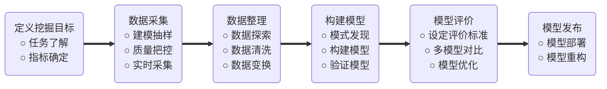
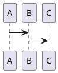

```python {cmd matplotlib=true}
from matplotlib_venn import venn2
from matplotlib_venn import venn3
import matplotlib.pyplot as plt
plt.figure(figsize=(4,3))
venn3((1,1,1,1,1,1,1,1))
plt.show()
```

```viz {}
digraph G{
    a->b
    subgraph cluster_ab{
        bgcolor=green
        label="a&b"
        a
        b
    }
}
```



```flow
st=>start
A=>operation: Operation1
B=>condition: dec
C=>subroutine: sub
end=>end

st->A->B
B(yes,right)->C(right)->A
B(no)->end
```




```viz
graph G{
    node [shape=Mrecord]
    A [label="X"]
}
```

