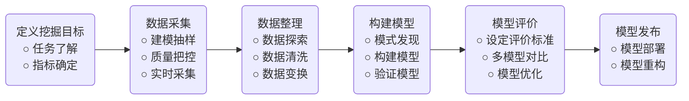

---
export_on_save:
 html: true
---
@import "/blog_head.md"

# Python 数据挖掘 (笔记)

> 参考：《Python数据分析与挖掘实战》

## 数据挖掘基础

### 数据挖掘的任务

- 分类
- 回归
- 聚类分析
- 偏差检测
- 时序模式
- 关联规则
- 智能推荐


### 数据挖掘的建模过程



### 定义挖掘目标

需要考虑以下几个问题：
- 本次挖掘的目标是什么？
- 系统完成后要达到什么样的效果？

为了解决这些问题，我们需要分析应用领域，包括应用中的各种知识和应用目标，了解相关领域的情况，熟悉背景知识，弄清用户需求。

### 数据采样

#### 确定采样的数据子集

在明确了数据挖掘的目标后，接下来就是从业务系统中抽取一个与挖掘目标相关的样本数据子集。抽取数据的标准是相关性，可靠性，有效性。通过对数据样本的精选不仅能够减少数据处理量，节省系统资源，还可以使我们想要寻找的规律性更加凸显。

#### 把控采样质量

任何时候都不能忽视数据的质量，即使是一个数据仓库中进行数据采样，也不能忘记检查其质量。因为数据挖掘是要探索某种现象内在的规律，原始数据的错误会导致很难从数据中得到其中的规律性。衡量数据质量的标准：
- 资料完整无缺，各类指标项齐全；
- 数据准确无误，反映的都是正常状态下的水平；

对于获取的数据，可以再从中抽样，抽样的方式很多，常见的有：
- 随机抽样
- 等距抽样
- 分层抽样
- 从起始顺序抽样
- 分类抽样

其中分层抽样得到的抽样结果更加具有代表性，能使模型具有更好的拟合精度；从起始顺序抽样是指抽取从数据起始处开始的连续数据；

### 数据探索

当我们拿到一个样本数据集后，需要注意以下几点：
- 它是否达到我们原来设想的要求？
- 样本中有没有什么明显的规律和趋势？
- 有没有出现从未设想过的数据状态？
- 属性之间有什么相关性？
- 它们可区分成怎样的一些类别？
- ... ...

对所抽取的样本数据进行探索、审核和必要的加工处理是保证最终的挖掘模型的质量所必须的。

机器学习中有一句名言：**数据和特征决定了机器学习的上限，而模型和算法的应用只是让我们不断逼近这个上限** 。这个算法说明了前期数据处理、特征提取的重要性。

数据探索主要包括：异常值分析、缺失值分析、相关分析 和 周期性分析。

### 数据预处理

当采样数据维度过大时，如何进行**降维处理**、**缺失值处理**等都是数据预处理要解决的问题。

由于采样数据中常常包含许多含有噪声、不完整，甚至是不一致的数据，对数据挖掘所涉及的数据对象必须进行预处理。

预处理主要包括以下方式：
- 数据筛选
- 数据变量转换
- 缺失值处理
- 数据标准化
- 主成分分析
- 属性选择
- 数据规约

### 挖掘建模

样本抽取完成并经过预处理后，接下来要考虑的问题是：本次建模属于数据挖掘应用中的哪类问题（分类、回归、聚类、时间模式、智能推荐、关联规则），选用哪种算法进行模型构建？

这一步是数据挖掘工作中的核心环节。

### 模型评价

模型评价的目的之一就是从多个模型中自动找到一个最好的模型，只有好的评估才能对模型的选择、调试具有指导意义。

## Python 数据分析简介

Python 是一门编程语言，这意味着原则上来说，它能够完成Matlab所能做的所有事情，而且在大多数情况下，同样的功能，同样功能的Python代码会比Matlab代码更加简洁易懂。

Python 以开发效率著称，即其致力于以最短的代码完成任务。Python通常为人诟病的是其运行效率，而 Python 还被称为“胶水语言”，它允许我们把耗时的核心部分用 C/C++ 等高效率的语言编写，然后由它进行“粘合”，这很大程度上解决了Python的运行效率问题。事实上，在**大多数数据任务**上，Python 的运行效率已经可以媲美 C/C++ 语言了。

### 数据结构

#### 列表/元组

列表(`list`)和元组(`tuple`)都是序列结构，它们本身很相似，但有有点不同。

从外形上看，列表用方括号标记，如 `a=[1,2,3]`，而元组是用圆括号标记的，如 `b=(4,5,6)`，访问列表和元组中的方式相同，容器中的元素类型没有限制。

列表/元组相关函数：
- `len(a)` : 列表/元组元素的个数
- `max(a)` : 列表/元组元素最大值
- `min(a)` : 列表/元组元素最小值
- `sum(a)` : 列表/元组元素求和
- `sorted(a)` : 对序列进行排序
- `reversed(a)` : 获得序列的反向遍历迭代器

此外，作为对象，列表本身自带了很多实用的方法（元组不允许修改，因此方法很少）：

- `a.append(1)` : 将 1 添加到列表`a`末尾
- `a.insert(2,1)` : 在索引2处插入元素1
- `a.pop(1)` : 移除列表`a`中索引为1的元素，并将该元素返回
- `del a[1]` : 移除列表`a`中索引为1的元素
- `a.count(1)` : 统计列表`a`中元素1出现的次数
- `a.index(1)` : 从列表中找到第一个1的索引位置
- `a.extend([1,2])` : 将列表 `[1,2]` 追加到列表`a`的末尾
- `a+b` : 将 `a` 和 `b` 合并后返回，其本身不变

最后，不得不提的是“列表解析”这一功能，它能够简化我们对列表内元素逐一进行操作的代码，如下面的代码：
```python
a = [1,2,3]
b = []
for i in a:
    b.append(i + 2)

# 上面的代码等价为:
b = [i+2 for i in a]
```
这正体现了Python以最短的代码完成任务的口号！

### 函数式编程

**函数式编程**称为函数程序设计或泛函编程，是一种编程范式，它将计算机运算视为数学上的函数计算，并且避免使用程序状态以及易变对象。简单来讲，函数式编程是一种 “广播式” 的编程，一般结合 lambda 定义函数，用于科学计算中会显得特别简洁方便。

在Python中，函数式编程主要由几个函数的使用构成：`lambda()`、 `map()`、 `reduce()`、 `filter()`。

#### lambda

`lambda` 用于定义行内函数，有点类似于 Matlab 中的“匿名函数”。
```python
f = lambda x : x + 2   # 定义函数 f(x)=x+2
g = lambda x, y: x + y # 定义函数 g(x,y)=x+y
```

#### map

`map` 函数将函数逐一应用到（map）列表中的每个元素，最后返回一个数组。

之前，我们用列表解析完成了将 `a` 中每个元素加2的操作，下面我们用map实现同样的功能：
```python {cmd}
a = [1,2,3]
b = map(lambda x:x+2, a)
print(tuple(b))
```
`map`函数创建了一个待运行的命令容器，在其他函数调用它时返回结果。

> 为什么相同功能的实现可以使用两种不同的语法？
使用列表解析本质上还是要使用`for`循环，而Python的`for`循环命令的效率低，而`map()`函数实现了相同的，并且效率更高，原则上来说，它的循环速度相当于C语言。

**上面的说法值得商榷，通过测试发现，使用列表解析所用的CPU时间稍小于`map`,而使用的系统时间多于`map`,两者之和其实相差非常小，所以建议还是使用列表解析吧。<https://stackoverflow.com/questions/1247486/python-list-comprehension-vs-map> 这个高票答案也说明了map效率并不能提高反而有时会降低，所以还是多用列表解析吧，效率高还可读性好。**

#### filter

`filter()`函数顾名思义就是用于筛选出列表中符合条件的元素，如筛选出数组中所有的偶数：
```python {cmd}
b = filter(lambda x:x%2==0, range(1,20,3))
print(list(b))
```
注意：`filter()`函数传入的第一个函数参数返回值必须是`bool`类型。

上面的代码也可以用列表解析实现：
```python {cmd}
print([x for x in range(1,20,3) if x%2==0])
```

## Python 数据分析工具

### 基础的库

- Numpy：提供数组支持，以及相应的高效的处理函数
- Scipy：提供矩阵支持，以及矩阵相关的数值计算模块
- Matplotlib：数据可视化

### 工具库
- Pandas：数据分析、探索工具
- StatsModels：统计建模和计量经济学，包括描述统计、统计模型估计和推断
- Scikit-Learn：支持回归、分类、聚类等强大的机器学习库
- Keras：深度学习库，用于建立神经网络以及神经学习模型

### 专业库
- Gensim：文本主题模型的库，文本挖掘可能用到
- Pillow：图片处理相关
- OpenCV：计算机视觉库，处理图片、视频
- GMPY3：高精度运算

## 数据探索

根据观察、调查收集到初步的样本数据集后，接下来要考虑的问题是：样本数据集的数量和质量是否满足构建模型的要求？是否出现从未想过的数据状态？其中有没有明显的规律和趋势？各因素之间有什么样的关联性？

### 数据质量分析

数据质量分析是数据挖掘中数据准备过程中的重要一环，是数据预处理的前提，也是数据挖掘分析有效性和准确性的基础。没有可信的数据，数据挖掘创建的模型将是空中楼阁。

数据质量分析的主要任务是检查原始数据中是否存在脏数据，脏数据一般是指不符合要求、不能直接进行相应分析的数据，在常见的数据挖掘工作中，脏数据包括如下内容：
- 缺失值
- 异常值
- 不一致的值
- 重复数据及含有特殊符号的（如\#、￥、\*）数据

#### 缺失值分析

数据缺失主要包括记录的缺失和记录中某个字段信息的缺失，两者都会造成分析结果的不准确。

- 缺失值产生的原因
    - 收集手段的原因：有些信息暂时无法获取，或者获取信息的代价太大；
    - 人为的原因：有些信息被遗漏，或者设备出故障；
    - 属性值不存在

- 缺失值的影响
    - 数据挖掘建模将丢失大量的有用信息
    - 数据挖掘模型所表现出的不确定性更加显著，模型中蕴含的规律更难把握
    - 包含空值的数据将会是建模过程陷入混乱，导致不可靠的输出

- 缺失值的分析
    - 使用简单的统计分析，可以得到含有缺失值的属性的个数，以及每个属性的未缺失数、缺失数、缺失率等；

从总体上说，缺失值的处理分为输出存在缺失值的记录、对可能值进行插补和不处理3中情况；

#### 异常值分析

异常值分析是检验数据是否有录入错误以及含有不合常理的数据。**忽略缺失值是非常危险的**，不加剔除地把异常值包括进数据的计算分析中，对结果会产生不良影响；重视异常值的出现，分析其产生的原因，常常成为发现问题进而改进决策的契机。

异常值是指样本中的个别值，其数值明显偏离其他的观测值。异常值也成为离群点，异常值分析也成为离群点分析。

- 简单统计分析
可以先对变量做一个描述性的统计，进而查看哪些数据是不合理的。最常用的统计量是最大值和最小值，用来判断这个变量的取值是否超过了合理的范围。如客户年龄的最大值为199，则该变量的取值存在异常；

- $3\sigma$原则
如果数据服从正态分布，在$3\sigma$原则下，异常值被定义为一组测定值中与平均值的偏差超过3倍标准差的值。在状态分布的假设下，距离平均值$3\sigma$之外的值出现的概率为$P(|x-\mu|>3\sigma\le0.003)$，属于极个别的小概率事件。如果数据不服从正态分布，也可以用远离平均值多少倍标准差来描述。

- 箱型图分析
箱型图提供了识别预测值的一个标准：异常值通常被定义为小于$Q_L-1.5IQR$或者大于$Q_U+1.5IQR$的值。$Q_L$称为下四分位数，$Q_U$称为上四分位数，$IQR$称为四分位间距，等于$Q_U-Q_L$，其间包含了全部观测值的一半。

箱型图依据实际数据绘制，没有对数据作任何限制性要求（如服从某种特定的发布形式），它只是真实直观地表现数据分布的本来面积；另一方面，箱型图判断异常值的标准以四分位数和四分位距为基础，四分位数具有一定的鲁棒性：多达25%的数据可以变得任意远而不会很大地扰动四分位数，所以异常值不能对这个标准施加影响。由此可见，箱型图识别异常值的结果比较客观，在识别异常值方面有一定的优越性。


