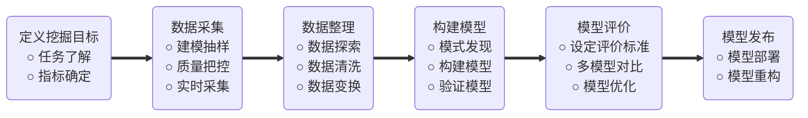

---
export_on_save:
 html: true
---

## 数据挖掘的任务

- 分类
- 回归
- 聚类分析
- 关联规则
- 时序模式
- 偏差检测
- 智能推荐

## 数据挖掘的建模过程

<!--  -->

### 定义挖掘目标

需要考虑以下几个问题：
- 本次挖掘的目标是什么？
- 系统完成后要达到什么样的效果？

为了解决这些问题，我们需要分析应用领域，包括应用中的各种知识和应用目标，了解相关领域的情况，熟悉背景知识，弄清用户需求。

### 数据采样

#### 确定采样的数据子集

在明确了数据挖掘的目标后，接下来就是从业务系统中抽取一个与挖掘目标相关的样本数据子集。抽取数据的标准是相关性，可靠性，有效性。通过对数据样本的精选不仅能够减少数据处理量，节省系统资源，还可以使我们想要寻找的规律性更加凸显。

#### 把控采样质量

任何时候都不能忽视数据的质量，即使是一个数据仓库中进行数据采样，也不能忘记检查其质量。因为数据挖掘是要探索某种现象内在的规律，原始数据的错误会导致很难从数据中得到其中的规律性。衡量数据质量的标准：
- 资料完整无缺，各类指标项齐全；
- 数据准确无误，反映的都是正常状态下的水平；

对于获取的数据，可以再从中抽样，抽样的方式很多，常见的有：
- 随机抽样
- 等距抽样
- 分层抽样
- 从起始顺序抽样
- 分类抽样

其中分层抽样得到的抽样结果更加具有代表性，能使模型具有更好的拟合精度；从起始顺序抽样是指抽取从数据起始处开始的连续数据；

### 数据探索

当我们拿到一个样本数据集后，需要注意以下几点：
- 它是否达到我们原来设想的要求？
- 样本中有没有什么明显的规律和趋势？
- 有没有出现从未设想过的数据状态？
- 属性之间有什么相关性？
- 它们可区分成怎样的一些类别？
- ... ...

对所抽取的样本数据进行探索、审核和必要的加工处理是保证最终的挖掘模型的质量所必须的。

机器学习中有一句名言：**数据和特征决定了机器学习的上限，而模型和算法的应用只是让我们不断逼近这个上限** 。这个算法说明了前期数据处理、特征提取的重要性。

数据探索主要包括：异常值分析、缺失值分析、相关分析 和 周期性分析。

### 数据预处理

当采样数据维度过大时，如何进行**降维处理**、**缺失值处理**等都是数据预处理要解决的问题。

