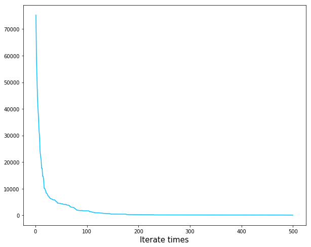
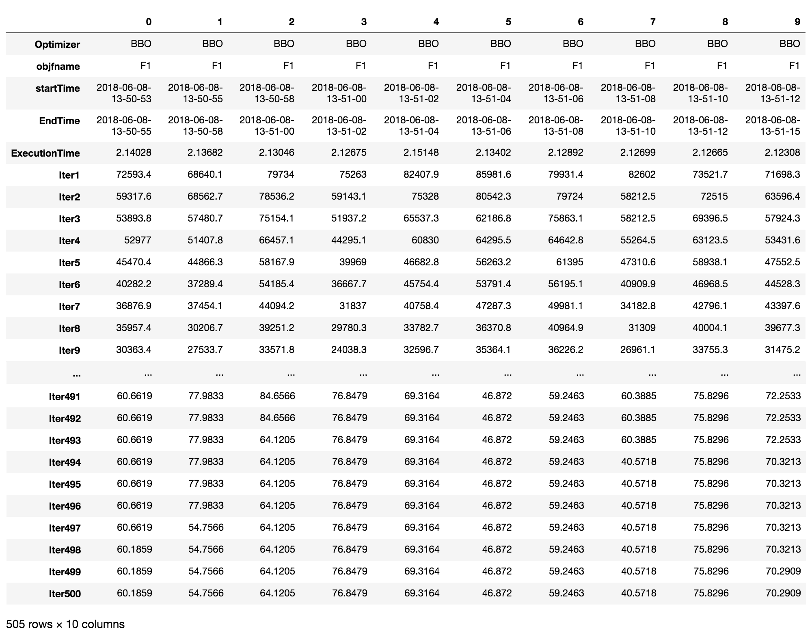

# 论文算法实现-实验报告

**姓名：丰华彬 &nbsp;&nbsp;&nbsp;&nbsp;学号：SA17011135**

论文 URL <https://ieeexplore.ieee.org/document/4475427/> 。


<!-- @import "[TOC]" {cmd="toc" depthFrom=1 depthTo=6 orderedList=false} -->

<!-- code_chunk_output -->

* [论文算法实现-实验报告](#论文算法实现-实验报告)
	* [基于生物地理学的优化算法](#基于生物地理学的优化算法)
		* [摘要](#摘要)
		* [介绍](#介绍)
		* [生物地理学](#生物地理学)
		* [基于生物地理学的优化算法](#基于生物地理学的优化算法-1)
			* [迁徙](#迁徙)
			* [变异](#变异)
		* [生物地理学优化算法实践](#生物地理学优化算法实践)

<!-- /code_chunk_output -->


## 基于生物地理学的优化算法

### 摘要

生物地理学是对生物个体在地理分布上的研究。在 19 世纪 60 年代，生物地理学首次用数学方程进行表示。驱动这一工程实践发展的思想是我们认为我们可以从自然世界中进行仿生学习。就像从数学的角度研究生物基因，我们发展出了遗传算法，从数学的角度研究生物神经，我们发展出了人工神经网络，该论文以数学的角度考虑生物地理学，由此发展出了一个新的领域——基于生物地理学的优化算法（Biogeography-Base Optimization, BBO）。我们将会讨论生物地理学及其数学上的表现形式，之后会讨论如何使用它来解决优化问题。BBO 有很多的特性与其他的基于生物学的优化算法类似，例如 遗传算法和粒子群优化。这使得 BBO 能够应用于很多多重局部优化的场景，当然 BBO 也有其独特的特性。

我们将从14个评价指标衡量 BBO 的性能，并将其与 7 个仿生优化算法进行比较。我们也将通过一个真实的例子——通过选择传感器对飞机引擎是否正常进行评估来介绍BBO的应用。

关键字——生物地理学 进化算法 卡尔曼过滤器 优化 传感器选择

缩写列表：
|缩写|含义|
|---|---|
|ACO|Ant colony optimization，蚁群优化算法|
|BBO|Biogeography-Based optimization，生物地理学优化算法|
|CPU|Central Processing Unit，中央处理器|
|DARE|Discrete algebraic Riccati equation，离散代数的Riccati方程|
|DE|Differential Evolution，差分进化|
|ES|Evolutionary Strategy，进化策略|
|GA|Genetic algorithm，遗传算法|
|HSI|Habitat suitability Index，栖息地适宜度指数|
|MAPSS|Modular aero propulsion system simulation，模块化航空推进系统仿真|
|PBIL|Probability-based incremental learning，基于概率的增量式学习|
|PSO|Particle swarm optimization，粒子群优化|
|SGA|Stud genetic algorithm，螺柱遗传算法|
|SIV|Suitability index variable，适应指数变量|
|SVD|Singular value decomposition，奇异值分解|


### 介绍

对生物地理学的研究可以追溯到 19 世纪的自然学家，比如 Alfred Wallance 和 Charles Darwin。在 19 世纪 60 年代之前，生物地理学通常是描述性和历史相关的内容。在 19 世纪 60 年代的早期，Robert MacArthur 和 Edward Wilson 开始一起以数学模型对生物地理学研究。他们的研究最终以论文 *The Theory of Island Biogeograph* 的形式在1967年发表。他们着眼于生物种群在相邻岛屿上的分布。他们对生物灭绝与种群迁徙的数学建模非常有兴趣。因为这两位老兄的工作，生物地理学成为了主要的研究领域。搜索生物学摘要（生物学研究指数）显示，2005年有 25452 篇论文与生物地理学有关。但是，搜索INSPEC（一项工程研究指数），显示没有生物地理学论文被发表。鉴于此种情况，这篇论文的动机之一就是合并蓬勃发展的生物地理学与工程领域，通过两者的相互借鉴从而取长补短。将生物地理学应用到到工程学与过去几十年中产生的遗传算法（GA），神经网络，模糊逻辑，粒子群优化（PSO）等计算机智能的其他领域非常类似。

生物地理学的数学模型描述了物种如何从一个岛迁移到另一个岛，如何产生新的物种，以及物种如何灭绝。这里使用的术语“岛”是描述性的而不是字面上的。也就是说，一个岛屿可以指代任何与其他栖息地在地理上隔离的区域。我们因此在本文中使用更通用的术语——“栖息地” 来取代“岛”。非常适合生物生存的地理区域被认为具有很高的栖息地适宜性指数（HSI）。与HSI相关的特征包括诸如降雨、植被多样性、地形特征多样性、土地面积和温度等因素。表征可居住性的特征变量被称为适宜性指数变量（SIV）。 SIV可以被认为是栖息地的自变量，HSI可以被认为是SIV的因变量。


HSI高的栖息地往往有大量的物种，而HSI较低的栖息地种类也相应较少。 HSI高的栖息地有许多物种会迁徙到到附近的栖息地。 HSI较高的栖息地的物种迁入率较低，因为它们的物种数量已经接近饱和。因此，高HSI的栖息地相比于低HSI栖息地更加静态。同样的，高 HSI 的栖息地的迁出率更高——因为有大量的物种，也就有了更多的机会迁徙到相邻的栖息地上（ 这并不意味着一个移民物种完全从其家乡栖息地消失，只有少数代表移民，因此移居物种仍然存在于其栖息地，同时迁徙到邻居栖息地）。

HSI低的栖息地由于种群稀少而具有较高的物种移民率。这种新物种向低HSI栖息地的移民可能会提高栖息地的HSI，因为栖息地的适宜性与其生物多样性成正比。然而，如果栖息地的HSI仍然很低，那么居住在那里的物种将趋于灭绝，这将进一步为额外的移民开辟道路。因此，HSI栖息地较低的HSI栖息地在物种分布上更具动态性。

生物地理学是自然界物种分布的方式，可以类比于一般问题的解决方案。假设我们遇到一个问题和一些候选解决方案。只要我们对给定解决方案的适用性有一个可量化的衡量标准，问题可以发生在任何生活领域（如工程学，经济学，医学，商业，城市规划，体育等）。一个好的解决方案类似于HSI高的栖息地，差的解决方案代表了HSI低的岛屿。高HSI解决方案比低HSI解决方案更能适应变化。同样，高HSI解决方案倾向于与低HSI解决方案共享其特性。 （这并不意味着这些特征从高HSI解决方案中消失了;共享特征仍然存在于高HSI解决方案中，同时在低HSI解决方案中出现新特征，这类似于一个物种的部分个体迁移到另一个栖息地，而其他个体仍保留在其原有栖息地）糟糕的解决方案接受了很多来自良好解决方案的新功能。这种向低HSI解决方案添加新功能可能会提高这些解决方案的质量。我们将这种新方法称为解决生物地理学优化问题（BBO）。

BBO具有与其他生物学算法相同的特征。与遗传算法及粒子群优化一样，BBO也存在解决方案之间共享信息的情况。遗传算法解决方案在每一代结束时“死亡”，而PSO和BBO解决方案永远存在（尽管它们的特性随着优化过程的进展而变化）。 PSO解决方案更有可能在类似的团队中聚集在一起，而GA和BBO解决方案不一定具有任何内置的集群趋势。


本文的目标有三个。首先，我们要介绍一种名为BBO的新优化方法。我们首先研究自然生物地理学，然后推广它以获得通用优化算法。其次，我们想比较BBO与其他基于人口的优化方法并进行对比。我们通过查看算法观点的共同点和差异来做到这一点，并通过比较他们在一组基准函数上的表现来做到这一点。第三，我们希望将BBO应用于飞机发动机健康评估的传感器选择的实际问题，以此证明BBO对现实世界问题的适用性。


第二部分回顾生物地理学的思想和数学，第三部分讨论生物地理学如何用于制定一个通用的优化算法，第四部分重新评估飞机发动机健康状况评估以及卡尔曼滤波如何被用于评估发动机健康状况，第五部分提供了一些比较BBO和其他优化方法的仿真结果，包括通用基准功能和传感器选择问题，第六部分提出了一些关于进一步工作的结论性意见和建议。

### 生物地理学


图1显示了单个栖息地物种的数量与迁出率和迁入率之间的函数。

从迁入曲线中可以看出，当物种数量为0时，迁入率最高，达到了 I。随着物种数量的增加，栖息地变得越来越拥挤，越来越少的物种能够成功地在栖息地生存下来，由此导致了迁入率的下降，栖息地可以容纳的物种数量达到最多，此时迁入率为零。


现在考虑迁出曲线。如果栖息地中没有物种，那么迁出率必须为零。随着物种数量的增加，栖息地变得越来越拥挤，越来越多的物种能够离开栖息地去探索其他可能的栖息地，而且迁出率也在增加。最大的迁出率是当栖息地能够容纳的物种数量最多时发生的。

物种的平衡数量 $S_0$ 是指在这一点上迁出率和迁入率是相等的。但是，由于时间的影响，$S_0$可能会偶尔出现改变。向正向的改变可能是由于突然的大量物种迁入（可能是由邻近的栖息地板块的碰撞），或突然生物大爆发（如寒武纪的微型爆炸）。负向的改变可能是由于疾病，特别贪婪的掠夺者的入侵或其他一些自然灾害。物种数量在大的扰动后达到平衡可能需要很的长时间。


我们将图1中的迁入率和迁出率曲线显示为直线，但一般而言，它们可能是更复杂的曲线。尽管如此，这个简单的模型给我们一个关于物种迁入和迁出过程的一般描述，细节可以根据需要进行调整。

现在考虑在栖息地中有 $S$ 个物种的概率 $P_s$ 随时间从 $t$ 变化到 $(t+\Delta t)$ 的公式：$$P_s(t+\Delta t)=P_s(t)(1-\lambda_s\Delta t-\mu_s\Delta t)+P_{s-1}\lambda_{s-1}\Delta t+P_{s+1}\mu_{s+1}\Delta t$$

其中：$\lambda_s$ 和 $\mu_s$ 分别表示当物种数量为 S 时，栖息地的迁入率和迁出率。该方程能够成立在于：为了在时间 $(t+\Delta t)$时刻有 S 个物种，下面的条件必定有一个满足：
1. 在 t 时刻，有 S 个种群，并且迁入率和迁出率在时间间隔 $t$ ~ $(t+\Delta t)$ 之间为0；
1. 在 t 时刻有（S-1）个种群，之后有 1 个种群迁入；
1. 在 t 时刻有（S+1）个种群，之后有 1 个种群迁出；

我们假定 $\Delta t$ 非常小，因此多于一个种群的物种迁入或迁出的情况可以忽略。当 $\Delta t\to0$  时，我们得到下面的公式：

$$
\dot P_s = \begin{cases}
-(\lambda_s+\mu_s)P_s+\mu_{s+1}P_{s+1}, &S=0 \\
-(\lambda_s+\mu_s)P_s+\lambda_{s-1}P_{s-1}+\mu_{s+1}P_{s+1}, &1\le S\le S_{max}-1 \\
-(\lambda_s+\mu_s)P_s+\lambda_{s-1}P_{s-1}, &S=S_{max}
\end{cases}
$$
我们设 $n=S_{max}$，$P=[P_0, \cdots, P_n]^T$，为了简化表示，我们可以将 $\dot P_s$ 用一个矩阵乘法表示（其中 $S=0,\cdots,n$）:$$\dot P=AP$$
其中 A 为：
$$
A=\begin{pmatrix}
-(\lambda_0+\mu_0) & \mu_1 & 0 & \cdots & 0 \\
\lambda_0 & -(\lambda_1+\mu_1) & \mu_2 & \ddots  & \vdots \\
\vdots & \ddots & \ddots & \ddots & \vdots \\
\vdots & \ddots &\lambda_{n-2} & -(\lambda_{n-2}+\mu_{n-1}) & \mu \\
0 & \cdots &0 &\lambda_{n-1} & -(\lambda_n+\mu_n)
\end{pmatrix}
$$
其中在图 1 中的直线方程满足：
$$
\begin {aligned}
\mu_k&=\frac{Ek}{n} \\
\lambda_k &= I(1-\frac{k}{n}) 
\end{aligned}
$$

现在考虑一种特殊的情况 $E=I$，在这种情况下，我们有 $$\lambda_k+\mu_k=E $$ ，此时 A 矩阵变为：
$$
A=E\begin{pmatrix}
-1 & \frac1n & 0 & \cdots & 0 \\
\frac nn & -1 & \frac2n & \ddots & \vdots \\
\vdots & \ddots & \ddots & \ddots & \vdots \\
\vdots & \ddots & \frac 2n & -1 & \frac nn \\
0 & \cdots & 0 & \frac 1n & -1
\end{pmatrix}
= EA'
$$
1. 观察 1 ：0 是 $A'$ 的一个特征值，其对应的特征特征向量：
$$
\begin{aligned}
v &= [v_1 \cdots v_{n+1}]^T \\
v_i &= \begin {cases}
\frac{n!}{(n-1-i)!(i-1)!} &(i=1,\cdots,i') \\
v_{n+2-i} &(i=i'+1, \cdots, n+1)
\end{cases}
\end{aligned}
$$
其中 $i'= ceil(\frac {n+1}{2})$

例如:
当 $n=4$ 时，我们有 $v=[1\quad4\quad6\quad4\quad1]^T$
当 $n=5$ 时，我们有 $v=[1\quad5\quad10\quad10\quad5\quad1]$

2. 推论 1 ：$A'$ 的特征值形式为$$k=\{0,\quad\frac{-2}n,\quad\frac{-4}n,\quad\cdots,\quad-2\}$$该推论还没有证明，但是通过观察所有的 $n$ 的值可以知道该结论应该是正确的。

3. 定理 1 ：最终稳定状态下的概率为：$$P(\infty)=\frac v{\sum_{i=1}^{n+1}v_i}$$

### 基于生物地理学的优化算法

在这节中，我们将讨论生物地理学理论被用于解决离散情况下的优化问题。

#### 迁徙

假定我们有一个问题及该问题的一些候选解，这些候选解可以被表示成一个由整数构成的一个向量。该向量中的每个整数被认为是一个适应度指数。另外假设我们有一些手段可以评价解决方案的优劣。好的解决方案 HSI 较高，差的解决方案 HSI 较低。HSI 类似于其他流行的基于种群优化算法（如 遗传算法） 中的适应度。高 HSI 的解决方案代表有很多物种的栖息地，第 HSI 的解决方案代表物种数量很少的栖息地。我们假定每个解决方案（栖息地）都有相同的物种曲线，但是 S 值取决于解决方案的 HSI。


图 2 中的 $S_1$ 代表了一个低 HSI 解决方案，$S_2$ 代表了一个高 HSI 解决方案。

我们使用 迁出率 和 迁入率表示每一种解决方案与其他解决方案进行信息共享的概率。我们以 $P_{mod}$ 的概率修改每个解决方案。如果一个解决方案被选定，我们将使用迁入率 $\lambda$ 来决定是否修改适应度指数变量。如果 $S_i$ 被选定需要进行修改，我们使用其他解决方案的迁出率以概率形式决定哪一个解决方案应该迁入到选定的 $S_i$ 处。

#### 变异

大的变动事件可能急剧地改变栖息地的 HSI，也可能由于外部物种入侵引起。这些事件在 BBO 中表现为对 SIV 的修改。

变异的步骤：
```
Step1:for i=1 to N do
    Step2: 计算突变概率 Ps
    Step3: 用突变概率 Ps 选取一个变量 xi
    Step4: i(f0，1)之间的均匀随机数小于msthen
    Step5:     随机一个变量代替 xi 中的 SIV end if
    Step6: end if
Step7:end for
```

### 生物地理学优化算法实践 

代码在 code 文件夹中，由于论文中的实验是将 BBO 与其他的算法进行对比，而本论文只是对 BBO 进行讲解，故只实现了 BBO 算法。

代码执行命令为：`python optimizer.py`

以 F1 为基准的优化曲线为：


其 10 次试验，每次迭代500次的数据存在于 code 文件夹下以时间为名的 xls 文件中，其内容如：


其中每一列都是一次独立的实验。
